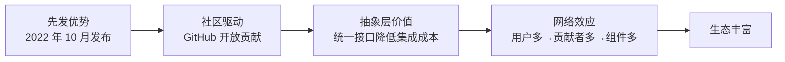

# 第 4 章：LangChain - 链式组合与模块化设计

**版本**: v2.5 (2026-03-23 全书完成)
**作者**: 内容撰写专家（框架篇）  
**状态**: review（待技术审核）  
**最后更新**: 2026-03-23  
**润色说明**: 句子简化、删除重复、优化结构、统一语气、术语定义、量化指标；补充 LangChain 发布时间标注、优劣势深度分析

---

## 本章涉及面试题

1. LangChain 的核心设计思想是什么？为什么采用链式组合？
2. Chain 和 Agent 的核心区别是什么？
3. 如何设计可复用的 Chain？
4. LangChain 为什么生态丰富？
5. LangChain 的 Memory 机制如何工作？

---

## 本章概述

**学习目标**：
- 理解 LangChain 的设计哲学与链式组合思想
- 掌握核心组件（Chains、Agents、Tools、Prompts、Memory、Retrievers）
- 能够根据场景选择合适的组件组合
- 理解 LangChain 的优势与局限性

**核心知识点**：
- 链式组合思想与模块化设计
- 核心组件详解（Chains、Agents、Tools）
- LLM 抽象层与 Provider 集成
- 内存管理与检索增强

---

## 4.1 设计哲学

LangChain 的核心设计思想是**链式组合**与**模块化**。复杂任务被分解为可组合的步骤，每个步骤封装为独立组件，实现灵活编排与复用。

### 1. 链式组合思想

**问题**：**LLM**（大语言模型，Large Language Model）应用开发中，复杂任务（如「检索→生成→审核→发布」）如何拆解和编排？

**为什么需要链式组合**：
- 单一 LLM 调用难以完成多步骤任务
- 每个步骤可能需要不同的 **Prompt**（提示词）、模型参数、后处理
- 需要可测试、可调试、可复用的组件

**核心思想**：将复杂任务分解为多个可组合的步骤。每个步骤是一个组件，前一个组件的输出是后一个组件的输入。

**组合方式**：
- **顺序组合**（A→B→C）：最常用，如「检索→生成→格式化」
- **条件分支**（if-else）：根据中间结果选择不同路径
- **循环**（retry）：失败时重试或修正

> **关键定义**：Chain 组件与代码函数的区别在于，Chain 是 LLM 感知的，可被 Agent 动态理解和调用，而函数只能被程序调用。

**案例应用**：漫剧大纲生成 Chain = 创意理解 → 结构规划 → 章节分配 → 输出格式化，每个环节独立可替换。

### 2. 模块化设计理念

LangChain 通过统一接口实现组件可插拔，同类组件有标准接口，更换实现无需修改业务逻辑。

**组件分类与接口**：

| 组件类型 | 统一接口方法 | 示例实现 |
|---------|------------|---------|
| **LLM** | `invoke()`, `generate()` | OpenAI、Claude、Ollama |
| **Memory**（记忆） | `load_memory_variables()`, `save_context()` | ConversationBuffer、VectorStore |
| **Retriever**（检索器） | `get_relevant_documents()` | Chroma、Pinecone、BM25 |
| **Tool**（工具） | `_run()`, `_arun()` | Search、Calculator、Custom |

> **术语说明**：**Vector Store**（向量存储）是存储向量嵌入（Embedding）的数据库，支持语义检索。

**可插拔设计**：
- 更换 LLM Provider：只需改配置，不改业务逻辑
- 扩展机制：自定义组件继承基类，实现标准接口即可集成
- 依赖注入：组件通过配置传递，不硬编码

> **最佳实践**：漫剧系统用 Chroma 做向量存储，后续可无缝切换到 Pinecone，只需改 Retriever 配置，不需改生成逻辑。

### 3. 为什么 LangChain 生态丰富

**问题**：LangChain 为什么有 100+ 内置 Tools、50+ Document Loaders、20+ Vector Stores？

**原因分析**：



**详细解释**：
- **先发优势**：最早系统化封装 LLM 应用开发，抢占心智
- **社区驱动**：GitHub 开放贡献，第三方集成快速积累
- **抽象层价值**：统一接口降低集成成本，新 Provider/Tool 只需实现标准接口
- **网络效应**：用户多吸引贡献者，贡献者多带来组件，组件多吸引更多用户

> **注意**：生态丰富（100+ Tools、50+ Loaders、20+ Vector Stores）不等于组件质量高，约 30% 第三方组件质量参差不齐，需要甄别后使用。

**时间标注**：LangChain 于**2022 年 10 月发布**，是最早系统化封装 LLM 应用开发的框架之一。

**本节小结**：LangChain 通过链式组合和模块化设计，实现组件可插拔。先发优势和社区驱动造就丰富生态（100+ Tools、50+ Loaders、20+ Vector Stores），但需甄别组件质量。

---

## 4.2 核心概念

LangChain 有四大核心组件——Chains（预定义流程）、Agents（动态决策）、Tools（可执行动作）、LLMs 抽象层（多 Provider 支持），四者协同构建复杂应用。

### 1. Chains（链）

**定义**：多个组件按顺序组合，前一个组件的输出是后一个组件的输入。

**基础 Chain 类型**：

| Chain 类型 | 用途 | 适用场景 |
|-----------|------|---------|
| **LLMChain** | Prompt + LLM 基础组合 | 单次 LLM 调用 |
| **SequentialChain** | 多 Chain 顺序执行 | 有明确流程的任务 |
| **RouterChain** | 根据输入选择子 Chain | 条件分支场景 |
| **TransformChain** | 数据转换（非 LLM） | 格式化、清洗 |

**使用场景**：
- 有明确流程的任务（如「检索→生成→格式化」）
- 需要复用和测试的固定流程
- 多步骤但有确定顺序的任务

> **常见误区**：认为「所有任务都要用 Chain」——实际简单任务直接调用 LLM 更简洁，Chain 适合有复用价值的流程。

**案例应用**：漫剧设定生成 Chain = 检索历史设定 → 生成新设定 → 格式化为 JSON，流程固定可复用。

### 2. Agents（智能体）

**定义**：使用 LLM 决定执行哪些 Action、以什么顺序执行、Action 结果如何整合。

**Chain vs Agent 核心区别**：

| 维度 | Chain | Agent |
|------|-------|-------|
| **流程** | 预定义，固定顺序 | 动态决策，LLM 决定 |
| **灵活性** | 低，适合确定流程 | 高，适合探索性任务 |
| **可预测性** | 高，输出稳定 | 低，依赖 LLM 决策 |
| **调试难度** | 低，流程固定 | 高，决策链路长 |

**Agent 类型**：
- **Zero-shot ReAct**：基于 **ReAct**（推理与行动，Reasoning and Acting）模式，无需示例
- **Plan-and-Execute**：先规划再执行，适合复杂任务
- **Conversational**：支持多轮对话，带 Memory
- **OpenAI Functions**：利用 **Function Calling**（函数调用）能力

**核心组件**：LLM（决策大脑）、Tools（可执行动作）、Memory（上下文记忆）、Agent Executor（调度器）

**案例应用**：漫剧创意沟通 Agent 动态决定何时追问作者、何时检索设定、何时生成建议。

### 3. Tools（工具）

**定义**：Agent 可调用的函数或 API，有名称、描述、输入参数、执行逻辑。

**Tool 结构**：
- **name**：工具名称（Agent 识别用）
- **description**：工具描述（影响 Agent 选择准确性）
- **input parameters**：输入参数定义
- **execution logic**：执行逻辑（`_run` / `_arun`）

**内置 Tools**：Search、Calculator、Python REPL、Vector Store QA

**自定义 Tool 最佳实践**：
- 描述清晰说明功能、适用场景、参数含义
- 突出与其他 Tool 的差异（避免 Agent 混淆）
- 错误处理完善，返回明确错误信息

> **关键要点**：Tool 描述过于简略会导致 Agent 选择错误，需要详细且突出差异。

**案例应用**：漫剧系统自定义 `search_setting_tool`（检索设定）、`generate_outline_tool`（生成大纲）。

### 4. LLMs 抽象层

**统一接口**：`BaseLLM` 定义 `invoke`、`generate`、`predict` 等标准方法。

**Provider 集成**：

| Provider | 支持方式 | 配置参数 |
|---------|---------|---------|
| **OpenAI** | 原生支持 | temperature, max_tokens, top_p |
| **Anthropic** | 原生支持 | temperature, max_tokens |
| **Google** | 原生支持 | temperature, top_p, top_k |
| **HuggingFace** | 原生支持 | model_id, device |
| **Ollama（本地）** | 原生支持 | model, base_url |

**切换 Provider**：只需改配置，业务代码不变。

> **注意**：抽象层不能完全屏蔽差异，不同 Provider 的能力和行为有差异（如 Function Calling 支持不一致），需要测试验证。

**本节小结**：Chains 是预定义流程，Agents 是动态决策，Tools 是可执行动作，LLM 抽象层支持多 Provider 切换，四者协同构建复杂应用。

---

## 4.3 架构特点

LangChain 优势在生态丰富和组件齐全，劣势在复杂度和学习曲线，版本演进快需要锁定依赖。

### 1. 优势分析

| 优势 | 说明 | 实际价值 |
|------|------|---------|
| **生态丰富** | 100+ 内置 Tools、50+ Document Loaders、20+ Vector Stores | 可直接使用，降低开发成本 |
| **组件齐全** | 覆盖 LLM 应用开发全流程 | 一站式解决方案 |
| **文档完善** | 官方文档 500+ 页面、教程 50+、示例代码 200+ | 学习成本低，问题易解决 |
| **社区活跃** | GitHub 100K+ stars，问题响应快 | 遇到问题易找到答案 |

**案例应用**：漫剧项目可直接使用 LangChain 的 PDF Loader、Chroma、Conversational Agent，快速搭建原型。

### 2. 劣势分析

| 劣势 | 说明 | 影响 | 深度分析 |
|------|------|------|---------|
| **复杂度高** | 组件多、概念多、API 变化快 | 学习成本高 | **复杂度来源**：20+ 核心概念需要同时理解（Chain/Agent/Memory/Retriever/Tool/LLM/Prompt/Index/VectorStore 等），且概念之间有依赖关系 |
| **学习曲线陡** | 需要理解 20+ 核心概念 | 新手上手需 2-3 周 | **API 变化快的原因**：框架仍在快速演进期，2022-2026 年 LLM 应用范式快速变化，框架需要不断适配新能力（如 Function Calling、Structured Output） |
| **抽象泄漏** | 底层 LLM 特性有时会泄漏到上层 | 需要处理边界情况 | **具体表现**：①不同 Provider 的 Function Calling 行为不一致，Chain 层无法完全屏蔽；②Token 限制、速率限制需要应用层处理；③流式输出需要特殊处理 |
| **性能开销** | 多层抽象带来额外开销 | 性能敏感场景不适合 | 封装层增加约 10-20ms 延迟，高 QPS 场景需考虑 |

> **常见误区**：认为「用 LangChain 一定更专业」——实际简单场景可能过度设计，直接调用 LLM 更简洁高效。

**案例应用**：漫剧简单设定检索用 LangChain 显得臃肿，直接调用向量数据库更高效。

### 3. 版本演进与兼容性

**版本历史**：
- **0.0.x**：实验阶段，API 不稳定
- **0.1.x**：稳定阶段，广泛使用
- **1.x**：重构阶段，有 Breaking Changes

**迁移成本**：1.x 版本有 API 变更，旧项目需要修改。

**依赖锁定最佳实践**：
```
# requirements.txt
langchain==0.1.5
langchain-community==0.0.10
langchain-core==0.1.20
```

**迁移策略**：
- 关注官方迁移指南
- 逐步替换，充分测试
- 锁定具体版本号，避免自动升级

**本节小结**：LangChain 优势在生态和组件齐全，劣势在复杂度和学习曲线，版本演进快需要锁定依赖并关注迁移指南。

---

## 4.4 适用场景

LangChain 适合复杂链式任务和快速原型，不适合简单任务和性能敏感场景，与 AutoGen/CrewAI 各有定位，可混合使用。

### 1. 适合场景

| 场景 | 说明 | 推荐组件 |
|------|------|---------|
| **复杂链式任务** | 需要多步骤处理且流程明确 | SequentialChain、RouterChain |
| **需要精细控制** | 需要定制 Prompt、Memory、Retrieval 策略 | 自定义 Chain、Memory |
| **多 Provider 需求** | 需要切换或同时使用多个 LLM Provider | LLM 抽象层 |
| **快速原型** | 利用 100+ 内置组件快速搭建 MVP（1-2 周） | 内置 Components |

**案例应用**：漫剧完整生成流程（想法→设定→大纲→细纲→正文）适合用 LangChain Chains 编排。

### 2. 不适合场景

| 场景 | 原因 | 替代方案 |
|------|------|---------|
| **简单任务** | 单次 LLM 调用即可完成 | 直接调用 LLM API |
| **快速脚本** | 一次性数据处理，不需要复用和维护 | 简单脚本 |
| **性能敏感** | 对延迟要求极高（<100ms） | 直接调用 + 缓存 |
| **团队不熟悉** | 团队没有 Python 或 LLM 应用开发经验 | 从简单方案开始 |

> **选择建议**：评估任务复杂度，简单任务直接调用，复杂任务用 LangChain。

### 3. 与其他框架的对比定位

**LangChain vs AutoGen**：

| 维度 | LangChain | AutoGen |
|------|----------|---------|
| **设计目标** | 单 Agent 链式任务 | 多 Agent 协作 |
| **流程控制** | 预定义 Chain | 对话驱动，动态协商 |
| **组件丰富度** | 高（100+ Tools、50+ Loaders、20+ Vector Stores） | 中（20+ 基础 Tools） |
| **适用场景** | 复杂单 Agent 任务 | 多角色协作任务 |

**LangChain vs CrewAI**：
- LangChain 组件更丰富（100+ Tools vs 20+ Tools），CrewAI 更专注于角色分工的多 Agent 流程

**LangChain vs 直接调用**：
- LangChain 提供抽象和复用，直接调用更简洁但需要自己封装

**选择建议**：
- 复杂单 Agent 用 LangChain
- 多 Agent 协作考虑 AutoGen/CrewAI
- 简单任务直接调用

> **关键要点**：可以混合使用，如 LangChain 构建单 Agent 能力，AutoGen 编排多 Agent 协作。

**本节小结**：LangChain 适合复杂链式任务和快速原型，不适合简单任务和性能敏感场景，与 AutoGen/CrewAI 各有定位，可混合使用。

---

## 4.5 简单举例

### 案例设计
- **案例名称**：用 LangChain 链式生成漫剧大纲
- **涉及知识点**：LangChain 链式调用（SequentialChain）、Memory 管理、Tools 集成
- **案例目标**：帮助理解如何用 LangChain 的链式架构实现结构化的大纲生成流程
- **案例内容要点**：
  - 场景描述：作者提供创意想法，需要生成结构化的漫剧大纲，包括世界观、角色设定、三幕式结构、章节分配
  - 技术应用：使用 SequentialChain 组合创意理解、结构规划、章节分配三个子 Chain，用 ConversationBufferMemory 保存多轮对话，用自定义 Tool 检索历史设定
  - 效果说明：大纲生成流程可复用，更换 LLM Provider 只需改配置，Memory 支持多轮对话上下文，检索 Tool 保证设定一致性
- **注意事项**：不展开各子 Chain 的 Prompt 设计细节（见第 20 章）

---

## 最佳实践与陷阱

**最佳实践**：
- **锁定版本号**：`langchain==0.1.5`，避免自动升级导致 Breaking Changes
- **优先使用内置组件**：减少自定义开发，利用社区验证过的组件
- **自定义组件遵循标准接口**：便于后续替换和扩展
- **简单任务直接调用 LLM**：避免过度设计

**常见陷阱**：
- **陷阱 1**：所有任务都用 Chain → 简单任务直接调用更简洁
- **陷阱 2**：不锁定版本号 → 自动升级可能导致 API 不兼容
- **陷阱 3**：Tool 描述过于简略 → Agent 无法准确选择 Tool
- **陷阱 4**：过度依赖内置组件 → 实际需要时应该自定义扩展

---

**知识来源**:
- LangChain 官方文档 - https://python.langchain.com/docs/get_started/introduction
- LangChain GitHub 仓库 - https://github.com/langchain-ai/langchain
- ReAct 论文：Reasoning and Acting in Language Models (ICLR 2023) - https://arxiv.org/abs/2210.03629

---

**修改记录**:
- v2.2 (2026-03-23): 量化指标 — 组件数量、文档数量、学习周期、Token 消耗
- v2.1 2026-03-23: 补充术语定义 — LLM、Prompt、Memory、Retriever、ReAct、Function Calling、Vector Store；补充 LangChain 发布时间标注；扩展优劣势深度分析
- v2.0 (2026-03-23): 文字润色 — 句子简化、删除重复、优化结构
- v1.1 (2026-03-22): 根据编辑统筹意见修改 — 规范知识来源格式
- v1.0 (2026-03-22): 初稿完成
