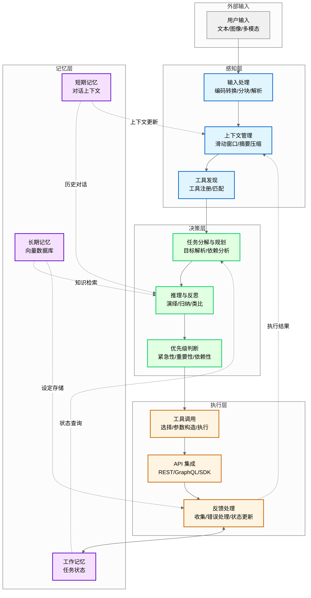

# 第 2 章：核心组件解析

**版本**: v2.6 (2026-03-23 全书完成)
**作者**: 内容撰写专家（基础篇） + 内容修正专家 1  
**状态**: draft  
**最后更新**: 2026-03-23  
**字数**: 约 5300 字（补充四层架构设计原理小节约 300 字）

---

## 本章涉及面试题

- Agent 的四层架构分别是什么？每层的核心职责是什么？
- 如何管理 LLM 的上下文窗口限制？有哪些压缩策略？
- 短期记忆、长期记忆、工作记忆有什么区别？如何协同工作？
- 工具调用机制的完整流程是什么？如何处理调用失败？
- 任务分解时如何识别子任务之间的依赖关系？

---

## 本章概述

**学习目标**：
1. 理解 Agent 四层架构（感知/决策/执行/记忆）的核心职责与设计原理
2. 掌握上下文管理的压缩策略与动态调整方法
3. 理解三层记忆（短期/长期/工作）的协同机制
4. 掌握工具调用与 API 集成的完整流程与错误处理
5. 能够设计符合漫剧生成场景的组件架构

**核心知识点**：
- 感知层：输入处理、上下文管理、工具发现
- 决策层：任务分解、推理反思、优先级判断
- 执行层：工具调用、API 集成、反馈处理
- 记忆层：短期记忆、长期记忆（向量数据库）、工作记忆

---

> **图 2-1**: Agent 四层架构完整数据流图 (v1.1 2026-03-23)
> 
> **说明**: 展示四层架构之间的完整数据流动与交互细节。感知层接收输入并管理上下文，决策层进行任务分解与规划，执行层调用工具并收集反馈，记忆层存储和检索信息支持各层运作。执行层与记忆层为双向箭头，表示执行结果存入记忆层，同时记忆层为执行层提供状态查询支持。
> 
> **来源**: 基于第 1 章架构定义 + 本章组件详解



**数据流说明**：
- **感知层内部**：输入处理→上下文管理→工具发现，为决策层提供高质量输入
- **决策层内部**：任务分解→推理反思→优先级判断，形成完整的决策链条
- **执行层内部**：工具调用→API 集成→反馈处理，确保动作可靠执行
- **记忆层内部**：短期/长期/工作记忆协同，支持跨会话连续性
- **跨层交互**：
  - 感知层→决策层：提供处理后的输入和可用工具列表
  - 决策层→执行层：下发任务规划和优先级指令
  - 执行层→记忆层：更新任务状态和存储执行结果
  - 记忆层→决策层：提供历史对话、知识检索、状态查询支持
  - 执行层→感知层：反馈执行结果用于上下文更新

---

## 2.1 感知层（Perception）

### 四层架构设计原理

**问题**：为什么 Agent 架构是四层（感知/决策/执行/记忆），而不是三层或五层？

**理论依据**：Agent 四层架构设计基于经典 PEAS 框架（Russell & Norvig《人工智能：一种现代方法》第 4 版，2020）。PEAS 框架从四个维度定义智能体任务环境：
- **P**erformance（性能）：如何衡量 Agent 表现
- **E**nvironment（环境）：Agent 在什么环境中运作
- **A**ctuators（执行器）：Agent 能执行哪些动作
- **S**ensors（传感器）：Agent 如何感知环境

**四层对应关系**：
- **感知层** ←→ **Sensors（传感器）**：解决「输入从哪里来」，将环境信号转换为内部表示
- **决策层** ←→ **Performance（性能）+ 推理**：解决「做什么决定」，基于目标和感知进行推理规划
- **执行层** ←→ **Actuators（执行器）**：解决「如何落地行动」，将决策转化为外部动作
- **记忆层** ←→ **状态保持**：解决「如何保持连续性」，存储历史信息支持跨会话一致性

**为什么不是三层**：若合并记忆层到其他层，会导致：
- 合并到感知层：记忆不仅是输入预处理，还涉及存储策略和检索机制，职责不单一
- 合并到决策层：记忆管理是持久化操作，与瞬时决策逻辑分离更符合关注点分离原则
- 合并到执行层：记忆检索不是外部动作，而是内部状态查询

**为什么不是五层**：若拆分某层，会导致：
- 拆分感知层（输入处理 + 上下文管理）：两者都是输入预处理，拆分增加层间通信开销
- 拆分决策层（任务分解 + 推理）：任务分解是推理的前置步骤，紧密耦合不宜拆分
- 拆分执行层（工具调用 + API 集成）：两者都是外部动作执行，拆分无实际收益

**工程价值**：四层架构实现关注点分离（Separation of Concerns），每层职责单一、接口清晰，便于：
- **独立优化**：可单独优化某层（如更换向量数据库只影响记忆层）
- **并行开发**：不同开发者负责不同层，减少代码冲突
- **问题定位**：问题可快速定位到特定层（如检索不准→记忆层，决策错误→决策层）

**漫剧案例应用**：漫剧剧本生成项目中，四层分工明确：感知层处理作者输入和设定检索，决策层规划章节结构和剧情走向，执行层调用写作工具和存储工具，记忆层保存设定和任务进度。四层协同确保项目高效推进。

> **关键定义**：四层架构不是随意设计，而是基于 PEAS 框架的理论推导和工程实践的平衡结果。

---

感知层是 Agent 与外部世界交互的入口。它负责接收并处理各类输入（文本、图像、多模态），管理上下文窗口，并提供工具发现机制，为决策层提供高质量的输入信息。

### 1. 输入处理（文本、图像、多模态）

**问题**：Agent 需要处理哪些类型的输入？如何统一处理？

**为什么需要**：漫剧创作场景中，作者可能输入文字描述（「我想要一个科幻题材的漫剧」）、参考图片（角色设计草图）、甚至语音留言。Agent 必须能够统一处理这些异构输入，转换为可理解的表示形式。

**解决方案**：

#### 文本输入处理

文本是最基础的输入形式，但需要处理以下问题：

- **编码问题**：UTF-8、GBK 等编码格式的统一转换
- **长度限制**：LLM 上下文窗口有限（通常 8K-128K token），需进行 **Chunking**（文本分块）
- **格式解析**：JSON、Markdown、YAML 等结构化格式的解析与验证

**分块策略**：
| 策略 | 说明 | 适用场景 |
|------|------|---------|
| **固定长度** | 按固定 token 数切分 | 通用场景 |
| **语义分块** | 按段落/章节边界切分 | 文档处理 |
| **重叠分块** | 相邻块重叠 10-20% | 保持上下文连贯 |

> **最佳实践**：chunk 重叠比例建议 10-20%，过低导致上下文断裂，过高增加冗余。

#### 图像输入处理

图像需通过视觉模型或 **OCR**（光学字符识别，Optical Character Recognition）转换为文本或向量表示：

- **视觉模型**：GPT-4V、Claude Vision 等，直接理解图像内容
- **OCR 提取**：Tesseract、PaddleOCR 等，提取图像中的文字
- **图像嵌入**：CLIP 等模型，将图像转换为向量，支持语义检索

**案例**：作者上传一张角色设计草图，Agent 使用视觉模型描述「这是一个穿红色斗篷的女性角色，手持法杖，背景是魔法学院」，然后将描述文本存入设定文档。

#### 多模态输入处理

多模态输入是文本 + 图像 + 音频的组合，需统一表示与对齐：

- **统一表示**：将所有输入转换为文本描述或向量
- **时间对齐**：音视频输入需与文本字幕对齐
- **跨模态检索**：支持「找到与这张图片相关的对话」等查询

> **注意**：多模态处理成本较高，建议仅在必要时使用（如作者明确上传图片）。

---

### 2. 上下文管理

**问题**：LLM 上下文窗口有限，如何管理历史对话长度？

**为什么需要**：不解决会导致对话失去连贯性（忘记之前说过的话）、设定不一致（忘记已确认的设定）、token 浪费（包含无关信息）。

**解决方案**：上下文管理策略

#### 上下文压缩策略

| 策略 | 说明 | 优点 | 缺点 |
|------|------|------|------|
| **滑动窗口** | 保留最近 N 轮对话（N=10-20） | 实现简单 | 丢失早期重要信息 |
| **摘要压缩** | 将早期对话压缩为摘要 | 保留核心信息 | 摘要可能丢失细节 |
| **关键信息提取** | 抽取设定、偏好等单独存储 | 精准保留关键信息 | 需要额外存储机制 |
| **混合策略** | 滑动窗口 + 摘要 + 关键信息 | 综合优势 | 实现复杂 |

**摘要压缩示例**：
```
原始对话（10 轮）→ 摘要：「作者确定漫剧题材为科幻，世界观设定在 2150 年的火星殖民地，
主角是火星殖民地 security 部门的调查员，故事核心是调查一起神秘失踪案。」
```

#### 动态上下文调整

根据任务阶段动态调整上下文内容：

- **创意收集阶段**：保留所有创意讨论，不压缩
- **大纲生成阶段**：压缩早期创意讨论，保留已确认设定
- **正文生成阶段**：仅保留当前章节相关设定与上下文

> **关键定义**：上下文管理不是「保留越多越好」，而是「保留最相关的」。过多上下文会干扰 LLM 注意力，降低生成质量。

---

### 3. 工具发现机制

**问题**：Agent 如何知道有哪些工具可用？如何选择合适的工具？

**为什么需要**：漫剧设定管理中，Agent 需知道有哪些存储工具（保存到文件、写入数据库、发送到协作平台）并选择合适工具。没有工具发现机制，Agent 无法调用外部能力。

**解决方案**：

#### 工具注册

Agent 启动时加载可用工具列表，每个工具包含：

- **名称**：唯一标识（如 `save_to_file`、`query_vector_db`）
- **功能描述**：自然语言描述工具用途
- **参数定义**：参数名称、类型、必填/可选、默认值
- **返回类型**：成功/失败、返回数据结构

**工具描述示例**：
```
工具名称：save_to_file
功能：将内容保存到指定文件
参数：
  - file_path (string, 必填): 文件路径
  - content (string, 必填): 文件内容
  - encoding (string, 可选，默认 "utf-8"): 文件编码
返回：{ success: boolean, message: string }
```

#### 工具匹配

根据任务需求选择合适的工具：

1. **意图理解**：LLM 理解用户意图（如「保存这个设定」）
2. **工具检索**：根据意图检索匹配的工具描述
3. **参数构造**：将任务需求转换为工具要求的参数格式
4. **调用确认**：必要时向用户确认（如「要保存到哪个文件？」）

> **注意**：工具发现不是自动的，需要明确的工具描述与注册机制。工具描述越清晰，LLM 选择越准确。

---

**本节小结**：感知层负责接收并处理各类输入（文本/图像/多模态），通过滑动窗口/摘要压缩/关键信息提取管理上下文窗口，并通过工具注册与匹配机制提供工具发现能力，是 Agent 与外部世界交互的入口。

---

## 2.2 决策层（Decision）

决策层是 Agent 的「大脑」，负责任务分解与规划、推理与反思、优先级判断，决定 Agent 如何行动。决策层的质量直接决定 Agent 的智能水平。

### 1. 任务分解与规划

**问题**：如何将复杂任务（如「生成漫剧大纲」）拆分为可执行的子任务？

**为什么需要**：漫剧大纲生成涉及多个步骤（确定章节数→定义每章要素→逐一生成），不分解会导致 LLM 上下文超载、生成质量下降、无法跟踪进度。

**解决方案**：任务分解与规划流程


#### 目标解析

理解用户意图，明确任务目标：

- **意图识别**：分类用户意图（创意收集/大纲生成/正文生成/审核）
- **目标明确化**：将模糊目标转为具体目标（「写个漫剧」→「生成 5 章科幻漫剧大纲」）
- **约束识别**：识别约束条件（字数限制、题材要求、完成时间）

#### 任务分解

将复杂任务拆分为可执行的子任务：

**漫剧大纲生成任务分解示例**：
1. 确定章节数（基于题材与篇幅）
2. 定义每章核心要素（起因/经过/结果/关键转折）
3. 逐一生成各章内容
4. 检查章节间连贯性
5. 输出完整大纲

> **最佳实践**：任务分解不是越细越好。过度分解会增加协调成本，建议分解到「单个 LLM 调用可完成」的粒度。

#### 依赖分析

识别子任务之间的依赖关系：

- **顺序依赖**：任务 B 必须在任务 A 完成后执行（如先生成大纲再生成正文）
- **并行依赖**：任务 B 和 C 可以并行执行（如同时生成第 1 章和第 2 章）
- **资源依赖**：任务 A 和 B 共享同一资源（如同一 API Key，需串行调用）

#### 规划生成

制定执行顺序与资源分配：

- **执行顺序**：根据依赖关系确定先后顺序
- **资源分配**：分配 API 配额、计算资源、存储资源
- **时间估算**：估算每个子任务的执行时间

---

### 2. 推理与反思

**问题**：Agent 如何基于已知信息进行逻辑推导？如何评估自身决策并改进？

**为什么需要**：漫剧设定生成中，Agent 需推理「这个世界观下角色应该有什么能力」，反思「这个设定是否与之前冲突」。没有推理与反思能力，Agent 无法保证内容一致性。

**解决方案**：

#### 推理类型

| 推理类型 | 说明 | 案例 |
|---------|------|------|
| **演绎推理** | 从一般到特殊 | 「所有火星人都能低重力跳跃→主角是火星人→主角能低重力跳跃」 |
| **归纳推理** | 从特殊到一般 | 「第 1/2/3 章都有反转→这部漫剧的风格是多反转」 |
| **类比推理** | 从相似到相似 | 「这部漫剧类似《星际穿越》→可以借鉴父女情感线设计」 |

#### 反思机制

评估自身决策与执行结果，识别改进点：

- **自我评估**：生成内容后自评「是否符合设定」「质量如何」
- **错误分析**：识别错误类型（设定冲突/逻辑漏洞/风格不一致）
- **策略调整**：根据反思结果调整后续策略（如「下次生成前先检索相关设定」）

> **关键定义**：反思不是「出错后重试」，而是从错误中学习并改进策略。Reflexion 模式的核心是通过反思历史执行记录来改进后续表现。

---

### 3. 优先级判断

**问题**：多个任务同时存在时，如何决定执行顺序？

**为什么需要**：漫剧生成中，可能同时有「完成大纲」「生成第 3 章」「修改角色设定」等任务，需根据紧急性/重要性/依赖性决定优先级。

**解决方案**：优先级判断矩阵

| 维度 | 说明 | 评估方法 |
|------|------|---------|
| **紧急性** | 任务的时间敏感度 | 是否有明确截止时间？用户是否等待？ |
| **重要性** | 任务对整体目标的影响 | 是否是核心任务？影响范围多大？ |
| **依赖性** | 其他任务是否依赖此任务完成 | 有多少任务等待此任务完成？ |
| **资源约束** | 可用时间、计算资源、API 配额 | 当前资源是否充足？ |

**优先级计算公式**（简化版）：
```
优先级 = 紧急性 × 0.3 + 重要性 × 0.4 + 依赖性 × 0.3 - 资源成本 × 0.1
```

**案例**：漫剧生成中，优先完成大纲再生成正文（依赖关系），优先处理核心章节再处理附录（重要性），优先处理用户等待的任务（紧急性）。

> **注意**：优先级不是固定的，需根据执行进度动态调整。如大纲完成后，正文生成的优先级自动提升。

---

**本节小结**：决策层是 Agent 的「大脑」，通过目标解析→任务分解→依赖分析→规划生成完成任务规划，通过演绎/归纳/类比推理进行逻辑推导，通过自我评估/错误分析/策略调整实现反思改进，通过紧急性/重要性/依赖性/资源约束判断优先级。

---

## 2.3 执行层（Execution）

执行层是 Agent 的「手和脚」，负责工具调用、API 集成、动作执行与反馈，将决策层的规划转化为实际动作。执行层的可靠性直接决定 Agent 的任务完成率。

### 1. 工具调用机制

**问题**：Agent 如何调用工具？如何处理调用结果？

**为什么需要**：漫剧设定管理中，Agent 需选择「保存文件」工具，构造参数（文件名、内容），调用后解析返回确认保存成功。没有工具调用机制，决策无法落地。

**解决方案**：工具调用完整流程


#### 工具选择

根据任务需求匹配工具描述：

- **语义匹配**：LLM 理解任务需求，匹配最相关的工具描述
- **多工具排序**：如有多个候选工具，按相关性排序
- **确认机制**：必要时向用户确认（如「要用哪个工具保存？」）

#### 参数构造

将任务需求转换为工具要求的参数格式：

- **类型转换**：字符串→数字、列表→JSON 等
- **必填检查**：确保所有必填参数都有值
- **默认值填充**：可选参数使用默认值

#### 调用执行

发起工具调用，处理同步/异步调用：

- **同步调用**：等待响应返回（适合快速操作，<5 秒）
- **异步调用**：立即返回，后续轮询或回调（适合长任务，>10 秒）
- **超时处理**：设置超时时间，超时后重试或降级

#### 结果解析

解析工具返回，转换为 Agent 可理解的格式：

- **成功解析**：提取有效数据，传递给决策层
- **失败解析**：识别错误类型，触发错误处理
- **部分成功**：处理部分成功场景（如批量操作中部分失败）

> **最佳实践**：工具调用不是「函数调用」那么简单，需要参数转换、结果解析、错误处理。建议为每个工具编写包装器（Wrapper），统一处理这些逻辑。

---

### 2. API 集成

**问题**：如何集成外部 API（LLM API、存储 API、审核 API）？

**为什么需要**：漫剧生成中，需调用 LLM API 生成内容，调用存储 API 保存结果，调用审核 API 检查合规性。API 集成是执行层的核心能力。

**解决方案**：

#### API 集成方式对比

| 集成方式 | 说明 | 优点 | 缺点 |
|---------|------|------|------|
| **REST API** | HTTP 请求/响应（Representational State Transfer） | 最通用，文档完善 | 可能有冗余数据 |
| **GraphQL** | 按需查询（Graph Query Language） | 减少冗余数据传输 | 学习成本高 |
| **SDK 封装** | 使用官方 **SDK**（软件开发工具包，Software Development Kit） | 简化调用，类型安全 | 依赖 SDK 维护 |
| **直接调用** | 手动构造请求 | 灵活，无依赖 | 容易出错 |

**建议**：优先使用官方 SDK（如有），其次使用 REST API。GraphQL 适合复杂查询场景。

#### 认证与授权

| 认证方式 | 说明 | 适用场景 |
|---------|------|---------|
| **API Key** | 请求头携带 Key | 服务端调用 |
| **OAuth** | 开放授权标准（Open Authorization） | 需要用户授权的场景 |
| **JWT** | JSON Web Token，Token 含用户信息 | 需要身份验证的场景 |

> **注意**：API Key 等敏感信息必须通过环境变量管理，严禁硬编码在代码中。

#### 错误处理

API 调用可能失败，需处理以下错误：

- **超时**：设置超时时间，超时后重试（建议 3 次，指数退避）
- **限流**：识别限流错误（429），等待后重试
- **认证失败**：检查 API Key 是否有效，提示用户更新
- **服务错误**：5xx 错误，切换备用服务或降级

---

### 3. 动作执行与反馈

**问题**：如何收集执行反馈？如何根据反馈调整？

**为什么需要**：漫剧章节生成中，调用 LLM API 生成内容后，需检查返回是否成功，失败时重试或切换模型。没有反馈机制，无法保证任务完成。

**解决方案**：执行→反馈→调整循环

#### 反馈收集

获取执行结果（成功/失败/部分成功）：

- **显式反馈**：API 返回的状态码、错误信息
- **隐式反馈**：生成内容的质量评估（如长度、格式、相关性）
- **用户反馈**：用户对结果的满意度评价

#### 错误处理

识别错误类型，采取相应措施：

| 错误类型 | 处理措施 |
|---------|---------|
| **可重试错误**（超时/限流） | 指数退避重试（1s→2s→4s） |
| **不可重试错误**（认证失败/参数错误） | 提示用户修正，不重试 |
| **服务降级**（多次重试失败） | 切换备用服务或降低质量要求 |

#### 状态更新

根据执行结果更新任务状态：

- **成功**：标记任务完成，更新工作记忆
- **失败**：标记任务失败，记录错误信息，触发重试或降级
- **部分成功**：标记部分完成，记录未完成部分

> **关键定义**：执行层不是「调用完就结束了」，而是需要收集反馈并更新状态。执行→反馈→调整形成闭环，保证任务最终完成。

---

**本节小结**：执行层是 Agent 的「手和脚」，通过工具选择→参数构造→调用执行→结果解析完成工具调用，通过 REST/GraphQL/SDK 集成外部 API，通过反馈收集→错误处理→状态更新形成执行闭环，将决策转化为实际动作。

---

## 2.4 记忆层（Memory）

记忆层是 Agent 的「知识库」，分为短期记忆、长期记忆和工作记忆，三者协同工作保证 Agent 的连续性。记忆层的设计直接决定 Agent 能否跨会话保持上下文连贯。

### 1. 短期记忆（对话上下文）

**问题**：如何保存当前对话或任务的即时上下文？

**为什么需要**：漫剧创意沟通中，作者说「把刚才那个设定改一下」，Agent 需理解「刚才那个设定」指什么。没有短期记忆，无法理解上下文引用。

**解决方案**：

#### 实现方式

| 方式 | 说明 | 优点 | 缺点 |
|------|------|------|------|
| **LLM 上下文窗口** | 将历史对话放入 prompt | 实现简单，直接可用 | 受 token 限制 |
| **对话历史列表** | 内存中保存对话列表 | 灵活，可自定义压缩策略 | 需手动管理 |
| **混合方式** | 近期对话放上下文，早期对话摘要 | 平衡效果与成本 | 实现复杂 |

#### 容量限制管理

受 LLM token 限制，需管理长度：

- **固定窗口**：保留最近 N 轮对话（N=10-20）
- **动态窗口**：根据任务复杂度调整窗口大小
- **摘要压缩**：超出窗口时，压缩最早对话为摘要

> **最佳实践**：短期记忆不是「全部历史」，而是「选择性保留关键信息」。建议保留最近 10-20 轮对话，早期对话压缩为摘要。

---

### 2. 长期记忆（向量数据库）

**问题**：如何持久化存储知识，支持跨会话检索？

**为什么需要**：漫剧设定管理中，已确认的世界观/角色设定需持久化存储，后续生成时可检索参考。没有长期记忆，每次会话都需重新讨论设定。

**解决方案**：

#### 向量数据库选型

| 类型 | 代表产品 | 优点 | 缺点 |
|------|---------|------|------|
| **托管服务** | Pinecone、Weaviate Cloud | 易用，免运维 | 成本较高 |
| **自托管** | Qdrant、Milvus | 可控，成本灵活 | 需运维 |
| **嵌入式** | Chroma 本地模式、LanceDB | 零配置，开发友好 | 不适合生产 |

**建议**：开发阶段用嵌入式（如 Chroma 本地模式），生产阶段用托管或自托管。

#### 检索机制

**Embedding**（向量嵌入）+ 相似度搜索：

1. **嵌入**：将文本转换为向量（使用 Embedding 模型）
2. **存储**：向量存入向量数据库，关联原始文本
3. **检索**：查询文本转换为向量，搜索相似向量
4. **返回**：返回最相似的 K 个结果（K=3-5）

**案例**：作者问「主角的能力是什么？」，Agent 将问题嵌入为向量，检索向量数据库，返回「主角是火星人，能在低重力环境下跳跃 10 米高」等相关设定。

> **关键定义**：长期记忆不是「数据库」那么简单，而是需要向量表示支持语义检索。传统数据库只能精确匹配，向量数据库支持「意思相近」的模糊匹配。

---

### 3. 工作记忆（任务状态）

**问题**：如何保存当前任务的执行状态与进度？

**为什么需要**：漫剧大纲生成中，需保存「已完成 3/5 章节，当前正在生成第 4 章」。没有工作记忆，无法跟踪任务进度，中断后无法恢复。

**解决方案**：

#### 实现方式

| 方式 | 说明 | 适用场景 |
|------|------|---------|
| **内存变量** | 进程内存中保存状态 | 短期任务，不跨会话 |
| **状态文件** | JSON/YAML 文件保存状态 | 中期任务，可跨会话 |
| **数据库记录** | 数据库表保存状态 | 长期任务，多用户共享 |

#### 内容类型

- **任务列表**：待完成任务清单
- **完成状态**：每个任务的完成进度（0-100%）
- **中间结果**：任务执行过程中的临时结果

#### 生命周期

- **创建**：任务开始时创建工作记忆
- **更新**：任务执行中更新状态
- **清除/归档**：任务结束后清除或归档

> **注意**：工作记忆与短期记忆不同。短期记忆关注对话历史，工作记忆关注任务状态。两者可协同工作：短期记忆保存「刚才说了什么」，工作记忆保存「任务做到哪了」。

---

### 三层记忆协同

**案例**：漫剧设定管理的记忆层设计

| 记忆类型 | 存储内容 | 更新时机 | 检索方式 |
|---------|---------|---------|---------|
| **短期记忆** | 当前对话历史 | 每轮对话后 | 直接读取 |
| **长期记忆** | 已确认的世界观/角色设定 | 设定确认后 | 向量检索 |
| **工作记忆** | 「已完成设定讨论，待进入大纲阶段」 | 任务状态变化时 | 直接读取 |

**协同流程**：
1. 作者与 Agent 讨论设定 → 短期记忆保存对话
2. 设定确认 → 存入长期记忆（向量数据库）
3. 任务状态更新 → 工作记忆标记「设定完成」
4. 进入大纲阶段 → 从长期记忆检索设定，参考生成大纲

> **最佳实践**：三层记忆不是独立的，而是协同工作的。短期记忆保证对话连贯性，长期记忆支持语义检索，工作记忆管理任务状态，三者协同支持 Agent 连续性。

---

**本节小结**：记忆层分为三层——短期记忆保存对话上下文（LLM 上下文窗口/对话历史列表），长期记忆持久化知识（向量数据库），工作记忆跟踪任务状态（内存变量/状态文件/数据库记录），三层协同支持 Agent 跨会话连续性。

---

## 2.5 简单举例

### 案例设计
- 案例名称：漫剧设定管理的记忆层设计
- 涉及知识点：Agent 四层架构（感知/决策/执行/记忆），特别是三层记忆（短期/长期/工作记忆）的协同机制
- 案例目标：帮助理解 Agent 如何在多轮对话和跨会话场景中保持上下文连贯性
- 案例内容要点：
  * 场景描述：作者与 Agent 多轮对话讨论漫剧设定，需保存讨论历史、已确认设定和当前进度
  * 技术应用：短期记忆保存最近 10-20 轮对话，长期记忆将世界观和角色设定存入向量数据库，工作记忆跟踪任务状态
  * 效果说明：三层记忆协同使 Agent 能在多轮对话中保持连贯，跨会话复用设定，清晰跟踪进度
- 注意事项：不展开向量数据库的具体实现细节（见第 11 章）

---

**知识来源**:
1. **LangChain 官方文档**: Memory 模块
   - 链接：https://python.langchain.com/docs/modules/memory/
   - 参考内容：记忆层设计、短期/长期记忆实现

2. **ReAct 论文**: ReAct: Synergizing Reasoning and Acting in Language Models (2022 Q4, ICLR 2023)
   - 链接：https://arxiv.org/abs/2210.03629
   - 参考内容：ReAct 模式原理、Thought-Action-Observation 循环

3. **Plan-and-Solve 论文**: Plan-and-Solve Prompting: Improving Zero-Shot Chain-of-Thought Reasoning (2023 Q2, arXiv:2305.04091)
   - 链接：https://arxiv.org/abs/2305.04091
   - 参考内容：Plan-and-Execute 模式原理、规划与执行两阶段架构

4. **Chroma 向量数据库官方文档**: 
   - 链接：https://docs.trychroma.com/
   - 参考内容：向量数据库使用、Embedding 存储与检索

---

**修改记录**:
- v2.3 (2026-03-23): 审核修正 - 补充四层架构设计原理 (PEAS 框架)、统一时间标注为「年份 + 季度」、补充 Plan-and-Solve 论文来源
- v2.2 (2026-03-23): 量化标准检查 - 术语定义精简至≤30 字、统一格式
- v2.1 (2026-03-23): 首次出现必定义 - 补充 Chunking、OCR、REST API、GraphQL、SDK、OAuth、JWT、Embedding 定义
- v2.0 (2026-03-23): 文字编辑润色 - 简化句子、删除重复、优化段落
- v1.1 (2026-03-22): 根据编辑统筹意见修改 — 规范知识来源格式（2-3 个权威来源）
- v1.0 (2026-03-22): 初稿完成
