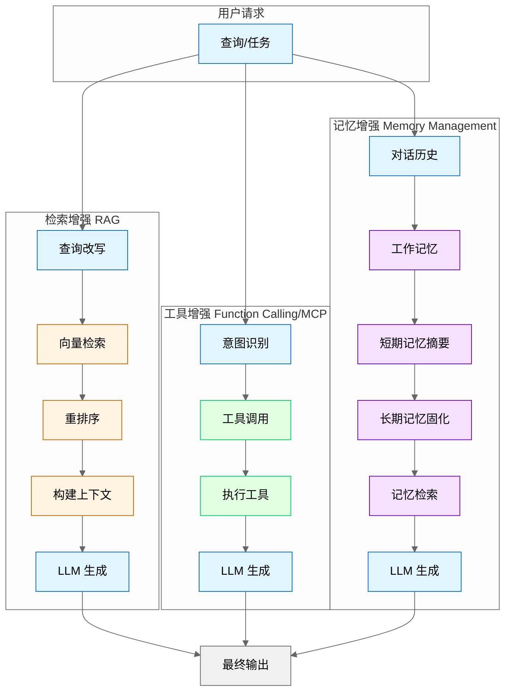

**版本**: v2.6 (2026-03-23 全书完成)

# 第 23 章：Agent Engineering 最佳实践

> **本章目标**：基于行业最佳实践，提供生产级 Agent 系统的设计、开发、部署和运维指南。所有内容基于实际工程经验，避免纯理论讨论。
>
> **核心来源**：基于 Anthropic + Stanford 提出的 Agentic Engineering 范式 (2024 Q4)、Anthropic Engineering Blog、LangChain/CrewAI 生产指南、Microsoft Agent Framework

---

## 23.1 Augmented LLM 构建模式

Augmented LLM 是指通过外部能力增强基础 LLM 能力的架构模式。核心思想是：**LLM 负责推理和决策，外部系统负责记忆、计算和执行**。

> **图 23-1**: Augmented LLM 三种模式对比图 (v1.0 2026-03-23)
>
> **说明**: 对比检索增强 (RAG)、工具增强 (Function Calling/MCP)、记忆增强三种架构模式的数据流和核心组件差异。
>
> **来源**: 行业最佳实践 + LangChain/LlamaIndex/OpenAI 官方文档



---

### 23.1.1 检索增强 (RAG 集成)

**核心原理**：在生成回答前，先从外部知识库检索相关信息，将检索结果作为上下文注入 Prompt。

**适用场景**：
- 企业知识库问答（产品文档、FAQ、内部 Wiki）
- 需要引用最新数据的场景（新闻、股价、天气）
- 私有数据问答（用户个人文档、聊天记录）

**漫剧项目案例**：
在漫剧剧本生成系统中，RAG 用于：
1. **角色一致性检查**：检索已有剧本中的角色设定，确保新剧本中角色性格、说话风格一致
2. **剧情连贯性**：检索前序剧集的剧情摘要，避免剧情矛盾
3. **风格参考**：检索同类型热门剧本的结构和节奏作为参考

**实现要点**：

```python
# RAG 基础流程伪代码
def rag_query(user_query, knowledge_base):
    # 1. 查询改写（可选但推荐）
    rewritten_query = llm_rewrite(user_query)
    
    # 2. 向量检索
    chunks = vector_store.search(rewritten_query, top_k=5)
    
    # 3. 重排序（提升相关性）
    reranked_chunks = cross_encoder.rerank(user_query, chunks)
    
    # 4. 构建上下文
    context = "\n\n".join([chunk.text for chunk in reranked_chunks[:3]])
    
    # 5. 生成回答
    prompt = f"""基于以下信息回答问题：

<context>
{context}
</context>

问题：{user_query}

如果上下文中没有相关信息，请明确说明"根据现有资料无法回答"。
"""
    return llm.generate(prompt)
```

**关键实践**：
- **Chunk 大小**：500-1000 tokens 为宜，过小丢失上下文，过大降低检索精度
- **检索策略**：混合检索（向量 + 关键词）效果优于单一检索
- **元数据过滤**：用时间、类型、来源等元数据预过滤，减少噪声
- **引用标注**：在回答中标注信息来源，便于用户验证

### 23.1.2 工具增强 (Function Calling/MCP)

**核心原理**：将外部 API、数据库、计算工具封装为 LLM 可调用的函数，扩展 LLM 的执行能力。

**两种实现方式**：

| 方式 | 适用场景 | 优点 | 缺点 |
|------|----------|------|------|
| **Function Calling** | 单一模型、简单工具集 | 原生支持、调用简洁 | 绑定特定模型、工具数量有限 |
| **MCP (Model Context Protocol)** | 多模型、复杂工具生态 | 标准化、可扩展、跨模型 | 需要额外基础设施 |

**漫剧项目案例**：
在漫剧生成系统中，工具增强用于：
1. **角色管理工具**：`create_character()`, `update_character_profile()`
2. **剧本结构工具**：`validate_script_structure()`, `extract_plot_points()`
3. **外部集成工具**：`search_trending_topics()`, `analyze_competitor_scripts()`

**实现要点**：

```python
# Function Calling 示例（OpenAI 风格）
tools = [
    {
        "type": "function",
        "function": {
            "name": "search_character_database",
            "description": "搜索角色数据库，获取角色详细信息",
            "parameters": {
                "type": "object",
                "properties": {
                    "character_name": {"type": "string", "description": "角色名称"},
                    "include_history": {"type": "boolean", "description": "是否包含角色历史"}
                },
                "required": ["character_name"]
            }
        }
    }
]

response = client.chat.completions.create(
    model="gpt-4",
    messages=[{"role": "user", "content": "查找主角张三的背景故事"}],
    tools=tools
)

# 处理工具调用
if response.choices[0].message.tool_calls:
    tool_call = response.choices[0].message.tool_calls[0]
    result = execute_tool(tool_call.function.name, tool_call.function.arguments)
    # 将结果返回给 LLM 继续生成
```

**关键实践**：
- **工具描述清晰**：描述中明确说明工具的用途、参数含义、返回值格式
- **错误处理**：工具调用失败时，返回结构化错误信息而非异常
- **工具数量控制**：单次调用不超过 10-15 个工具，避免模型混淆
- **权限隔离**：敏感操作（删除、修改）需要额外确认或权限验证

### 23.1.3 记忆增强 (短期/长期记忆管理)

**核心原理**：LLM 本身无状态，需要外部系统管理对话历史和长期知识。

**记忆分层架构**：

```
┌─────────────────────────────────────────┐
│          工作记忆 (Working Memory)       │
│  - 当前对话的完整历史                     │
│  - 临时变量和中间状态                     │
│  - 生命周期：单次会话                     │
└─────────────────────────────────────────┘
                    ↓ 摘要/提取
┌─────────────────────────────────────────┐
│          短期记忆 (Short-term Memory)    │
│  - 最近 5-10 轮对话摘要                    │
│  - 当前任务的关键信息                     │
│  - 生命周期：数小时至数天                 │
└─────────────────────────────────────────┘
                    ↓ 固化
┌─────────────────────────────────────────┐
│          长期记忆 (Long-term Memory)     │
│  - 用户偏好和习惯                         │
│  - 已验证的事实和知识                     │
│  - 生命周期：永久（除非显式删除）         │
└─────────────────────────────────────────┘
```

**漫剧项目案例**：
在漫剧生成系统中，记忆管理用于：
1. **工作记忆**：当前剧本生成过程中的中间状态（已生成的场景、待补充的对话）
2. **短期记忆**：本季剧集的整体剧情走向、角色关系变化
3. **长期记忆**：角色核心设定、世界观规则、系列标志性元素

**实现要点**：

```python
class MemoryManager:
    def __init__(self, user_id):
        self.user_id = user_id
        self.working_memory = []  # 当前会话消息
        self.short_term_db = Redis()  # 短期记忆
        self.long_term_db = VectorStore()  # 长期记忆
    
    def add_message(self, role, content):
        # 添加到工作记忆
        self.working_memory.append({"role": role, "content": content})
        
        # 定期摘要（每 10 轮）
        if len(self.working_memory) % 20 == 0:
            self._summarize_and_archive()
    
    def _summarize_and_archive(self):
        # 用 LLM 摘要最近对话
        summary = llm.summarize(self.working_memory[-20:])
        
        # 提取长期记忆（用户偏好、重要事实）
        facts = llm.extract_facts(self.working_memory[-20:])
        
        # 存储
        self.short_term_db.set(f"session:{self.user_id}:summary", summary)
        for fact in facts:
            self.long_term_db.add(fact)
        
        # 压缩工作记忆（保留最近 5 轮）
        self.working_memory = self.working_memory[-10:]
    
    def get_context(self):
        # 组装上下文
        context = []
        context.append(f"长期记忆：{self.long_term_db.search_relevant()}")
        context.append(f"短期摘要：{self.short_term_db.get(f'session:{self.user_id}:summary')}")
        context.append(f"当前对话：{self.working_memory}")
        return "\n".join(context)
```

**关键实践**：
- **自动摘要**：定期用 LLM 摘要对话，避免上下文爆炸
- **记忆提取**：从对话中提取可复用的事实（用户偏好、已确认信息）
- **记忆检索**：根据当前话题检索相关长期记忆，而非全量注入
- **记忆删除**：提供用户显式删除记忆的接口（隐私合规）

---

## 23.2 Workflow vs Agent 架构决策

### 23.2.1 定义与对比

| 特性 | Workflow | Agent |
|------|----------|-------|
| **控制流** | 预定义、确定性 | 动态、自主决策 |
| **适用任务** | 结构化、可预测 | 开放式、需灵活性 |
| **可调试性** | 高（固定路径） | 低（非确定性） |
| **开发成本** | 低 | 高 |
| **维护成本** | 低 | 高 |
| **失败恢复** | 简单（重试节点） | 复杂（需状态管理） |

### 23.2.2 决策流程图

```
                    ┌─────────────────┐
                    │   任务是否可    │
                    │ 明确分解为步骤？│
                    └────────┬────────┘
                             │
              ┌──────────────┴──────────────┐
              │ Yes                         │ No
              ↓                             ↓
    ┌─────────────────┐           ┌─────────────────┐
    │ 每步输出格式    │           │ 是否需要跨多    │
    │ 是否固定？      │           │ 轮对话自主决策？│
    └────────┬────────┘           └────────┬────────┘
             │                             │
    ┌────────┴────────┐           ┌────────┴────────┐
    │ Yes             │ No        │ Yes             │ No
    ↓                 ↓           ↓                 ↓
┌─────────┐   ┌─────────────┐ ┌─────────┐   ┌─────────────┐
│ Workflow│   │ 混合架构    │ │  Agent  │   │ 简单 LLM    │
│ (纯流程)│   │ (流程+Agent)│ │ (纯Agent)│   │ 调用        │
└─────────┘   └─────────────┘ └─────────┘   └─────────────┘
```

### 23.2.3 适用场景详解

**Workflow 适用场景**：
- 数据清洗和转换管道
- 文档生成（固定模板）
- 审批流程自动化
- 批量数据处理
- **漫剧案例**：剧本格式标准化（提取→格式化→校验→输出）

**Agent 适用场景**：
- 开放式问题解答
- 多轮对话助手
- 需要探索性搜索的任务
- 创意生成（需要多次迭代）
- **漫剧案例**：剧情创意生成（需要多轮头脑风暴和评估）

**混合架构场景**：
- 主流程固定，但部分节点需要自主决策
- 需要批量处理，但每条记录的处理逻辑有差异
- **漫剧案例**：
  ```
  Workflow（主流程）:
    1. 接收需求 → 2. 检索角色库 → 3. 生成初稿 → 4. 格式校验 → 5. 输出
  
  Agent（节点 3 内部）:
    - 自主决定剧情走向
    - 多轮迭代优化对话
    - 动态调整节奏
  ```

### 23.2.4 漫剧生成混合架构案例

```python
# 漫剧生成系统架构
class DramaGenerationSystem:
    def __init__(self):
        self.workflow = DramaWorkflow()
        self.creative_agent = CreativeAgent()
        self.validator = ScriptValidator()
    
    def generate(self, requirements):
        # Workflow 部分：固定流程
        characters = self._retrieve_characters(requirements)  # 确定性
        outline = self.workflow.generate_outline(requirements)  # 固定模板
        
        # Agent 部分：创意生成
        script_draft = self.creative_agent.write_script(
            outline=outline,
            characters=characters,
            style=requirements.style
        )  # 自主决策
        
        # Workflow 部分：校验和输出
        validation_result = self.validator.validate(script_draft)  # 确定性
        if validation_result.passed:
            return self.workflow.format_output(script_draft)
        else:
            # Agent 部分：根据反馈修改
            return self.creative_agent.revise_script(
                script_draft, 
                validation_result.feedback
            )
```

---

## 23.3 框架使用原则

### 23.3.1 何时使用框架

**推荐使用框架的场景**：

| 场景 | 推荐框架 | 理由 |
|------|----------|------|
| 快速原型验证 | LangChain | 组件丰富、文档完善 |
| 多 Agent 协作 | CrewAI/AutoGen | 内置协作模式 |
| 企业级部署 | LangGraph | 状态管理、可观测性 |
| RAG 应用 | LlamaIndex | 检索优化、数据连接器 |

**框架核心价值**：
1. **标准化接口**：统一的 LLM、工具、记忆接口
2. **内置组件**：预置常用工具（搜索、数据库、API）
3. **状态管理**：处理多轮对话的状态持久化
4. **可观测性**：内置 Trace、日志、监控

### 23.3.2 何时直接用原生 API

**推荐原生 API 的场景**：

| 场景 | 理由 |
|------|------|
| 性能敏感 | 框架抽象层带来 10-30% 延迟 |
| 简单任务 | 单次 LLM 调用即可解决 |
| 定制化需求 | 框架不支持的特殊逻辑 |
| 成本敏感 | 框架可能产生额外 Token 消耗 |
| 调试困难 | 框架黑盒导致问题难以定位 |

**原生 API 示例**：
```python
# 简单任务：直接用原生 API
import openai

def classify_sentiment(text):
    response = openai.chat.completions.create(
        model="gpt-4",
        messages=[{
            "role": "system",
            "content": "判断以下文本的情感倾向，只返回：positive/negative/neutral"
        }, {
            "role": "user",
            "content": text
        }]
    )
    return response.choices[0].message.content.strip()

# 对比：用 LangChain 会引入不必要的抽象
# from langchain.chat_models import ChatOpenAI
# from langchain.prompts import ChatPromptTemplate
# ... (额外 20 行代码，性能下降 20%)
```

### 23.3.3 框架陷阱与避免方法

**陷阱 1：过度抽象**
```python
# ❌ 错误：为简单任务创建复杂的 Chain
chain = (
    prompt_template
    | model
    | output_parser
    | result_formatter
    | response_validator
    | final_processor
)

# ✅ 正确：简单任务直接调用
response = model.invoke(prompt)
result = process(response)
```

**陷阱 2：调试困难**
- **问题**：框架封装多层，错误堆栈不清晰
- **解决**：
  - 启用框架的 verbose/logging 模式
  - 关键节点添加自定义日志
  - 保留绕过框架的直接调用路径（用于对比测试）

**陷阱 3：隐式 Token 消耗**
- **问题**：框架自动添加系统 Prompt、重试、验证，消耗额外 Token
- **解决**：
  - 定期审查框架生成的实际 Prompt
  - 对高频调用路径做 Token 审计
  - 考虑关键路径用原生 API 重写

**陷阱 4：供应商锁定**
- **问题**：深度绑定特定框架，迁移成本高
- **解决**：
  - 在框架外层封装统一接口
  - 核心逻辑不依赖框架特有 API
  - 定期评估框架替代方案

### 23.3.4 理解底层代码的重要性

**原则**：**框架是工具，不是黑盒**。必须理解：
1. 框架如何构建 Prompt
2. 框架如何处理错误和重试
3. 框架如何管理状态和记忆
4. 框架的网络调用和缓存策略

**实践建议**：
- 阅读框架核心模块源码（至少关键路径）
- 用 `verbose=True` 或调试模式观察内部行为
- 定期用原生 API 重写核心逻辑做对比测试
- 参与框架社区，了解设计意图和已知问题

---

## 23.4 生产级 Agent 模式

### 23.4.1 多 Agent 协作模式

**模式 1：层级式 (Hierarchical)**
```
┌─────────────────┐
│   Manager Agent │  ← 任务分解、分配、汇总
└────────┬────────┘
         │
    ┌────┴────┬────────────┐
    ↓         ↓            ↓
┌───────┐ ┌───────┐ ┌───────────┐
│Worker │ │Worker │ │  Worker   │  ← 执行具体任务
│ Agent │ │ Agent │ │  Agent    │
└───────┘ └───────┘ └───────────┘
```

**适用场景**：任务可明确分解、需要统一协调
**漫剧案例**：
- Manager：接收剧本需求，分解为角色设定、剧情大纲、对话生成
- Worker A：负责角色设定生成和一致性检查
- Worker B：负责剧情大纲生成
- Worker C：负责具体场景对话生成

**模式 2：事件驱动 (Event-Driven)**
```
┌──────────┐    ┌──────────┐    ┌──────────┐
│  Agent A │───→│   Event  │───→│  Agent B │
│ (发布事件)│    │  Bus     │    │ (订阅事件)│
└──────────┘    └──────────┘    └──────────┘
```

**适用场景**：松耦合、异步处理、需要扩展性
**漫剧案例**：
- 剧本生成完成 → 发布 `script.completed` 事件
- 审核 Agent 订阅事件 → 自动触发审核流程
- 审核通过 → 发布 `script.approved` 事件
- 发布 Agent 订阅事件 → 自动发布到平台

**模式 3：图式 (Graph-based)**
```
┌─────┐    ┌─────┐
│  A  │───→│  B  │
└──┬──┘    └──┬──┘
   │          │
   ↓          ↓
┌─────┐    ┌─────┐
│  C  │←───│  D  │
└─────┘    └─────┘
```

**适用场景**：复杂依赖关系、条件分支、循环
**工具推荐**：LangGraph、State Machine
**漫剧案例**：剧本生成流程中的条件分支（审核不通过→修改→再审）

### 23.4.2 人在回路 (Human-in-the-Loop) 设计

**核心原则**：关键决策点引入人工审核，平衡自动化与可控性。

**介入点设计**：

| 介入时机 | 适用场景 | 实现方式 |
|----------|----------|----------|
| **执行前** | 高风险操作（删除、发布、支付） | 生成计划→人工确认→执行 |
| **执行中** | 创意类任务（需要方向校准） | 生成初稿→人工反馈→迭代 |
| **执行后** | 质量敏感任务（对外内容） | 生成结果→人工审核→发布 |

**漫剧案例**：
```python
class HumanInLoopScriptGenerator:
    def generate_with_review(self, requirements):
        # 阶段 1：生成大纲（人工确认方向）
        outline = self.agent.generate_outline(requirements)
        if not self.human_review(outline, stage="大纲"):
            return None  # 用户否决，终止流程
        
        # 阶段 2：生成初稿（人工反馈迭代）
        draft = self.agent.write_script(outline)
        feedback = self.human_feedback(draft, stage="初稿")
        if feedback.needs_revision:
            draft = self.agent.revise(draft, feedback.comments)
        
        # 阶段 3：最终审核（发布前确认）
        if not self.human_review(draft, stage="终稿"):
            return None
        
        return draft
```

**最佳实践**：
- 明确标注 AI 生成内容，避免人工审核遗漏
- 提供差异对比（修改前后），降低审核成本
- 记录人工决策，用于后续模型优化
- 设置超时机制，避免人工审核阻塞流程

### 23.4.3 断点续跑与 Checkpointing

**核心思想**：长流程任务定期保存状态，失败后从断点恢复而非从头开始。

**实现要点**：

```python
import json
import hashlib

class CheckpointManager:
    def __init__(self, task_id, storage_path="./checkpoints"):
        self.task_id = task_id
        self.storage_path = storage_path
    
    def save_checkpoint(self, stage, state):
        """保存检查点"""
        checkpoint = {
            "task_id": self.task_id,
            "stage": stage,
            "state": state,
            "timestamp": time.time(),
            "checksum": hashlib.md5(json.dumps(state).encode()).hexdigest()
        }
        path = f"{self.storage_path}/{self.task_id}/{stage}.json"
        os.makedirs(os.path.dirname(path), exist_ok=True)
        with open(path, 'w') as f:
            json.dump(checkpoint, f)
    
    def load_checkpoint(self, stage):
        """加载检查点"""
        path = f"{self.storage_path}/{self.task_id}/{stage}.json"
        if not os.path.exists(path):
            return None
        with open(path, 'r') as f:
            checkpoint = json.load(f)
        # 验证完整性
        expected_checksum = checkpoint["checksum"]
        actual_checksum = hashlib.md5(json.dumps(checkpoint["state"]).encode()).hexdigest()
        if expected_checksum != actual_checksum:
            raise ValueError("Checkpoint corrupted")
        return checkpoint["state"]
    
    def get_latest_stage(self):
        """获取最新完成的阶段"""
        # 扫描所有检查点文件，返回最新的 stage
        ...

# 使用示例
def long_running_task(task_id, requirements):
    checkpoint_mgr = CheckpointManager(task_id)
    
    # 检查是否有断点
    latest_stage = checkpoint_mgr.get_latest_stage()
    
    if latest_stage == "outline":
        state = checkpoint_mgr.load_checkpoint("outline")
        outline = state["outline"]
    else:
        outline = generate_outline(requirements)
        checkpoint_mgr.save_checkpoint("outline", {"outline": outline})
    
    if latest_stage == "draft":
        state = checkpoint_mgr.load_checkpoint("draft")
        draft = state["draft"]
    else:
        draft = write_script(outline)
        checkpoint_mgr.save_checkpoint("draft", {"draft": draft})
    
    # ... 继续后续阶段
```

**最佳实践**：
- **检查点粒度**：每个主要阶段结束后保存，避免过于频繁
- **状态最小化**：只保存必要状态，减少存储和恢复开销
- **版本兼容**：检查点格式变更时提供迁移脚本
- **清理策略**：任务完成后保留最近 N 个检查点，避免存储膨胀

### 23.4.4 错误恢复与重试策略

**错误分类与处理**：

| 错误类型 | 示例 | 处理策略 |
|----------|------|----------|
| **瞬态错误** | 网络超时、API 限流 | 指数退避重试 |
| **内容错误** | LLM 输出格式错误 | 重新生成（最多 N 次） |
| **逻辑错误** | 业务规则校验失败 | 人工介入或终止 |
| **系统错误** | 服务崩溃、数据损坏 | 从检查点恢复 |

**重试策略实现**：
```python
import time
import random

def retry_with_backoff(func, max_retries=5, base_delay=1.0, max_delay=60.0):
    """指数退避重试"""
    last_exception = None
    
    for attempt in range(max_retries):
        try:
            return func()
        except TransientError as e:
            last_exception = e
            if attempt == max_retries - 1:
                break
            
            # 指数退避 + 抖动
            delay = min(base_delay * (2 ** attempt), max_delay)
            jitter = random.uniform(0, delay * 0.1)
            time.sleep(delay + jitter)
    
    raise RetryExhaustedError(f"Failed after {max_retries} attempts") from last_exception

def retry_with_regenerate(func, max_retries=3):
    """LLM 输出错误时重新生成"""
    for attempt in range(max_retries):
        result = func()
        if validate_output(result):
            return result
        # 记录错误，用于调试
        log_error(f"Invalid output attempt {attempt}: {result}")
    
    raise OutputValidationError(f"Failed to generate valid output after {max_retries} attempts")
```

**漫剧案例**：
```python
def generate_script_with_recovery(requirements):
    try:
        # 阶段 1：大纲生成
        outline = retry_with_regenerate(
            lambda: agent.generate_outline(requirements),
            max_retries=3
        )
        
        # 阶段 2：剧本生成（可能失败，从检查点恢复）
        try:
            draft = retry_with_regenerate(
                lambda: agent.write_script(outline),
                max_retries=3
            )
        except OutputValidationError as e:
            # 记录错误，人工介入
            log_critical_error(e)
            notify_human_review(outline)  # 发送人工审核
            raise
    
    except RetryExhaustedError as e:
        # 重试耗尽，从检查点恢复或终止
        checkpoint = load_latest_checkpoint()
        if checkpoint:
            return resume_from_checkpoint(checkpoint)
        else:
            raise TaskFailedError("Cannot recover from failure") from e
```

---

## 23.5 调试与可观测性实践

### 23.5.1 Prompt 调试技巧

**问题**：Prompt 效果不佳，但难以定位原因。

**调试方法**：

**1. 版本对比**
```python
# 保存 Prompt 版本
prompt_versions = {
    "v1": "直接生成剧本",
    "v2": "添加角色设定约束",
    "v3": "添加剧情结构模板",
}

# A/B 测试
def ab_test_prompts(test_cases, versions):
    results = {}
    for version_name, prompt_template in versions.items():
        scores = []
        for test_case in test_cases:
            output = llm.generate(prompt_template.format(**test_case))
            score = evaluate(output, test_case.expected)
            scores.append(score)
        results[version_name] = {
            "avg_score": sum(scores) / len(scores),
            "scores": scores
        }
    return results
```

**2. 分步调试**
```python
# 将复杂 Prompt 拆解为多个步骤，逐步验证
def debug_prompt_pipeline(input_data):
    # 步骤 1：信息提取
    extracted = llm.extract(input_data, prompt=EXTRACT_PROMPT)
    log("Extracted:", extracted)
    
    # 步骤 2：结构化
    structured = llm.structure(extracted, prompt=STRUCTURE_PROMPT)
    log("Structured:", structured)
    
    # 步骤 3：生成
    output = llm.generate(structured, prompt=GENERATE_PROMPT)
    log("Output:", output)
    
    return output
```

**3. 边界测试**
```python
# 测试极端输入
test_cases = [
    "",  # 空输入
    "a" * 10000,  # 超长输入
    "特殊字符：!@#$%^&*()",  # 特殊字符
    "混合语言：Hello 你好 こんにちは",  # 多语言
]

for i, case in enumerate(test_cases):
    try:
        result = generate(case)
        log(f"Test {i} passed")
    except Exception as e:
        log(f"Test {i} failed: {e}")
```

### 23.5.2 Trace 分析与问题定位

**Trace 数据结构**：
```json
{
  "trace_id": "abc123",
  "start_time": "2024-01-15T10:30:00Z",
  "end_time": "2024-01-15T10:30:05Z",
  "spans": [
    {
      "span_id": "span1",
      "operation": "llm.generate",
      "model": "gpt-4",
      "input": {"prompt": "..."},
      "output": {"content": "..."},
      "metrics": {
        "latency_ms": 2500,
        "tokens_prompt": 150,
        "tokens_completion": 300,
        "cost_usd": 0.012
      }
    },
    {
      "span_id": "span2",
      "operation": "tool.search",
      "tool": "vector_store",
      "input": {"query": "..."},
      "output": {"results": 5},
      "metrics": {
        "latency_ms": 150
      }
    }
  ]
}
```

**问题定位流程**：
1. **定位慢调用**：按 `latency_ms` 排序，找到瓶颈
2. **定位高成本调用**：按 `cost_usd` 排序，优化 Token 消耗
3. **定位错误调用**：筛选 `status=error` 的 Span，分析错误模式
4. **关联分析**：同一 `trace_id` 下的多个 Span，分析调用链

**工具推荐**：
- LangSmith (LangChain 官方)
- Arize Phoenix (开源)
- 自研：基于 OpenTelemetry + ELK

### 23.5.3 日志记录最佳实践

**日志级别定义**：
```python
import logging

# DEBUG: 详细调试信息（Prompt、中间状态）
logger.debug(f"Prompt: {prompt}")
logger.debug(f"LLM Response: {response}")

# INFO: 关键流程节点
logger.info(f"Task {task_id} started stage: {stage}")
logger.info(f"Task {task_id} completed stage: {stage}")

# WARNING: 可恢复的异常
logger.warning(f"LLM output validation failed, retrying: {error}")

# ERROR: 需要人工介入的错误
logger.error(f"Task {task_id} failed: {error}", exc_info=True)

# CRITICAL: 系统级错误
logger.critical(f"Checkpoint storage unavailable: {error}")
```

**日志结构化**：
```python
# ❌ 错误：非结构化日志
logger.info(f"User {user_id} generated script {script_id} with {tokens} tokens")

# ✅ 正确：结构化日志（便于查询分析）
logger.info("script.generated", extra={
    "user_id": user_id,
    "script_id": script_id,
    "tokens": tokens,
    "latency_ms": latency,
    "model": model_name
})
```

**日志保留策略**：
- DEBUG：保留 24 小时（调试用）
- INFO：保留 30 天（运营分析）
- WARNING/ERROR：保留 90 天（问题追溯）
- CRITICAL：永久保留（审计合规）

### 23.5.4 监控指标设计

**核心指标**：

| 指标类别 | 指标名称 | 说明 | 告警阈值 |
|----------|----------|------|----------|
| **延迟** | p50_latency_ms | 50% 请求的延迟 | - |
| | p95_latency_ms | 95% 请求的延迟 | > 5000ms |
| | p99_latency_ms | 99% 请求的延迟 | > 10000ms |
| **成本** | cost_per_request | 单次请求平均成本 | > $0.05 |
| | daily_token_usage | 每日 Token 消耗 | 超出预算 |
| **质量** | success_rate | 成功率 | < 95% |
| | output_valid_rate | 输出格式校验通过率 | < 98% |
| | human_rejection_rate | 人工审核拒绝率 | > 20% |
| **容量** | requests_per_second | 每秒请求数 | 接近上限 |
| | queue_depth | 排队任务数 | > 100 |

**监控看板示例**：
```
┌─────────────────────────────────────────────────────────┐
│              Agent System Dashboard                      │
├─────────────────────────────────────────────────────────┤
│  请求量：12,345/天  │  成功率：98.2%  │  平均延迟：2.3s  │
├─────────────────────────────────────────────────────────┤
│  成本：$234.56/天  │  Token 使用：1.2M  │  人工审核：45  │
├─────────────────────────────────────────────────────────┤
│  [延迟趋势图]  [成本趋势图]  [错误分布图]                │
├─────────────────────────────────────────────────────────┤
│  最近告警：                                               │
│  - 10:30  p95 延迟超过阈值 (5.2s > 5s)                   │
│  - 09:15  人工审核拒绝率升高 (25% > 20%)                 │
└─────────────────────────────────────────────────────────┘
```

---

## 23.6 成本与延迟优化实战

### 23.6.1 Token 优化技巧

**1. Prompt 压缩**
```python
# ❌ 冗余 Prompt
prompt = """
你是一个专业的剧本作家。你需要根据用户提供的要求生成一个漫剧剧本。
漫剧是一种漫画形式的剧集，通常每集 3-5 分钟。
你需要考虑角色设定、剧情发展、对话设计等方面。
请确保剧本符合以下格式要求：
1. 场景描述
2. 角色对话
3. 动作指示
...
（共 500 tokens 的系统 Prompt）
"""

# ✅ 压缩后 Prompt
prompt = """生成漫剧剧本。格式：[场景] 描述 + [角色] 对话 + (动作)。
要求：角色一致、剧情连贯、节奏紧凑。
"""
# 压缩至 50 tokens，效果相当
```

**2. Few-shot 优化**
```python
# ❌ 过多示例
examples = [example1, example2, example3, example4, example5]  # 2000 tokens

# ✅ 精选示例
examples = [best_example1, best_example2]  # 400 tokens
# 选择最具代表性的示例，而非数量堆砌

# ✅ 动态示例（根据输入选择）
def select_examples(input_query):
    similar = vector_store.search(input_query, top_k=2)
    return similar
```

**3. 输出格式约束**
```python
# ❌ 开放输出（可能冗长）
prompt = "请分析这个剧本的优缺点"

# ✅ 结构化输出（控制长度）
prompt = """分析剧本优缺点。格式：
优点：[最多 3 条，每条 20 字内]
缺点：[最多 3 条，每条 20 字内]
建议：[最多 2 条，每条 30 字内]
"""
```

**4. 流式输出 + 早停**
```python
# 流式输出，满足条件后提前终止
def generate_with_early_stop(prompt, stop_condition):
    stream = llm.generate_stream(prompt)
    accumulated = ""
    for chunk in stream:
        accumulated += chunk
        if stop_condition(accumulated):
            break  # 提前终止，节省 Token
    return accumulated
```

### 23.6.2 缓存策略

**1. 精确缓存 (Exact Cache)**
```python
import hashlib
import redis

class ExactCache:
    def __init__(self):
        self.redis = redis.Redis()
    
    def get_cache_key(self, prompt, model):
        return hashlib.md5(f"{prompt}:{model}".encode()).hexdigest()
    
    def get(self, prompt, model):
        key = self.get_cache_key(prompt, model)
        cached = self.redis.get(key)
        return cached.decode() if cached else None
    
    def set(self, prompt, model, response, ttl=3600):
        key = self.get_cache_key(prompt, model)
        self.redis.setex(key, ttl, response)

# 使用
cache = ExactCache()
cached_response = cache.get(prompt, model)
if cached_response:
    return cached_response
else:
    response = llm.generate(prompt, model)
    cache.set(prompt, model, response)
    return response
```

**适用场景**：相同 Prompt 重复调用（配置查询、固定模板）

**2. 语义缓存 (Semantic Cache)**
```python
class SemanticCache:
    def __init__(self, vector_store, similarity_threshold=0.9):
        self.vector_store = vector_store
        self.threshold = similarity_threshold
    
    def search(self, prompt):
        # 向量检索相似 Prompt
        similar = self.vector_store.search(prompt, top_k=1)
        if similar and similar[0].score > self.threshold:
            return similar[0].cached_response
        return None
    
    def store(self, prompt, response):
        # 存储 Prompt 向量和响应
        self.vector_store.add(prompt, metadata={"response": response})
```

**适用场景**：相似问题复用（问答系统、创意生成）

**3. 混合缓存策略**
```python
class HybridCache:
    def __init__(self):
        self.exact_cache = ExactCache()
        self.semantic_cache = SemanticCache(vector_store)
        self.hit_stats = {"exact": 0, "semantic": 0, "miss": 0}
    
    def get(self, prompt, model):
        # 先查精确缓存
        response = self.exact_cache.get(prompt, model)
        if response:
            self.hit_stats["exact"] += 1
            return response
        
        # 再查语义缓存
        response = self.semantic_cache.search(prompt)
        if response:
            self.hit_stats["semantic"] += 1
            return response
        
        # 未命中
        self.hit_stats["miss"] += 1
        return None
    
    def get_hit_rate(self):
        total = sum(self.hit_stats.values())
        return (self.hit_stats["exact"] + self.hit_stats["semantic"]) / total
```

**缓存失效策略**：
- **时间失效**：TTL 自动过期（适合时效性内容）
- **手动失效**：API 触发清理（适合配置变更）
- **LRU 淘汰**：内存满时淘汰最少使用（适合内存缓存）

### 23.6.3 批处理与并行执行

**1. 请求批处理**
```python
# ❌ 串行请求（慢）
results = []
for item in items:
    result = llm.generate(prompt_template.format(item=item))
    results.append(result)

# ✅ 批处理请求（快）
batched_prompt = """处理以下所有项目，返回 JSON 数组：
""" + "\n".join([f"- {item}" for item in items])
batched_result = llm.generate(batched_prompt)
results = json.loads(batched_result)
```

**注意**：批处理可能增加单次 Token 消耗，需权衡成本与延迟。

**2. 并行执行**
```python
import asyncio
import aiohttp

async def parallel_generate(items, prompt_template):
    async with aiohttp.ClientSession() as session:
        tasks = [
            llm.async_generate(prompt_template.format(item=item))
            for item in items
        ]
        results = await asyncio.gather(*tasks)
    return results

# 控制并发度
semaphore = asyncio.Semaphore(10)  # 最多 10 个并发

async def limited_parallel_generate(items, prompt_template):
    async def limited_generate(item):
        async with semaphore:
            return await llm.async_generate(prompt_template.format(item=item))
    
    tasks = [limited_generate(item) for item in items]
    return await asyncio.gather(*tasks)
```

**3. 流水线并行**
```python
# 多阶段任务，阶段间并行
# 阶段 1 → 阶段 2 → 阶段 3
# 任务 A1   任务 A2   任务 A3
# 任务 B1   任务 B2   任务 B3
# 任务 C1   任务 C2   任务 C3

async def pipeline(tasks, stages):
    # 初始化流水线
    queues = [asyncio.Queue() for _ in range(len(stages))]
    
    # 生产者
    async def producer():
        for task in tasks:
            await queues[0].put(task)
        await queues[0].put(None)  # 结束标记
    
    # 阶段处理者
    async def stage_worker(stage_idx, stage_func):
        while True:
            item = await queues[stage_idx].get()
            if item is None:
                await queues[stage_idx + 1].put(None)
                break
            result = await stage_func(item)
            await queues[stage_idx + 1].put(result)
    
    # 启动流水线
    # ... (略)
```

### 23.6.4 模型选型与降级方案

**模型分级策略**：
```python
MODEL_TIER = {
    "premium": ["gpt-4", "claude-3-opus"],      # 复杂推理、创意生成
    "standard": ["gpt-3.5-turbo", "claude-3-sonnet"],  # 常规任务
    "economy": ["gpt-3.5-turbo-16k"],    # 简单任务、批量处理
}

def select_model(task_complexity, cost_budget):
    if task_complexity > 0.8:
        return MODEL_TIER["premium"]
    elif task_complexity > 0.5:
        return MODEL_TIER["standard"]
    else:
        return MODEL_TIER["economy"]
```

**降级方案**：
```python
class ModelFallback:
    def __init__(self, primary_model, fallback_models):
        self.primary = primary_model
        self.fallbacks = fallback_models
    
    def generate(self, prompt):
        models = [self.primary] + self.fallbacks
        
        for i, model in enumerate(models):
            try:
                response = llm.generate(prompt, model=model)
                if validate_response(response):
                    log_model_usage(model, "success")
                    return response
                else:
                    log_model_usage(model, "invalid_output")
            except Exception as e:
                log_model_usage(model, f"error: {e}")
                if i == len(models) - 1:
                    raise  # 所有模型都失败
        
        raise ModelFallbackExhausted("All models failed")
```

**漫剧案例**：
- **创意生成**：GPT-4（高质量）
- **格式校验**：GPT-3.5（低成本）
- **批量预处理**：本地小模型（零 API 成本）
- **降级方案**：GPT-4 失败 → GPT-3.5 → 返回缓存结果 → 人工处理

---

## 23.7 评估与迭代流程

### 23.7.1 A/B 测试设计

**测试框架**：
```python
class ABTestFramework:
    def __init__(self, experiment_name, variants):
        self.name = experiment_name
        self.variants = variants  # {"A": config_a, "B": config_b}
        self.assignments = {}  # user_id -> variant
        self.metrics = defaultdict(list)
    
    def assign_variant(self, user_id):
        if user_id not in self.assignments:
            # 一致性哈希：同一用户始终分配到同一变体
            self.assignments[user_id] = random.choice(list(self.variants.keys()))
        return self.assignments[user_id]
    
    def record_metric(self, user_id, metric_name, value):
        variant = self.assignments.get(user_id)
        if variant:
            self.metrics[variant].append({metric_name: value})
    
    def analyze(self):
        results = {}
        for variant, data in self.metrics.items():
            results[variant] = {
                "sample_size": len(data),
                "avg_success_rate": np.mean([d.get("success", 0) for d in data]),
                "avg_latency": np.mean([d.get("latency", 0) for d in data]),
                "avg_cost": np.mean([d.get("cost", 0) for d in data]),
            }
        return results
```

**漫剧案例**：
- **变体 A**：使用 RAG 检索角色设定
- **变体 B**：不使用 RAG，仅依赖 Prompt
- **指标**：角色一致性评分、人工审核通过率、生成延迟
- **样本量**：每变体至少 100 个剧本

### 23.7.2 持续评估 (Continuous Evaluation)

**自动化评估流水线**：
```
┌─────────────┐    ┌─────────────┐    ┌─────────────┐
│  代码提交   │───→│  自动测试   │───→│  评估报告   │
└─────────────┘    └─────────────┘    └─────────────┘
                          │
                          ↓
                   ┌─────────────┐
                   │  指标回归？  │
                   └──────┬──────┘
                          │
              ┌───────────┴───────────┐
              │ Yes                   │ No
              ↓                       ↓
       ┌─────────────┐         ┌─────────────┐
       │  阻断发布   │         │  允许发布   │
       └─────────────┘         └─────────────┘
```

**评估指标**：
```python
EVALUATION_METRICS = {
    "quality": [
        "output_valid_rate",      # 输出格式校验通过率
        "human_approval_rate",    # 人工审核通过率
        "user_satisfaction",      # 用户评分（如有）
    ],
    "performance": [
        "p95_latency_ms",         # 95 分位延迟
        "throughput_rps",         # 每秒吞吐量
    ],
    "cost": [
        "cost_per_request",       # 单次请求成本
        "token_efficiency",       # Token 使用效率
    ]
}

def evaluate_release(new_version, baseline_version, test_cases):
    new_results = run_tests(new_version, test_cases)
    baseline_results = run_tests(baseline_version, test_cases)
    
    regression = []
    for metric in EVALUATION_METRICS["quality"]:
        if new_results[metric] < baseline_results[metric] * 0.95:  # 下降超过 5%
            regression.append(f"质量指标 {metric} 下降")
    
    for metric in EVALUATION_METRICS["performance"]:
        if new_results[metric] > baseline_results[metric] * 1.2:  # 变差超过 20%
            regression.append(f"性能指标 {metric} 变差")
    
    return {
        "passed": len(regression) == 0,
        "regressions": regression,
        "detailed_results": {"new": new_results, "baseline": baseline_results}
    }
```

### 23.7.3 数据飞轮 (Data Flywheel)

**核心思想**：用户使用 → 收集数据 → 优化模型 → 更好体验 → 更多用户

**实现流程**：
```
┌─────────────────────────────────────────────────────────┐
│                   数据飞轮闭环                           │
│                                                         │
│  ┌─────────┐    ┌─────────┐    ┌─────────┐    ┌───────┐│
│  │ 用户使用 │───→│ 收集数据 │───→│ 分析标注 │───→│优化模型││
│  └─────────┘    └─────────┘    └─────────┘    └───┬───┘│
│       ▲                                           │    │
│       │                                           ↓    │
│       │                                   ┌───────────┐│
│       └───────────────────────────────────│ 部署上线  ││
│                                           └───────────┘│
└─────────────────────────────────────────────────────────┘
```

**数据收集策略**：
```python
class DataFlywheel:
    def __init__(self):
        self.data_store = DataStore()
    
    def log_interaction(self, user_id, input_data, output_data, feedback=None):
        """记录用户交互"""
        record = {
            "user_id": user_id,
            "timestamp": time.time(),
            "input": input_data,
            "output": output_data,
            "feedback": feedback,  # 用户显式反馈（点赞/点踩/修改）
            "implicit_signal": self._extract_implicit_signal(output_data),
        }
        self.data_store.insert(record)
    
    def _extract_implicit_signal(self, output_data):
        """提取隐式信号"""
        # 用户是否采纳了输出？
        # 用户是否修改了输出？修改了多少？
        # 用户是否重复使用了类似输入？
        pass
    
    def sample_training_data(self, n=1000):
        """采样训练数据"""
        # 优先选择高价值样本
        return self.data_store.query("""
            SELECT * FROM interactions
            WHERE feedback IS NOT NULL  -- 有显式反馈
               OR implicit_signal > 0.8  -- 隐式信号强
            ORDER BY timestamp DESC
            LIMIT ?
        """, (n,))
```

**漫剧案例**：
1. **收集**：记录每个生成剧本的用户修改（用户改了哪里？为什么改？）
2. **标注**：将用户修改标注为"改进"，训练模型学习修改模式
3. **优化**：用标注数据 Fine-tune 模型或优化 Prompt
4. **验证**：A/B 测试验证优化效果

### 23.7.4 用户反馈闭环

**反馈收集渠道**：
```python
FEEDBACK_CHANNELS = {
    "explicit": [
        "thumbs_up_down",      # 点赞/点踩
        "star_rating",         # 星级评分
        "text_feedback",       # 文字反馈
        "bug_report",          # 问题报告
    ],
    "implicit": [
        "adoption_rate",       # 采纳率（是否使用输出）
        "modification_rate",   # 修改率（是否修改输出）
        "repeat_usage",        # 重复使用率
        "session_duration",    # 会话时长
    ]
}

# 反馈处理流水线
def process_feedback(feedback):
    if feedback["type"] == "bug_report":
        # 高优先级：自动创建工单
        create_ticket(feedback)
        notify_engineering_team(feedback)
    
    elif feedback["type"] == "text_feedback":
        # 中优先级：NLP 分析情感
        sentiment = analyze_sentiment(feedback["text"])
        if sentiment == "negative":
            escalate_to_human_review(feedback)
    
    elif feedback["type"] in ["thumbs_up_down", "star_rating"]:
        # 低优先级：批量分析
        batch_analyze(feedback)
```

**反馈驱动优化**：
```python
def optimize_from_feedback(feedback_data):
    # 分析常见负面反馈模式
    negative_patterns = analyze_negative_patterns(feedback_data)
    
    for pattern in negative_patterns:
        if pattern["type"] == "format_error":
            # 格式错误：优化输出约束
            update_prompt_template(pattern["fix"])
        
        elif pattern["type"] == "content_quality":
            # 内容质量：收集正例，优化 Few-shot
            collect_positive_examples(pattern["topic"])
            update_few_shot_examples(pattern["topic"])
        
        elif pattern["type"] == "missing_feature":
            # 功能缺失：评估优先级，排期开发
            add_to_product_roadmap(pattern["feature"])
```

---

## 23.8 Agent Engineering 检查清单

### 23.8.1 上线前检查项

**功能检查**：
- [ ] 核心功能测试通过（单元测试 + 集成测试）
- [ ] 边界条件测试通过（空输入、超长输入、特殊字符）
- [ ] 错误处理测试通过（网络错误、API 错误、超时）
- [ ] 多轮对话状态管理正确
- [ ] 工具调用参数验证正确
- [ ] 输出格式校验通过
- [ ] API 版本兼容性检查（向后兼容测试）
- [ ] 回滚机制验证（快速回滚到上一稳定版本）
- [ ] 灾难恢复演练（数据备份恢复、故障转移）

**性能检查**：
- [ ] p95 延迟 < 目标值（通常 5s）
- [ ] 吞吐量 > 目标值（根据业务需求）
- [ ] 并发测试通过（预期峰值的 2 倍）
- [ ] 内存使用稳定（无泄漏）
- [ ] 缓存命中率 > 预期值

**安全检查**：
- [ ] 输入验证（防止 Prompt 注入）
- [ ] 输出过滤（防止敏感信息泄露）
- [ ] 权限验证（工具调用权限）
- [ ] 速率限制（防止滥用）
- [ ] 审计日志（关键操作可追溯）

### 23.8.2 性能优化检查项

**Token 优化**：
- [ ] Prompt 已压缩（去除冗余描述）
- [ ] Few-shot 示例已精选（不超过 3 个）
- [ ] 输出格式已约束（避免冗长）
- [ ] 缓存策略已配置（精确缓存 + 语义缓存）

**延迟优化**：
- [ ] 并行执行已启用（独立任务）
- [ ] 流式输出已启用（首字延迟优化）
- [ ] 模型降级策略已配置
- [ ] 超时设置合理（避免长尾延迟）

**成本优化**：
- [ ] 模型选型合理（不过度使用高价模型）
- [ ] 批处理已启用（适合场景）
- [ ] 缓存 TTL 合理（避免无效缓存）
- [ ] 成本监控告警已配置

### 23.8.3 安全检查项

**Prompt 安全**：
- [ ] 用户输入已转义（防止 Prompt 注入）
- [ ] 系统 Prompt 与用户输入已隔离
- [ ] 敏感指令已过滤（"忽略之前指令"等）

**数据安全**：
- [ ] 敏感数据已脱敏（PII、密钥）
- [ ] 数据传输已加密（HTTPS、TLS）
- [ ] 数据存储已加密（静态加密）
- [ ] 数据保留策略已配置（合规）

**访问控制**：
- [ ] API 认证已启用（API Key、OAuth）
- [ ] 权限分级已实现（RBAC）
- [ ] 速率限制已配置（防止滥用）
- [ ] 异常检测已启用（异常行为告警）

### 23.8.4 监控告警检查项

**指标监控**：
- [ ] 延迟指标（p50/p95/p99）
- [ ] 成功率指标
- [ ] 成本指标（Token 使用、API 调用成本）
- [ ] 业务指标（用户满意度、转化率）

**日志监控**：
- [ ] 错误日志告警（ERROR 级别）
- [ ] 异常模式检测（相同错误重复出现）
- [ ] 慢查询告警（超过阈值的调用）

**告警配置**：
- [ ] 告警阈值合理（避免误报/漏报）
- [ ] 告警渠道配置（邮件、短信、IM）
- [ ] 告警升级策略（未响应自动升级）
- [ ] 告警静默策略（避免告警风暴）

---

## 23.9 Agent Engineering 面试题目

### 题目 1：架构设计
**问题**：设计一个智能客服系统，需要处理用户咨询、订单查询、投诉处理三类任务。请说明：
1. 你会选择 Workflow、Agent 还是混合架构？为什么？
2. 如何设计记忆系统以支持多轮对话？
3. 如何在成本和用户体验之间做权衡？

**考察点**：
- 架构决策能力（Workflow vs Agent）
- 记忆管理理解（短期/长期记忆）
- 工程权衡思维（成本 vs 体验）

**参考要点**：
1. 混合架构：订单查询用 Workflow（结构化），投诉处理用 Agent（需灵活性）
2. 工作记忆存当前对话，短期记忆存会话摘要，长期记忆存用户偏好
3. 简单任务用低价模型 + 缓存，复杂任务用高价模型，设置降级方案

### 题目 2：调试与优化
**问题**：生产环境中，Agent 的 p95 延迟从 2s 突然升高到 8s，但错误率没有变化。请描述你的排查步骤。

**考察点**：
- 问题定位能力
- 可观测性理解
- 系统性思维

**参考要点**：
1. 检查 Trace：定位哪个 Span 延迟升高（LLM 调用？工具调用？）
2. 检查外部依赖：API 响应时间、数据库查询时间
3. 检查资源：CPU/内存使用率、网络带宽
4. 检查变更：最近是否有代码/配置/数据量变更
5. 检查缓存：缓存命中率是否下降

### 题目 3：成本优化
**问题**：某 Agent 系统每日 Token 消耗 1000 万，成本 $500/天。老板要求降低成本 50%，但不显著影响用户体验。请给出你的优化方案。

**考察点**：
- 成本优化经验
- 权衡决策能力
- 技术深度

**参考要点**：
1. 分析 Token 分布：哪些任务消耗最多？能否优化？
2. Prompt 优化：压缩 Prompt、减少 Few-shot、约束输出
3. 缓存策略：相同/相似查询复用结果
4. 模型降级：简单任务用低价模型，设置降级方案
5. 批处理：适合场景合并请求
6. 预期效果：缓存 30% + Prompt 20% + 模型降级 20% ≈ 50%

### 题目 4：生产级设计
**问题**：设计一个支持断点续跑的长流程 Agent 系统（流程可能持续数小时）。请说明：
1. 如何设计 Checkpoint 机制？
2. 如何处理流程中的错误恢复？
3. 如何监控长流程的执行状态？

**考察点**：
- 生产级系统设计
- 状态管理理解
- 错误处理经验

**参考要点**：
1. Checkpoint：每个阶段结束保存状态（阶段名、状态数据、校验和），支持从任意阶段恢复
2. 错误恢复：瞬态错误重试（指数退避），内容错误重新生成，逻辑错误人工介入
3. 监控：心跳机制（定期上报进度）、超时告警、状态看板（各阶段耗时、成功率）

### 题目 5：评估与迭代
**问题**：如何评估一个 Agent 系统的效果？请设计一个完整的评估体系，包括指标、方法、迭代流程。

**考察点**：
- 评估体系设计
- 数据驱动思维
- 持续改进意识

**参考要点**：
1. 指标：质量（成功率、满意度）、性能（延迟、吞吐量）、成本（单次成本、Token 效率）
2. 方法：自动化测试（回归测试）、A/B 测试（新版本对比）、人工评估（抽样审核）
3. 迭代：持续评估流水线、数据飞轮（用户反馈→优化）、定期回顾（月度/季度）

---

## 本章小结

本章提供了 Agent Engineering 的全方位最佳实践，涵盖：

1. **Augmented LLM 构建**：RAG、工具增强、记忆管理的实现要点
2. **架构决策**：Workflow vs Agent 的选择标准与混合架构案例
3. **框架使用**：何时用框架、何时用原生 API、避免框架陷阱
4. **生产级模式**：多 Agent 协作、人在回路、断点续跑、错误恢复
5. **调试与可观测性**：Prompt 调试、Trace 分析、日志实践、监控指标
6. **成本与延迟优化**：Token 优化、缓存策略、并行执行、模型降级
7. **评估与迭代**：A/B 测试、持续评估、数据飞轮、用户反馈
8. **检查清单**：上线前、性能优化、安全、监控告警的完整检查项

**核心原则**：
- **实用主义**：基于实际工程经验，避免纯理论
- **权衡思维**：成本、延迟、质量之间的平衡
- **持续迭代**：数据驱动、用户反馈、A/B 测试
- **生产优先**：可观测性、错误恢复、安全检查

---

*本章内容基于 Anthropic Engineering、LangChain/CrewAI 生产指南、Microsoft Agent Framework 及行业最佳实践编写，并结合漫剧剧本生成项目的实际工程经验。*
