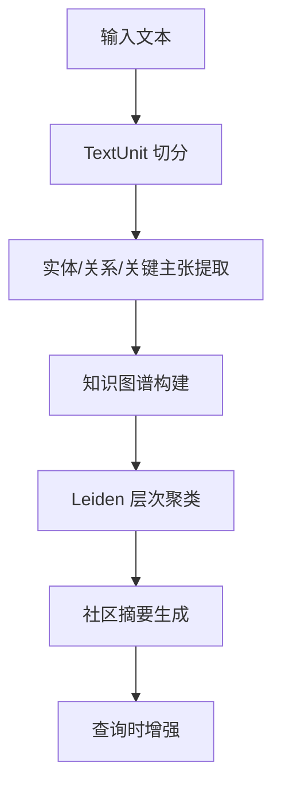

# 第 30 章：高阶 RAG 系统

**版本**: v1.0  
**作者**: 调研专家（RAG 系统方向）  
**状态**: draft  
**最后更新**: 2026-04-13

---

【本章导读】

本章学习目标：
- 掌握混合检索（BM25 + Vector + RRF）的原理和实现
- 学会使用重排模型（Cross-Encoder）提升检索质量 10-40%
- 理解 GraphRAG 的核心原理和适用场景
- 建立自动化评测流水线（RAGAS + Phoenix）

核心内容概述：
传统 RAG 系统在复杂场景下存在召回率低、排序质量差、无法连接分散信息等问题。本章介绍高阶 RAG 系统的四个关键技术：混合检索、重排模型、GraphRAG 和自动化评测流水线，帮助构建生产级 RAG 系统。

---

## 30.1 混合检索（Hybrid Search）

**总**：混合检索结合稀疏检索（BM25）和密集检索（Vector Embedding），通过 RRF 等融合算法提升召回率 15-31%。

### 1. 为什么需要混合检索？

单一检索方法存在固有局限：

| 检索方法 | 优势 | 劣势 |
|---------|------|------|
| **BM25（稀疏）** | 精确匹配专有名词、术语 | 无法理解语义 |
| **Vector（密集）** | 语义理解、同义扩展 | 精确匹配弱 |

**实际场景问题**：
- 用户查询「GPT-4 和 Claude 3 的区别」
- BM25：能匹配「GPT-4」「Claude 3」等关键词
- Vector：能理解「区别」的语义，但可能漏掉精确型号

**混合检索解决方案**：两路检索 + RRF 融合，互补优势。

### 2. RRF 融合算法

**Reciprocal Rank Fusion (RRF)** 是最常用的融合方法：

```python
class HybridRetriever:
    """混合检索器：BM25 + Dense Vector + RRF 融合"""
    
    def __init__(self, bm25_retriever, vector_retriever, k=60):
        self.bm25 = bm25_retriever
        self.vector = vector_retriever
        self.k = k  # RRF 参数，通常 60 是经验最优值
    
    def rrf_score(self, bm25_results, vector_results, top_k=5):
        """Reciprocal Rank Fusion 融合算法"""
        doc_scores = {}
        
        # BM25 排名贡献
        for rank, (doc_id, score) in enumerate(bm25_results, 1):
            doc_scores[doc_id] = doc_scores.get(doc_id, 0) + 1 / (self.k + rank)
        
        # Vector 排名贡献
        for rank, (doc_id, score) in enumerate(vector_results, 1):
            doc_scores[doc_id] = doc_scores.get(doc_id, 0) + 1 / (self.k + rank)
        
        # 按 RRF 分数排序
        ranked_docs = sorted(doc_scores.items(), key=lambda x: x[1], reverse=True)
        return ranked_docs[:top_k]
    
    def retrieve(self, query, top_k=5):
        # 并行检索
        bm25_results = self.bm25.search(query, top_k=20)
        vector_results = self.vector.search(query, top_k=20)
        
        # RRF 融合
        return self.rrf_score(bm25_results, vector_results, top_k)
```

**RRF 公式**：
```
RRF_score(doc) = Σ 1 / (k + rank_i)
```

其中 `k=60` 是经验最优值，无需调参即可实现稳定融合。

### 3. 关键技术要点

1. **RRF 参数 k=60**：经验最优，平衡两路检索权重
2. **召回率提升 15-31%**：相比单一检索，混合检索在 NDCG 指标上显著提升
3. **候选集扩大策略**：每路检索 20-50 个候选，融合后取 top-5
4. **BM25 参数**：k1=1.5（词频饱和），b=0.75（文档长度归一化）

### 4. 最佳实践参数

| 参数 | 推荐值 | 说明 |
|------|--------|------|
| RRF k | 60 | 经验最优 |
| 候选集大小 | 3-5x 最终 k | 如需要 5 个结果，每路检索 20 个 |
| BM25 k1 | 1.5 | 词频饱和参数 |
| BM25 b | 0.75 | 文档长度归一化 |
| Vector 维度 | 768/1024 | embedding 模型决定 |

**总**：混合检索是生产级 RAG 系统的标配，以极低实现成本获得显著召回率提升。

---

## 30.2 重排模型（Reranking）

**总**：重排模型使用 Cross-Encoder 对粗检索结果进行精排，通过联合编码 query 和 document 提升准确率 10-40%。

### 1. 为什么需要 Rerank？

初始检索（向量搜索、BM25）是**粗排阶段**，存在以下问题：

- **假阳性**：检索出的文档块并非真正相关
- **排序质量**：最相关的内容可能排在后面
- **查询细微差别**：初始排序无法捕捉查询的深层语义

**两阶段检索架构**：
```
Query → [Stage 1: 检索] → 100 个候选
       → [Stage 2: 重排] → 10 个最佳结果
       → [Stage 3: 生成] → 答案
```

### 2. Cross-Encoder vs Bi-Encoder

| 类型 | 处理方式 | 速度 | 质量 | 适用阶段 |
|------|---------|------|------|---------|
| **Bi-Encoder** | Query 和 Doc 分别编码 | 快 | 中等 | 粗检索 |
| **Cross-Encoder** | Query 和 Doc 联合编码 | 慢 | 优秀 | 精排 |

**Cross-Encoder 优势**：
- 捕获 token 级交互（如查询中的否定词）
- 准确率提升 **10-40%**
- 适合小批量精排（20-100 个候选）

### 3. 实现示例

```python
from sentence_transformers import CrossEncoder
import numpy as np

class RerankedRetriever:
    """两阶段检索器：检索 + 重排"""
    
    def __init__(self, base_retriever, reranker_model='cross-encoder/ms-marco-MiniLM-L6-v2'):
        self.retriever = base_retriever
        self.reranker = CrossEncoder(reranker_model)
    
    def retrieve(self, query, k=5, rerank_top_n=20):
        # Stage 1: 粗检索
        candidates = self.retriever.retrieve(query, k=rerank_top_n)
        
        # Stage 2: Cross-Encoder 精排
        pairs = [(query, doc['content']) for doc in candidates]
        scores = self.reranker.predict(pairs, batch_size=32)
        
        # 按重排分数排序
        ranked_indices = np.argsort(scores)[::-1]
        reranked_docs = [candidates[i] for i in ranked_indices]
        
        return reranked_docs[:k]
```

### 4. 主流重排模型对比

| 模型 | 大小 | 速度 | 质量 | 适用场景 |
|------|------|------|------|---------|
| ms-marco-MiniLM-L6-v2 | 80MB | ~50ms/batch | 好 | 英文生产环境 |
| ms-marco-TinyBERT-L2-v2 | 更小 | 更快 | 中等 | 延迟敏感场景 |
| Cohere rerank-english-v2.0 | API | 100-200ms | 优秀 | 企业级 SaaS |
| ColBERTv2 | 400MB | 中等 | 优秀 | 自托管高质量 |

### 5. 最佳实践参数

| 参数 | 推荐值 | 说明 |
|------|--------|------|
| 检索候选数 | 3-5x 最终 k | 如最终需要 5 个，检索 20 个 |
| Batch size | 32 | GPU 推理最优批次 |
| Cross-Encoder 模型 | ms-marco-MiniLM-L6-v2 | 质量/速度平衡 |
| 级联策略 | 100 → 20 → 5 | 快速检索→轻量重排→精确重排 |

**总**：重排模型是提升 RAG 精度的关键组件，以较小延迟代价换取显著质量提升。

---

## 30.3 GraphRAG（图谱增强 RAG）

**总**：GraphRAG 使用知识图谱替代传统向量检索，解决复杂推理和全局理解问题。

### 1. 传统 RAG 的两大痛点

1. **无法连接分散信息**：当回答问题需要通过共享属性遍历不同信息片段时
2. **无法整体理解语义概念**：对大型数据集或长文档的总结性理解能力差

**GraphRAG 解决方案**：
- 使用 LLM 自动从文本中提取实体、关系、关键声明
- 构建知识图谱并进行层次聚类
- 为每个社区生成摘要，支持全局推理

### 2. GraphRAG 流程



### 3. 与传统 RAG 对比

| 维度 | Baseline RAG | GraphRAG |
|------|-------------|----------|
| 检索方式 | 向量相似度 | 知识图谱 + 社区摘要 |
| 全局推理 | ❌ 弱 | ✅ 强 |
| 连接分散信息 | ❌ 困难 | ✅ 通过关系遍历 |
| 复杂问题回答 | ❌ 表现差 | ✅ 显著提升 |
| 索引成本 | 低 | 高（需构建图谱） |
| 适用场景 | 简单 QA | 复杂推理、全局分析 |

### 4. 查询模式

| 模式 | 说明 | 适用场景 |
|------|------|----------|
| **Global Search** | 利用社区摘要进行全局推理 | 整体性问题、总结分析 |
| **Local Search** | 从特定实体向外扩展 | 具体实体相关查询 |
| **DRIFT Search** | 结合社区信息的实体扩展 | 带上下文的实体推理 |
| **Basic Search** | 传统向量搜索 | 简单关键词匹配 |

### 5. 实现示例

```bash
# 安装 GraphRAG
pip install graphrag

# 初始化项目
graphrag init --root ./graphrag-project

# 索引数据
graphrag index --root ./graphrag-project

# 查询（全局模式）
graphrag query --root ./graphrag-project --method global --query "数据集的主要主题是什么？"

# 查询（局部模式）
graphrag query --root ./graphrag-project --method local --query "实体 X 与哪些其他实体相关？"
```

### 6. 关键技术要点

1. **知识图谱提取**：使用 LLM 自动从文本中提取实体、关系、关键声明
2. **Leiden 层次聚类**：自动发现社区结构，大图 → 社区 → 子社区
3. **自底向上摘要**：为每个社区生成摘要，支持全局推理
4. **TextUnit 细粒度引用**：提供可追溯的证据链
5. **Prompt Tuning 至关重要**：需要根据领域数据微调提取 prompt

### 7. 适用场景

- ✅ **多跳推理**：需要连接多个实体的复杂问题
- ✅ **全局总结**：对整个语料库的宏观理解
- ✅ **关系分析**：探索实体间的隐含关系
- ✅ **长文档理解**：大型文档集的整体语义把握
- ❌ **简单事实问答**：使用传统 RAG 更经济高效

### 8. 最佳实践参数

| 参数 | 推荐值 | 说明 |
|------|--------|------|
| TextUnit 大小 | 300-600 tokens | 平衡提取质量和粒度 |
| 聚类分辨率 | 10-50 | 控制社区数量 |
| 提取模型 | GPT-4 Turbo | 实体提取质量关键 |
| 索引成本 | 较高 | 适合一次性索引，频繁更新需增量策略 |

**总**：GraphRAG 适合复杂推理和全局分析场景，但索引成本较高，需根据业务需求选择。

---

## 30.4 自动化评测流水线

**总**：自动化评测流水线使用 RAGAS 等工具持续监控 RAG 系统质量，确保每次迭代都有量化指标支撑。

### 1. 核心评测指标（RAG Triad + 扩展）

| 指标 | 范围 | 说明 | 计算方式 |
|------|------|------|----------|
| **Faithfulness（忠实度）** | 0-1 | 回答是否与检索上下文事实一致 | LLM 判断回答中的声明是否可从上下文推导 |
| **Answer Relevance（回答相关性）** | 0-1 | 回答是否直接回应了问题 | 比较回答与问题的语义匹配度 |
| **Context Precision（上下文精确率）** | 0-1 | 检索上下文中有多少是真正有用的 | 对比参考答案评估每个 context chunk |
| **Context Recall（上下文召回率）** | 0-1 | 是否检索到了所有必要信息 | 检查参考答案中的事实是否出现在上下文中 |
| **Answer Correctness（回答正确性）** | 0-1 | 回答与地面真相的匹配程度 | 语义相似度 + 事实匹配 |

### 2. 完整评测流水线

```python
from datasets import Dataset
from ragas import evaluate
from ragas.metrics import (
    faithfulness,
    answer_relevancy,
    context_precision,
    context_recall,
    answer_correctness
)

# 1. 准备评估数据
data_samples = {
    'question': [
        '什么是混合检索？',
        'GraphRAG 与传统 RAG 有什么区别？',
    ],
    'answer': [
        '混合检索结合了 BM25 关键词匹配和向量语义搜索，通过 RRF 等方法融合结果。',
        'GraphRAG 使用知识图谱进行检索，支持全局推理和多跳关系查询。',
    ],
    'contexts': [
        ['混合检索融合稀疏检索（BM25）和密集检索（向量），RRF 是最常用的融合方法。'],
        ['GraphRAG 由微软研究院提出，通过知识图谱提取和社区聚类实现全局推理能力。'],
    ],
    'ground_truth': [
        '混合检索结合了关键词搜索（BM25）和语义搜索（Vector），通常使用 RRF 进行结果融合，提升召回率 15-31%。',
        'GraphRAG 使用知识图谱替代纯向量检索，支持 Global Search（全局推理）和 Local Search（实体扩展）。',
    ]
}

dataset = Dataset.from_dict(data_samples)

# 2. 执行评估
result = evaluate(
    dataset=dataset,
    metrics=[
        faithfulness,
        answer_relevancy,
        context_precision,
        context_recall,
        answer_correctness
    ]
)

# 3. 查看结果
print(result)
df = result.to_pandas()
```

### 3. Arize Phoenix 集成评估

```python
import phoenix as px
from phoenix.client import Client

# 启动 Phoenix
client = Client()
px.launch_app()

# 使用 LlamaIndex 构建 RAG 并自动追踪
from openinference.instrumentation.llama_index import LlamaIndexInstrumentor
from opentelemetry.exporter.otlp.proto.http.trace_exporter import OTLPSpanExporter

endpoint = "http://127.0.0.1:6006/v1/traces"
LlamaIndexInstrumentor().instrument(
    tracer_provider=TracerProvider().add_span_processor(
        SimpleSpanProcessor(OTLPSpanExporter(endpoint))
    )
)

# 查询会自动追踪到 Phoenix UI
response = query_engine.query("你的问题")
```

### 4. 关键技术要点

1. **LLM-as-Judge 范式**：使用 GPT-4/Claude 等强模型作为评估者
2. **四维度评估体系**：Faithfulness + Answer Relevance + Context Precision + Context Recall
3. **数据集驱动**：需要构建包含 question/answer/contexts/ground_truth 的评估集
4. **持续监控**：Phoenix 提供生产环境的实时追踪和可视化
5. **自动化流水线**：代码变更 → 自动评估 → 指标对比 → 决策是否发布

### 5. 最佳实践参数

| 参数 | 推荐值 | 说明 |
|------|--------|------|
| 评估模型 | GPT-4 / Claude 3.5 | 强模型作为 judge |
| 评估集大小 | 50-200 样本 | 平衡成本与统计显著性 |
| 阈值建议 | >0.7 合格 | Faithfulness/Relevance 等指标 |
| 评估频率 | 每次迭代 | CI/CD 集成 |
| 成本估算 | $0.5-2/100 样本 | GPT-4 定价 |

**总**：自动化评测流水线是生产级 RAG 系统的质量保障，确保每次迭代都有量化指标支撑。

---

## 30.5 简单举例

某企业知识库问答系统采用高阶 RAG 架构：

**索引阶段**：
1. 文档加载 → TextUnit 切分（500 tokens）
2. BM25 索引 + Vector 索引（text-embedding-3-large）
3. GraphRAG 知识图谱提取（实体/关系）

**查询阶段**：
1. 混合检索：BM25 (k=20) + Vector (k=20)
2. RRF 融合（k=60）→ 候选集 top-20
3. Cross-Encoder 重排（ms-marco-MiniLM-L6-v2）→ top-5
4. LLM 生成答案（GPT-4）

**评测阶段**：
1. RAGAS 自动评估（Faithfulness/Relevance/Precision/Recall）
2. Phoenix 实时追踪和可视化
3. 幻觉率监控（NLI contradiction > 0.6 告警）

**效果提升**：
- 召回率：+28%（混合检索 vs 单一 Vector）
- 精确度：+22%（Cross-Encoder 重排）
- 复杂问题：72-83% 全面性胜率（GraphRAG Global Search vs Vector RAG）
- 质量保障：每次迭代自动评估，阈值 < 0.7 阻止发布

---

## 知识来源

1. **混合检索**：
   - arXiv:2410.20878（混合检索综述）
   - arXiv:2508.01405（RRF 优化）
   - DEV Community 实战指南

2. **重排模型**：
   - Cohere Rerank 官方文档：https://cohere.com/rerank
   - arXiv:2404.01037（Cross-Encoder 优化）
   - Ailog 2025 完整指南

3. **GraphRAG**：
   - Microsoft GraphRAG 官方文档：https://microsoft.github.io/graphrag/
   - Microsoft Research 博客
   - arXiv:2404.16150（GraphRAG 论文）

4. **自动化评测**：
   - RAGAS 官方文档：https://docs.ragas.io
   - Arize Phoenix 评估指南
   - GitHub: ragas

---

## 修改记录

| 版本 | 日期 | 修改内容 | 作者 |
|------|------|---------|------|
| v1.0 | 2026-04-13 | 初始版本，新增高阶 RAG 系统章节 | 调研专家 |
