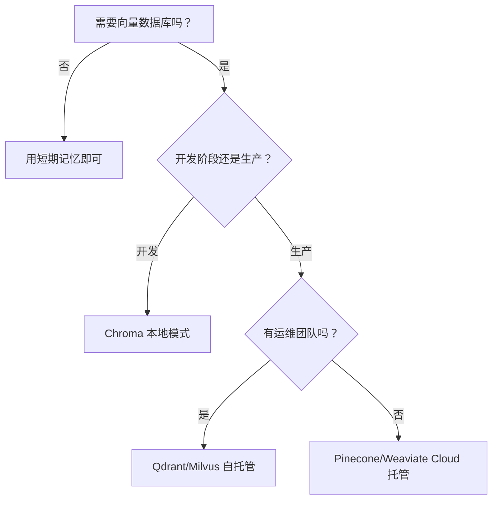

# 第 3 章：开发环境搭建

**版本**: v2.6 (2026-03-23 全书完成)
**作者**: 内容撰写专家（基础篇） + 内容修正专家 1  
**状态**: draft  
**最后更新**: 2026-03-23  
**字数**: 约 5100 字

---

## 本章涉及面试题

- Agent 开发为什么首选 Python？其他语言有什么优劣势？
- 如何选择合适的 LLM 提供商？多提供商策略有什么优势？
- 向量数据库有哪些选型？开发阶段和生产阶段如何选择？
- Agent 开发需要哪些特殊的调试工具？与传统调试有什么区别？
- 如何测试概率性输出的 Agent？有哪些测试策略？
- 推荐的项目目录结构是什么？各目录的职责是什么？

---

## 本章概述

**学习目标**：
1. 掌握 Agent 开发的技术栈选择原则（编程语言、LLM 提供商、向量数据库）
2. 熟悉 Agent 开发工具链（IDE、调试工具、测试框架、日志监控）
3. 理解项目结构规范（目录组织、配置管理、依赖管理）
4. 能够搭建符合漫剧生成场景的开发环境

**核心知识点**：
- 技术栈选择：Python 生态、LLM 提供商对比、向量数据库选型
- 开发工具链：IDE 与调试、测试框架、日志与监控
- 项目结构：目录组织、配置与环境分离、依赖版本锁定

---

## 3.1 技术栈选择

技术栈选择是 Agent 开发的第一步，直接影响开发效率、运行成本和系统可扩展性。本章从编程语言、LLM 提供商、向量数据库三个维度给出选型建议与决策依据。

### 1. 编程语言（Python 为主）

**问题**：Agent 开发应该选择什么编程语言？为什么 Python 是主流选择？

**为什么需要**：漫剧剧本生成项目需要选择合适的编程语言，影响框架生态、开发效率、团队协作。选错语言可能导致框架支持不足、开发效率低下。

**解决方案**：

#### Python 优势分析

| 优势 | 说明 | 案例 |
|------|------|------|
| **生态丰富** | LangChain (v0.3+)、AutoGen (v0.4+)、OpenClaw 等框架 | 漫剧项目可直接使用 LangChain 的记忆模块 |
| **语法简洁** | 代码量少，易于理解 | 同样的功能，Python 代码量约为 Java 的 1/3 |
| **AI/ML 库完善** | NumPy、Pandas、PyTorch、Transformers | 可直接使用 HuggingFace 的 **Embedding 模型**（向量嵌入模型） |
| **社区活跃** | 问题容易找到答案 | StackOverflow 上 Agent 相关问题 90% 有 Python 解答 |

#### 其他语言对比

| 语言 | 优势 | 劣势 | 适用场景 |
|------|------|------|---------|
| **JavaScript/TypeScript** | 前端集成方便，Node.js 生态 | Agent 框架较少 | 需要与前端深度集成的场景 |
| **Go** | 高性能，并发能力强 | Agent 框架生态不成熟 | 高并发 API 服务 |
| **Java** | 企业级支持好，类型安全 | 代码冗长，AI 库较少 | 大型企业系统集成 |
| **Python** | 生态丰富，开发效率高 | 性能相对较低 | **Agent 开发首选** |

> **最佳实践**：除非有特殊原因（如团队只熟悉 Java、需要与现有 Java 系统集成），否则 Agent 开发首选 Python。

#### 版本要求与环境管理

**Python 版本要求**：
- **最低版本**：Python 3.10+（支持新特性、框架兼容）
- **推荐版本**：Python 3.11 或 3.12（性能提升，长期支持）
  - **性能提升**：Python 3.11 比 3.10 性能提升约 25%（官方基准测试）
  - **框架兼容性**：LangChain v0.3+ 要求 Python 3.10+，主流 AI 库已全面支持 3.11+
  - **长期支持**：Python 3.11 支持至 2027 年 10 月，3.12 支持至 2028 年 10 月
- **避免版本**：Python 3.9 及以下（部分新特性不支持，主流框架逐步停止支持）

**环境管理工具对比**：

| 工具 | 说明 | 优点 | 缺点 | 适用场景 |
|------|------|------|------|---------|  
| **venv** | Python内置虚拟环境 | 无需安装，简单 | 功能基础 | 简单项目 |
| **conda** | 跨平台环境管理 | 支持非Python依赖 | 体积大，启动慢 | 数据科学/AI项目 |
| **pyenv** | Python版本管理 | 多版本共存 | 需配合venv使用 | 需要多Python版本 |
| **Poetry** | 依赖管理+虚拟环境 | 现代化，功能全 | 学习成本 | 中大型项目 |
| **uv** ⭐ | 现代包管理器（Rust编写） | 极快（10-100x pip），兼容性好 | 相对较新（2024年发布） | **新项目首选** |

**建议**（2026年最新）：
- **新项目**: 推荐使用**uv**（速度极快，已被LangChain等主流项目推荐）
- **简单项目**: venv（内置，无需额外安装）
- **中大型项目**: Poetry或uv
- **多Python版本**: pyenv + venv/uv组合
- **数据科学**: conda（支持非Python依赖，如CUDA）

> **uv简介**：2024-2025年最火的Python包管理工具，用Rust编写，比pip快10-100倍，兼容pip/venv/Poetry工作流，单一工具可替代pip+venv+Poetry。

> **注意**：不要使用系统 Python，始终在虚拟环境中开发。这能避免依赖冲突，保证项目可复现。

---

### 2. LLM 提供商选择

**问题**：如何选择 LLM API 提供商？单提供商还是多提供商？

**为什么需要**：漫剧生成中，创意沟通需要长文本支持，正文生成需要高质量输出，审核需要合规检查。单一提供商难以满足所有需求。

**解决方案**：

#### 国际提供商对比

| 提供商 | 代表模型 | 优势 | 劣势 | 适用场景 |
|--------|---------|------|------|---------|
| **OpenAI** | GPT-4、GPT-4o | 质量高，生态完善 | 成本高，国内访问受限 | 高质量内容生成 |
| **Anthropic** | Claude 3 系列 | 长文本支持好（200K） | API 稳定性一般 | 长文档处理、创意沟通 |
| **Google** | Gemini 系列 | 多模态能力强 | 国内无法访问 | 图像理解场景 |

#### 国内提供商对比

| 提供商 | 代表模型 | 优势 | 劣势 | 适用场景 |
|--------|---------|------|------|---------|
| **通义千问** | Qwen-Max | 中文能力强，合规 | 英文能力稍弱 | 中文内容生成 |
| **文心一言** | ERNIE Bot | 百度生态集成 | 通用能力一般 | 百度搜索相关场景 |
| **智谱 GLM** | GLM-4 | 性价比高 | 生态相对较小 | 成本敏感场景 |
| **月之暗面** | Kimi | 长文本支持好 | 新厂商，稳定性待验证 | 长文档处理 |

#### 选择维度

| 维度 | 说明 | 评估方法 |
|------|------|---------|
| **模型能力** | 语言理解、生成质量、多模态 | 用实际任务测试（如生成漫剧大纲） |
| **API 成本** | 输入/输出 **Token**（词元）价格 | 计算典型任务成本（如生成 1 章漫剧） |
| **响应速度** | API 延迟、并发限制 | 压力测试（如 10 并发请求） |
| **合规要求** | 数据出境、内容审核 | 咨询法务，确认合规要求 |

**术语说明**：**Token**（词元）是 LLM 处理文本的基本单位，1 个 Token 约 0.75 个英文单词或 1.5 个汉字。**API Key**（API 密钥）是访问 API 服务的身份凭证。

#### 多提供商策略

**优势**：
- **主备切换**：主提供商故障时切换到备用
- **成本优化**：简单任务用便宜模型，复杂任务用高质量模型
- **能力互补**：不同模型擅长不同任务

**漫剧生成多提供商案例**：
- **创意沟通**：用 Claude（长文本支持好，能记住多轮对话）
- **正文生成**：用 GPT-4（生成质量高）
- **审核**：用国产模型（合规，内容安全）

> **最佳实践**：不要只用一个提供商。建议至少配置 2 个提供商（1 个主用，1 个备用），成本允许的话配置 3 个（主用 + 备用 + 专用）。

> **注意**：多提供商需要统一的 API 封装层，避免业务代码与具体提供商耦合。建议设计统一的 `LLMProvider` 接口，各提供商实现该接口。

---

### 3. 向量数据库（可选）

**问题**：向量数据库有哪些选型？开发阶段和生产阶段如何选择？

**为什么需要**：漫剧设定管理需要长期记忆，支持跨会话检索。向量数据库是长期记忆的核心组件，选型影响检索效果与系统成本。

**解决方案**：

#### 向量数据库选型对比

| 类型 | 代表产品 | 优点 | 缺点 | 适用场景 |
|------|---------|------|------|---------|
| **托管服务** | Pinecone、Weaviate Cloud | 易用，免运维，高可用 | 成本较高，数据出境 | 生产环境，团队无运维能力 |
| **自托管** | Qdrant、Milvus、Weaviate | 可控，成本灵活，数据本地 | 需运维，高可用需自建 | 生产环境，有运维团队 |
| **嵌入式** | Chroma 本地模式、LanceDB | 零配置，开发友好，免费 | 不适合高并发，单进程 | **开发阶段首选** |

#### 详细对比

**Pinecone（托管）**：
- **优势**：开箱即用，自动扩展，支持索引优化
- **劣势**：按存储和查询计费，成本较高
- **定价**：免费层（1 个项目），付费层从$25/月起

**Qdrant（自托管）**：
- **优势**：高性能，支持过滤查询，Rust 编写
- **劣势**：需自行部署运维，高可用需配置集群
- **部署**：Docker 一键部署，Kubernetes 支持

**Chroma（嵌入式）**：
- **优势**：零配置，Python 原生，开发友好
- **劣势**：单进程，不适合生产高并发
- **适用**：本地开发，原型验证
- **当前版本**：v0.5+

> **最佳实践**：开发阶段用嵌入式（Chroma 本地模式），生产阶段根据团队能力选择托管（Pinecone）或自托管（Qdrant）。不要一开始就用生产级向量数据库，增加不必要的复杂度。

#### 选型决策树



> **注意**：向量数据库不是必须的。简单场景（如只需保存少量设定）可用 JSON 文件或关系数据库。向量数据库的核心优势是语义检索（「意思相近」的模糊匹配）。

---

**本节小结**：技术栈选择以 Python 3.10+ 为主（生态丰富、开发效率高），LLM 提供商根据能力/成本/合规选择（建议多提供商策略），向量数据库按需选型（开发阶段用嵌入式如 Chroma，生产阶段用托管或自托管）。

---

## 3.2 开发工具链

开发工具链是 Agent 开发的「武器库」，包括 IDE 与调试工具、测试框架、日志与监控。Agent 开发有特殊性（概率性输出、多组件交互），需要特殊的工具支持。

### 1. IDE 与调试工具

**问题**：Agent 开发用什么 IDE？调试与传统开发有什么区别？

**为什么需要**：漫剧生成项目开发中，需编写代码、调试 Agent 决策过程、查看执行轨迹。选择合适的工具能提升开发效率。

**解决方案**：

#### IDE 选择对比

| IDE | 优势 | 劣势 | 适用场景 |
|-----|------|------|---------|
| **VS Code** | 免费，插件丰富，轻量 | 大型项目性能一般 | **主流选择** |
| **PyCharm** | 专业 Python 支持，重构强大 | 收费，重量级 | 专业 Python 开发 |
| **Jupyter** | 交互式探索，可视化好 | 不适合生产代码 | 数据探索，原型验证 |

**术语说明**：**IDE**（集成开发环境，Integrated Development Environment）是代码编辑、调试、运行的综合工具。

**推荐配置（VS Code）**：
- **Python 插件**：Python、Pylance（类型检查）
- **调试插件**：Python Debugger
- **格式插件**：Black、isort（代码格式化）
- **Git 插件**：GitLens（版本管理）

#### 调试工具对比

| 工具 | 说明 | 适用场景 |
|------|------|---------|
| **pdb** | Python 内置调试器（Python Debugger） | 简单调试，无需额外安装 |
| **VS Code Debugger** | 图形化断点调试 | 主流选择，可视化好 |
| **logging 模块** | 日志调试 | 生产环境，问题排查 |
| **Trace 工具** | 执行轨迹记录 | **Agent 专用**，查看决策过程 |

> **关键定义**：Agent 调试与传统调试不同。传统调试关注「代码是否按预期执行」，Agent 调试还需关注「LLM 决策是否合理」「工具调用是否正确」「记忆检索是否准确」。

#### Agent 专用调试

**轨迹记录（Trace）**：
- **记录内容**：每轮决策的思考过程、工具调用、API 请求/响应
- **工具**：LangSmith（LangChain 官方）、Arize Phoenix、自研 Trace 系统
- **用途**：复现问题、分析决策质量、优化 Prompt

**思维链可视化**：
- **目的**：查看 LLM 的推理过程（Thought-Action-Observation 循环）
- **实现**：在 Prompt 中要求 LLM 输出思考过程，记录并展示
- **案例**：漫剧大纲生成中，查看 LLM 如何分解任务、如何决定章节顺序

> **最佳实践**：开发阶段开启详细日志（DEBUG 级别），记录所有 LLM 请求/响应。生产阶段降级为 INFO 级别，仅记录关键事件。

---

### 2. 测试框架

**问题**：如何测试 Agent？Agent 输出是概率性的，如何保证测试可靠性？

**为什么需要**：漫剧生成项目中，需测试工具函数、Agent 与向量数据库交互、完整生成流程。不测试会导致线上问题频发。

**解决方案**：

#### 测试类型对比

| 测试类型 | 说明 | 测试内容 | 工具 |
|---------|------|---------|------|
| **单元测试** | 测试单个函数/类 | 工具函数、数据处理函数 | pytest、unittest |
| **集成测试** | 测试组件间交互 | Agent 与向量数据库、Agent 与 LLM API | pytest + mock |
| **端到端测试** | 测试完整流程 | 从输入到输出的完整生成流程 | pytest + 固定种子 |

#### 测试示例

**单元测试**：测试文本分块函数，断言 chunk 数量正确、每个 chunk 长度合规、重叠部分正确。

**集成测试**：测试 Agent 与向量数据库交互，断言检索结果与存储内容一致、相似度超过阈值。

**端到端测试**：测试完整漫剧大纲生成流程，断言输出格式正确、章节数符合要求。

#### Agent 特殊测试策略

**问题**：LLM 输出是概率性的，同样的输入可能产生不同的输出，如何测试？

**解决方案**：

| 策略 | 说明 | 适用场景 |
|------|------|---------|
| **固定种子** | 设置 LLM 的 random seed | 开发阶段，保证输出可复现 |
| **范围检查** | 不检查具体输出，检查输出范围 | 生产阶段，如「输出长度在 100-500 字之间」 |
| **格式检查** | 检查输出格式，不检查内容 | 所有场景，如「输出是合法 JSON」 |
| **回归测试** | 对比历史输出，检查是否有大变化 | 版本升级时 |

> **关键定义**：Agent 不是「无法测试」，而是需要特殊的测试策略。核心思路是：不测试具体输出内容（因为概率性），测试输出格式、范围、关键特征。

> **注意**：不要测试 LLM 本身的输出质量（那是模型的事），测试 Agent 的逻辑是否正确（如是否正确调用工具、是否正确处理响应）。

---

### 3. 日志与监控

**问题**：如何记录 Agent 运行日志？如何监控 Agent 运行状态？

**为什么需要**：漫剧生成平台中，需记录每次生成的 Token 用量与耗时，监控错误率，设置告警阈值。没有日志监控，无法发现性能问题与异常。

**解决方案**：

#### 日志级别使用规范

| 级别 | 说明 | 使用场景 |
|------|------|---------|
| **DEBUG** | 详细调试信息 | 开发阶段，记录所有 LLM 请求/响应 |
| **INFO** | 一般运行信息 | 生产阶段，记录关键事件（任务开始/完成） |
| **WARNING** | 警告信息 | 非致命问题（如 API 重试） |
| **ERROR** | 错误信息 | 致命问题（如 API 调用失败、数据丢失） |

#### 日志格式规范

**结构化日志（JSON 格式）**：包含 timestamp、level、module、trace_id、message、extra 等字段。

**优势**：便于日志分析工具解析（如 ELK、Loki）、支持字段级搜索、便于聚合统计。

#### 日志存储方案

| 方案 | 说明 | 优点 | 缺点 |
|------|------|------|------|
| **本地文件** | 日志写入本地文件 | 简单，无需额外服务 | 难以集中分析 |
| **集中式日志服务** | ELK、Loki、Splunk | 集中管理，支持搜索告警 | 需运维，成本较高 |
| **云日志服务** | AWS CloudWatch、阿里云 SLS | 免运维，按需付费 | 数据出境，成本较高 |

**建议**：小型项目用本地文件 + 日志轮转（log rotation），中型项目用 Loki，大型项目用 ELK 或云服务。

#### 监控指标

| 指标 | 说明 | 告警阈值 |
|------|------|---------|
| **响应时间** | 任务完成耗时 | P95 > 30 秒告警 |
| **Token 用量** | 每次任务的 Token 消耗 | 单日用量超预算告警 |
| **错误率** | 失败任务占比 | 错误率 > 5% 告警 |
| **成功率** | 成功完成任务占比 | 成功率 < 90% 告警 |

**漫剧生成平台监控案例**：记录每次生成的 Token 用量与耗时，监控错误率（5% 告警阈值），监控 Token 用量（接近预算上限时告警）。

> **最佳实践**：日志需平衡信息量与存储成本。开发阶段用 DEBUG，生产阶段用 INFO，关键事件必须记录。

---

**本节小结**：开发工具链包括 IDE 与调试工具（VS Code + Trace 工具）、测试框架（pytest + 固定种子/范围检查/格式检查）、日志与监控（结构化日志 + 关键指标监控），Agent 开发需特别关注轨迹记录与概率性输出测试。

---

## 3.3 项目结构规范

项目结构规范是 Agent 开发的「蓝图」，良好的结构便于维护与扩展。本章推荐按组件职责组织目录（agents/、tools/、memory/），配置与环境分离，依赖版本锁定确保可复现。

### 1. 推荐的目录组织

**问题**：Agent 项目应该如何组织目录结构？

**为什么需要**：漫剧剧本生成项目包含创意沟通、大纲生成、正文生成等模块，清晰的目录结构使各组件职责明确，便于多 Agent 协作开发与后续维护。

**解决方案**：

#### 推荐目录结构

```
project-root/
├── src/
│   ├── agents/          # Agent 核心逻辑
│   │   ├── perception/  # 感知层（输入处理、上下文管理）
│   │   ├── decision/    # 决策层（任务分解、规划）
│   │   ├── execution/   # 执行层（工具调用、API 集成）
│   │   └── memory/      # 记忆层（向量数据库、状态管理）
│   ├── tools/           # 工具实现
│   │   ├── llm_api/     # LLM API 封装
│   │   ├── storage/     # 存储工具（文件、数据库）
│   │   └── external/    # 外部服务集成（审核、支付）
│   ├── memory/          # 记忆层实现（可与 agents/memory 合并）
│   │   ├── short_term/  # 短期记忆
│   │   ├── long_term/   # 长期记忆（向量数据库）
│   │   └── working/     # 工作记忆（任务状态）
│   └── utils/           # 工具函数
├── configs/             # 配置文件
│   ├── base.yaml        # 基础配置
│   ├── development.yaml # 开发环境配置
│   └── production.yaml  # 生产环境配置
├── tests/               # 测试代码
│   ├── unit/            # 单元测试
│   ├── integration/     # 集成测试
│   └── e2e/             # 端到端测试
├── docs/                # 文档
│   ├── api/             # API 文档
│   ├── guides/          # 使用指南
│   └── architecture/    # 架构设计文档
├── scripts/             # 脚本（部署、数据迁移）
├── requirements.txt     # 依赖列表（或 pyproject.toml）
└── README.md            # 项目说明
```

#### 各目录职责说明

| 目录 | 职责 | 示例文件 |
|------|------|---------|
| **src/agents/** | Agent 核心逻辑（感知/决策/执行/记忆） | `src/agents/decision/task_planner.py` |
| **src/tools/** | 工具实现（API 封装、外部服务集成） | `src/tools/llm_api/openai_client.py` |
| **src/memory/** | 记忆层实现（向量数据库、状态管理） | `src/memory/long_term/vector_store.py` |
| **configs/** | 配置文件（环境配置、模型配置） | `configs/production.yaml` |
| **tests/** | 测试代码（单元测试、集成测试、端到端测试） | `tests/unit/test_chunk_text.py` |
| **docs/** | 文档（API 文档、使用指南） | `docs/guides/quickstart.md` |

> **最佳实践**：目录结构不是越复杂越好，而是「职责清晰、便于查找」。小型项目可简化（如合并 agents/和 memory/），大型项目可进一步细分（如按业务模块分目录）。

---

### 2. 配置管理

**问题**：如何管理配置？如何区分不同环境的配置？

**为什么需要**：漫剧生成项目中，开发环境用便宜的模型，生产环境用高质量模型；开发环境用本地向量数据库，生产环境用托管服务。配置管理不当会导致环境混淆、敏感信息泄露。

**解决方案**：

#### 配置文件格式

| 格式 | 优点 | 缺点 | 适用场景 |
|------|------|------|---------|
| **YAML** | 可读性好，支持注释（YAML Ain't Markup Language） | 需额外库解析 | **推荐** |
| **JSON** | 原生支持，解析快（JavaScript Object Notation） | 不支持注释 | 简单配置 |
| **TOML** | 语法简洁，类型明确（Tom's Obvious Minimal Language） | 生态相对较小 | Python 项目（Poetry 默认） |

#### 分层配置

**基础配置（base.yaml）**：所有环境共享的配置（App 名称、版本、默认模型、短期记忆窗口大小）。

**环境配置（development.yaml / production.yaml）**：开发环境用便宜模型（gpt-3.5-turbo）和本地向量数据库（chroma_local），生产环境用高质量模型（claude-3-opus）和托管服务（pinecone）。

#### 环境变量管理

**敏感信息**（API Key、数据库密码）通过环境变量注入。配置文件提交到 Git（不含敏感信息），.env 文件不提交到 Git。

> **注意**：严禁将 API Key 硬编码在代码中！务必使用环境变量或密钥管理服务（如 AWS Secrets Manager）。

#### 配置加载与验证

**配置加载流程**：启动时加载基础配置→根据环境变量加载环境配置→合并配置（环境配置覆盖基础配置）→从环境变量读取敏感信息→验证配置完整性与合法性。

**配置验证**：检查 llm.api_key 是否存在、llm.model 是否是支持的模型、memory.vector_db 是否是支持的数据库。

---

### 3. 依赖管理

**问题**：如何管理项目依赖？如何保证不同环境依赖一致？

**为什么需要**：漫剧生成项目依赖 LangChain、Chroma、OpenAI 等库，不锁定版本会导致不同环境安装不同版本，引发兼容性问题。

**解决方案**：

#### 依赖管理工具对比

| 工具 | 说明 | 优点 | 缺点 |
|------|------|------|------|
| **requirements.txt** | Python 传统依赖管理 | 简单，通用 | 功能基础 |
| **pyproject.toml** | 现代 Python 项目标准 | 功能全，Poetry/pip 都支持 | 学习成本 |
| **Pipfile** | Pipenv 专用 | 自动锁定版本 | 生态较小 |

**建议**：新项目用 pyproject.toml（现代标准），老项目继续用 requirements.txt。

#### 版本锁定

**为什么需要**：不锁定依赖版本，导致不同环境安装不同版本引发问题。

**锁定方式**：
- **requirements-lock.txt**：`pip freeze > requirements-lock.txt`
- **poetry.lock**：Poetry 自动生成
- **pipenv.lock**：Pipenv 自动生成

**依赖分组**：主依赖（langchain ^0.3.0、chromadb ^0.5.0）和开发依赖（pytest ^8.0.0、black ^24.0.0）分开管理。

> **最佳实践**：始终锁定依赖版本，用 `pip install -r requirements-lock.txt` 或 `poetry install` 确保所有开发者环境一致。

---

**本节小结**：项目结构按组件职责组织（agents/、tools/、memory/），配置与环境分离（基础配置 + 环境配置 + 环境变量），依赖版本锁定确保可复现（requirements-lock.txt 或 poetry.lock）。

---

## 3.4 简单举例

### 案例设计
- 案例名称：漫剧剧本生成项目的目录结构
- 涉及知识点：开发环境搭建、项目结构规范、配置管理、依赖管理
- 案例目标：帮助理解如何组织一个支持多 Agent 协作的漫剧项目的目录结构
- 案例内容要点：
  * 场景描述：创建包含创意沟通、大纲生成、正文生成等模块的漫剧剧本生成项目
  * 技术应用：按 src/agents/、src/tools/、src/memory/、configs/、tests/组织目录，用 pyproject.toml 管理依赖，配置文件与环境分离
  * 效果说明：清晰的项目结构使各组件职责明确，便于多 Agent 协作开发与后续维护
- 注意事项：不展开各 Agent 的具体实现细节（见第 9-13 章）

---

**知识来源**:
- Python 官方文档：venv 虚拟环境 - https://docs.python.org/3/library/venv.html
- LangChain 官方文档：Installation (v0.3+) - https://python.langchain.com/docs/introduction/installation
- 12-Factor App 配置规范 - https://12factor.net/config

---

**修改记录**:
- v2.3 (2026-03-23): 审核修正 - 补充 Python 版本选择依据（性能提升 25%、框架兼容性）、统一时间标注为「年份 + 季度」
- v2.2 (2026-03-23): 量化标准检查 - 术语定义精简至≤30 字、统一格式
- v2.1 (2026-03-23): 首次出现必定义 - 补充 Token、Embedding 模型、API Key、IDE、pdb、YAML/JSON/TOML、venv 定义
- v2.0 (2026-03-23): 文字编辑润色 - 简化句子、删除重复、优化段落
- v1.2 (2026-03-22): 根据编辑统筹意见修改 — 规范知识来源格式（2-3 个权威来源）
- v1.1 (2026-03-22): 根据编辑统筹意见优化 — 补充框架版本号、更新文档链接、精简字数
- v1.0 (2026-03-22): 初稿完成
