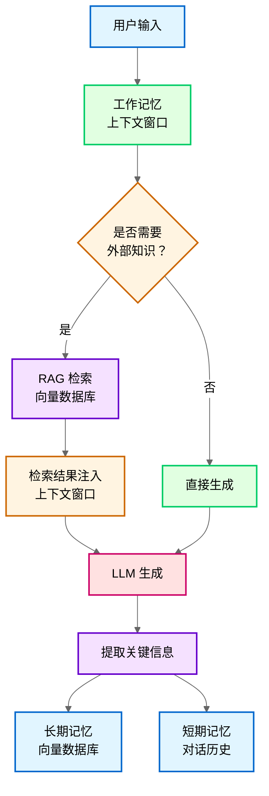
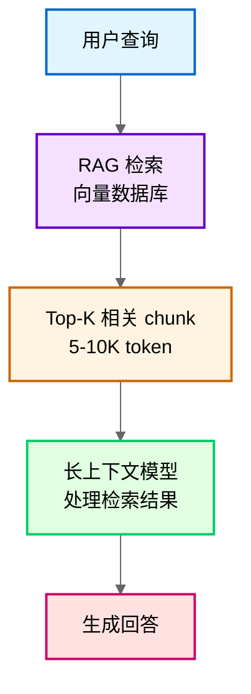
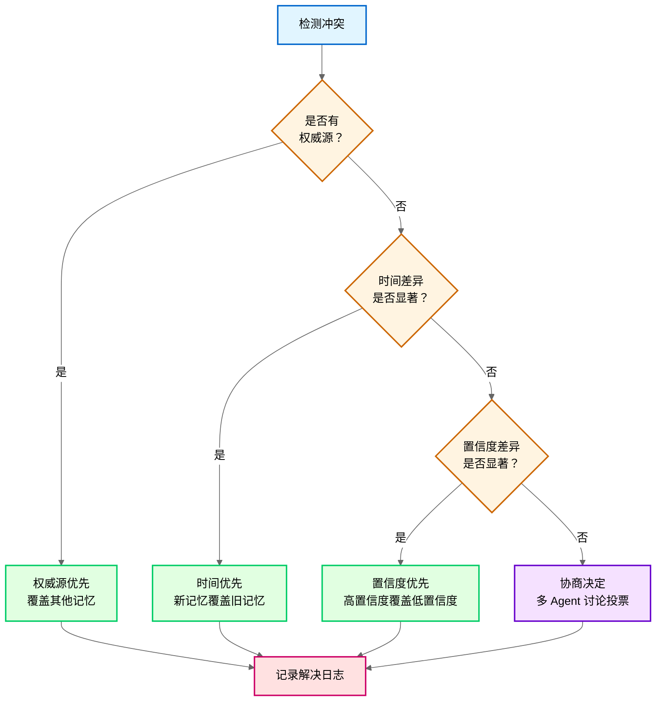

# 第 13 章：RAG 与记忆管理

**版本**: v1.0  
**作者**: 内容撰写专家（RAG 方向）  
**状态**: draft  
**最后更新**: 2026-04-15

---

【本章导读】

RAG（检索增强生成）与记忆管理是 Agent 系统中密切相关的两大模块。RAG 负责从外部知识库检索信息，记忆系统负责维护 Agent 的上下文状态和历史信息。两者的有效集成决定了 Agent 能否在复杂场景中保持一致性和准确性。

**学习目标**：
- 理解 Agent 记忆系统的分层架构（工作记忆、短期记忆、长期记忆）
- 掌握将 RAG 集成到记忆层的设计模式与技术要点
- 能够设计增量索引更新策略，平衡实时性与索引质量
- 理解长上下文模型与 RAG 的对比及混合架构
- 掌握多源记忆冲突检测与解决策略

本章内容达到大厂 Agent 开发面试水平，重点回答「RAG 如何与记忆系统集成」「索引如何动态更新」「长上下文能否替代 RAG」「多源记忆冲突如何处理」等核心问题。

---

## 13.1 记忆层设计

**总**：Agent 记忆系统分为工作记忆（上下文窗口）、短期记忆（对话历史）、长期记忆（向量数据库）三层，分别负责速度、连贯性和知识持久化，三者协同形成完整的记忆体系。

### 1. 记忆层架构

> **与第 2 章的呼应**：
>
> RAG 是记忆层的「外部扩展」，工作记忆是「内部缓存」。两者配合形成完整的记忆体系：

| 维度 | RAG（外部记忆） | 工作记忆（内部缓存） | 长期记忆（向量库） |
|------|---------------|-------------------|------------------|
| **存储位置** | 向量数据库 | 上下文窗口 | 向量数据库 |
| **容量** | 近乎无限 | 有限（8K-128K token） | 近乎无限 |
| **检索方式** | 向量检索 + rerank | 直接访问 | 向量检索 |
| **更新频率** | 按需更新 | 每轮对话更新 | 按需更新 |
| **典型用途** | 知识库检索 | 短期对话历史 | 用户设定/偏好 |

**设计原则**：
- **RAG 负责「广度」**：海量知识检索，覆盖所有领域知识
- **工作记忆负责「速度」**：快速访问近期信息，支持实时交互
- **长期记忆负责「深度」**：用户个性化信息，持久化存储

三者协同工作，详见第 2.3 节（记忆层架构设计）。

### 2. 工作记忆（Working Memory）

**定义**：工作记忆是 Agent 的「内部缓存」，存储在当前上下文窗口中，用于快速访问近期信息。

**核心特性**：
- **容量有限**：受 LLM 上下文窗口限制（8K-128K token）
- **访问速度快**：无需检索，直接访问（延迟<10ms）
- **生命周期短**：仅在单次对话会话中有效

**管理策略**：
- **滑动窗口**：保留最近 N 轮对话（N=5-10）
- **摘要压缩**：对历史对话进行摘要，节省上下文空间
- **关键信息提取**：提取重要信息（如用户偏好、关键决策）存入长期记忆

### 3. 短期记忆（Short-term Memory）

**定义**：短期记忆存储近期对话历史和上下文信息，用于维持对话连贯性。

**核心特性**：
- **容量中等**：通常存储最近 10-50 轮对话
- **结构化存储**：按对话轮次组织，支持时间线查询
- **可检索**：通过关键词或语义检索历史对话

**应用场景**：
- **上下文延续**：「刚才说的那个角色叫什么？」
- **信息回溯**：「我之前提到的设定是什么？」
- **状态管理**：跟踪任务进度、用户意图变化

### 4. 长期记忆（Long-term Memory）

**定义**：长期记忆存储持久的知识，包括用户设定、偏好、领域知识等，通过向量数据库实现持久化和检索。

**核心特性**：
- **容量近乎无限**：受向量数据库容量限制（百万级文档）
- **持久化存储**：跨会话保留，永久有效
- **语义检索**：通过向量检索访问相关知识

**技术实现**：
- **向量数据库**：Pinecone、Milvus、Chroma、Weaviate
- **索引结构**：HNSW（Hierarchical Navigable Small World）、IVF（Inverted File Index）
- **嵌入模型**：text-embedding-ada-002、bge-large、m3e

**记忆层数据流**：



**流程说明**：
1. 用户输入进入工作记忆（上下文窗口）
2. 判断是否需要外部知识（通过查询分析或 RAG 路由）
3. 需要时触发 RAG 检索，从长期记忆（向量数据库）检索相关知识
4. 检索结果注入上下文窗口，LLM 生成回答
5. 提取关键信息存入长期记忆（如用户偏好、新设定）和短期记忆（对话历史）

---

## 13.2 RAG 与记忆集成

**总**：RAG 与记忆集成有三种模式（独立架构、统一架构、混合架构），核心设计决策是「RAG 作为记忆的一部分还是独立模块」，需要根据查询模式、知识类型和更新频率选择合适模式。

### 1. 集成模式对比

**独立架构（RAG 与记忆分离）**

- **架构**：RAG 模块和记忆模块独立，各自维护自己的向量数据库
- **数据流**：用户查询 → RAG 检索（知识库）+ 记忆检索（对话历史）→ 合并结果 → LLM 生成
- **优势**：
  - 职责清晰：RAG 负责知识库，记忆负责对话历史
  - 独立优化：可分别优化检索策略和索引结构
  - 故障隔离：RAG 故障不影响记忆检索
- **劣势**：
  - 数据冗余：相同信息可能存储在两个数据库
  - 检索冲突：RAG 和记忆可能返回矛盾信息
  - 集成复杂：需要额外的合并逻辑
- **适用场景**：知识库和对话历史差异大、更新频率不同

**统一架构（RAG 即记忆）**

- **架构**：RAG 和记忆共用同一个向量数据库，所有信息统一索引
- **数据流**：用户查询 → 统一检索（知识库 + 对话历史）→ LLM 生成
- **优势**：
  - 数据一致：单一数据源，避免冲突
  - 检索简单：一次检索覆盖所有信息
  - 维护成本低：只需维护一个数据库
- **劣势**：
  - 检索干扰：知识库和对话历史可能互相干扰
  - 更新耦合：知识库更新影响记忆检索
  - 扩展性差：难以针对不同数据类型优化
- **适用场景**：知识库和对话历史高度相关、数据量中等

**混合架构（分层检索）**

- **架构**：RAG 和记忆独立存储，但检索时按优先级分层检索
- **数据流**：用户查询 → 优先检索记忆（近期信息）→ 如无结果则检索 RAG（知识库）→ LLM 生成
- **优势**：
  - 优先级明确：近期信息优先，知识库补充
  - 检索高效：避免不必要的 RAG 检索
  - 灵活配置：可针对不同数据类型优化检索策略
- **劣势**：
  - 设计复杂：需要定义检索优先级和切换条件
  - 延迟可能增加：分层检索增加响应时间
- **适用场景**：需要区分「记忆信息」和「知识库信息」的优先级

### 2. 集成模式决策

**决策依据**：

| 场景 | 推荐模式 | 理由 |
|------|---------|------|
| 知识库大（>10 万文档）、对话历史少 | 独立架构 | RAG 和记忆数据差异大 |
| 知识库小（<1 万文档）、对话历史多 | 统一架构 | 数据量小，统一管理简单 |
| 需要区分记忆和知识库优先级 | 混合架构 | 近期信息优先，知识库补充 |
| 知识库频繁更新、记忆稳定 | 独立架构 | 避免更新干扰记忆检索 |
| 知识库和记忆高度相关 | 统一架构 | 减少数据冗余和冲突 |

**实践建议**：
1. **从独立架构开始**：职责清晰，便于调试和优化
2. **按需合并**：如发现数据冗余和冲突，考虑统一架构
3. **优先级明确**：如需要区分记忆和知识库，采用混合架构

### 3. 记忆注入策略

**RAG 检索结果注入记忆的时机**：

| 策略 | 说明 | 适用场景 |
|------|------|---------|
| **实时注入** | 检索结果立即注入上下文窗口 | 对话式场景（如客服助手） |
| **按需注入** | 仅当 LLM 需要时才注入 | 任务型场景（如代码生成） |
| **延迟注入** | 在生成前统一注入 | 批量处理场景（如报告生成） |

**注入格式**：
```
[检索结果]
- 文档 1: [chunk 内容]（相似度：0.85）
- 文档 2: [chunk 内容]（相似度：0.78）
- ...

[对话历史]
- 用户: [上一轮问题]
- Agent: [上一轮回答]

[用户当前问题]
{query}
```

**注入约束**：
- **上下文窗口限制**：检索结果 + 对话历史 + 用户问题 ≤ 上下文窗口（如 128K token）
- **优先级排序**：检索结果按相似度排序，优先注入高相似度 chunk
- **截断策略**：超出上下文窗口时，截断低相似度 chunk 或历史对话

---

## 13.3 增量索引更新策略

**总**：文档更新时，增量索引更新策略有局部更新和全量重建两种，核心决策依据是变更比例（<10% 局部更新、>30% 全量重建），推荐混合策略（每天局部更新 + 每周全量重建）平衡实时性与索引质量。

### 1. 局部更新

**操作**：只更新变更的 chunk（新增/修改/删除）

**优势**：
- **快速**：毫秒级更新（1000 个 chunk 中修改 10 个，只更新 10 个向量，耗时从 100 秒降至 1 秒）
- **成本低**：仅变更部分的向量计算成本

**劣势**：
- **索引碎片化**：频繁局部更新导致索引结构碎片化
- **向量分布偏移**：新 chunk 的向量模型版本可能与旧 chunk 不一致（如 embedding 模型升级）

**适用场景**：
- 小批量更新（<10% 文档变更）
- 更新频繁（如每天多次）

**案例应用**：漫剧设定文档频繁修改（作者每天调整设定）。采用局部更新（实时），确保新增设定立即可检索。

### 2. 全量重建

**操作**：重新向量化所有文档，重建整个索引

**优势**：
- **索引质量高**：NDCG@10 提升 5-10%
- **向量分布一致**：所有 chunk 用同一版本模型

**劣势**：
- **耗时长**：1000 个 chunk 需 100-500 秒
- **成本高**：是局部更新的 50-100 倍

**适用场景**：
- 大批量更新（>30% 文档变更）
- 定期维护（如每周一次）
- 向量模型升级后

### 3. 决策阈值

| 变更比例 | 策略 | 理由 |
|---------|------|------|
| <10% | 局部更新 | 成本低，质量影响小 |
| 10-30% | 评估后决定 | 考虑时间窗口、质量要求 |
| >30% | 全量重建 | 局部更新收益低，质量风险高 |

**混合策略**：局部更新（每天）+ 定期全量重建（每周）
- 日常小修改用局部更新，保证实时性
- 每周一次全量重建，确保索引质量

**案例应用**：漫剧设定文档频繁修改（作者每天调整设定）。采用局部更新（实时）+ 每周全量重建（确保索引质量）。

**常见误区**：认为「局部更新一定更好」。实际频繁局部更新（>5 次/天）会导致索引碎片化，检索质量下降 5-15%。

### 4. 更新检测机制

**如何检测文档变更？**

| 方法 | 说明 | 适用场景 |
|------|------|---------|
| **时间戳对比** | 记录文档最后修改时间，定期扫描变更 | 文档管理系统完善 |
| **哈希对比** | 计算文档哈希值，对比前后哈希 | 内容变更检测 |
| **版本控制** | 使用 Git 等版本控制系统，跟踪变更 | 代码/文档仓库 |
| **人工触发** | 用户手动触发更新 | 小规模场景 |

**实践参数**：
- **扫描频率**：每小时/每天（根据更新频率调整）
- **变更阈值**：10%（低于阈值局部更新，高于阈值全量重建）
- **全量重建窗口**：凌晨 2-4 点（低峰期）

---

## 13.4 长上下文 vs RAG

**总**：长上下文模型（如 1M token）理论上可放入整本书，但 RAG 仍有必要，核心原因是成本（200 倍差距）、精度（召回率 85-95% vs 60-70%）和更新灵活性，未来趋势是 RAG + 长上下文混合架构。

### 1. 超长上下文模型现状

**现状**：超长上下文模型不断突破
- Claude-3：200K token
- Gemini 1.5：1M token
- 理论上可放入整本书（约 70-80 万字）

**问题**：有了 1M 上下文的模型，RAG 架构还有必要吗？

**答案**：RAG 仍有必要，理由如下：

### 2. RAG vs 长上下文对比

**成本对比**

- **长上下文推理成本**：远高于 RAG（1M token 处理成本约$10-20）
- **RAG 成本**：只送入相关 chunk，成本可控（单次查询$0.01-0.05）
- **差距**：1M 上下文推理成本可能是 RAG（只送入 5K 相关 chunk）的 200 倍

**精度对比**

- **长上下文精度**：超长上下文中 LLM 注意力分散，关键信息可能被忽略
  - 「大海捞针」测试显示，100K+ 上下文中段信息召回率降至 60-70%
  - 即使 1M 上下文模型，对中间位置的信息召回率也会下降（从 95% 降至 60-70%）
- **RAG 精度**：先检索再送入，确保关键信息在上下文中占比高（召回率 85-95%）

**更新灵活性**

- **RAG**：支持动态更新知识库，新增文档只需更新索引
- **长上下文**：需要重新输入全部文档，操作繁琐

**多知识库支持**

- **RAG**：可灵活切换不同知识库（如设定库、剧情库、角色库）
- **长上下文**：需要手动选择文档，灵活性差

### 3. 适用场景对比

| 场景 | 推荐方案 | 理由 |
|------|---------|------|
| 知识库大（>100 万字） | RAG | 成本、精度优势明显 |
| 频繁更新 | RAG | 动态更新方便 |
| 成本敏感 | RAG | 只处理相关 chunk |
| 文档数量少（1-10 篇） | 长上下文 | 一次性分析，操作简单 |
| 一次性分析 | 长上下文 | 不需要检索，直接处理 |

### 4. 未来趋势：RAG + 长上下文混合架构

**混合架构设计**：
1. **RAG 检索相关 chunk**：从大规模知识库中检索 Top-K 相关 chunk
2. **长上下文模型处理**：用长上下文模型处理检索结果（捕捉长距离依赖）
3. **优势**：结合 RAG 的检索精度和长上下文的推理能力

**混合架构流程**：



**案例应用**：漫剧系列设定（100 万字+）即使用 1M 上下文模型也放不下（1M token 约 70-80 万字），且成本高（单次$10-20），仍用 RAG 检索相关设定后送入 LLM（单次$0.01-0.05）。

**常见误区**：认为「有了长上下文模型就不需要 RAG」。实际成本（200 倍差距）和精度问题（召回率 60-70% vs 85-95%）使 RAG 在大多数场景仍是更优选择。

---

## 13.5 记忆冲突处理

**总**：记忆冲突检测用向量检索比较差异，解决策略有权威源优先/时间优先/置信度优先/协商决定四种，同步机制用统一记忆源/更新广播/定期同步/版本管理，确保多源记忆一致性。

### 1. 记忆冲突类型

| 类型 | 示例 | 检测方法 |
|------|------|---------|
| **同一事实不同描述** | 角色 A 能力：火系 vs 水系 | 检索各记忆中关于角色 A 的描述，比较差异 |
| **时间线冲突** | 事件 A：第 5 章 vs 第 7 章 | 提取时间表述，检查是否矛盾 |
| **设定矛盾** | 世界观规则：允许飞行 vs 禁止飞行 | 检索设定文档，检查是否冲突 |
| **RAG 与记忆冲突** | RAG 检索到设定 A，记忆中存储设定 B | 对比 RAG 结果与记忆内容 |

### 2. 冲突检测方法

**向量检索比较**：
- 检索各记忆中关于同一实体的描述
- 用嵌入模型计算字段相似度
- 相似度<0.5 判定为冲突

**冲突记录格式**：
```json
{
  "冲突 ID": "conflict_001",
  "实体": "角色 A",
  "冲突字段": "能力",
  "记忆源 A": "火系",
  "记忆源 B": "水系",
  "相似度": 0.3,
  "检测时间": "2026-04-15 15:30"
}
```

### 3. 冲突解决策略

**四种解决策略**：

| 策略 | 说明 | 适用场景 | 示例 |
|------|------|---------|------|
| **权威源优先** | 官方设定文档优先于 Agent 推断 | 有官方文档时 | 检索官方设定确认火系，覆盖 Agent B 记忆 |
| **时间优先** | 新设定优先于旧设定 | 用户可能修改想法 | 第 10 章设定覆盖第 5 章设定 |
| **置信度优先** | 计算综合置信度（来源/时间/一致性） | 无明显权威源时 | 记忆 A 置信度 0.8>记忆 B 0.6，采用 A |
| **协商决定** | 多 Agent 讨论决定采用哪个版本 | 复杂冲突 | GroupChat 讨论后投票决定 |

**冲突解决流程**：



**案例应用**：漫剧冲突检测发现角色 A 能力矛盾：
1. 检索官方设定文档（权威源）→ 确认火系
2. 覆盖 Agent B 的水系记忆
3. 记录冲突解决日志

### 4. 记忆同步机制

**为什么需要同步？**

各记忆源独立存储容易导致冲突，需要同步机制保证记忆一致。

**四种同步机制**：

| 机制 | 说明 | 实现方式 |
|------|------|---------|
| **统一记忆源** | 所有模块从同一记忆源检索 | 中央向量数据库，所有模块检索同一数据源 |
| **记忆更新广播** | 某模块更新记忆后广播给其他模块 | 发布 - 订阅模式，更新事件广播 |
| **定期同步** | 定期同步各记忆源 | 每轮对话后同步，或每小时同步 |
| **版本管理** | 记忆有版本号，冲突时比较版本 | 每次更新版本号 +1，冲突时采用高版本 |

**实践建议**：
1. **统一记忆源优先**：避免各自记忆冲突
2. **更新广播**：确保实时同步（如设定检查员更新角色 A 能力）
3. **定期同步**：兜底机制，防止广播丢失（每轮对话后同步）
4. **版本管理**：冲突时采用高版本（v1.0→v1.1→v2.0）

**案例应用**：漫剧审核系统用中央向量数据库：
- 所有模块检索同一记忆源（避免各自记忆冲突）
- 某模块更新记忆后广播（如设定检查员更新角色 A 能力）
- 每轮对话后同步（确保各模块记忆一致）
- 版本管理（v1.0→v1.1→v2.0，冲突时采用高版本）

---

## 13.6 RAG 无召回知识时的约束

**总**：RAG 未检索到相关知识时，LLM 可能基于训练数据产生幻觉，需要通过显式告知/置信度阈值/引用约束/降级策略四种约束机制避免编造信息。

### 1. 约束策略

**显式告知**

Prompt 中明确说明：「如果检索内容为空，请说明不知道，不要编造信息。」

**置信度阈值**

- 检索相似度低于阈值时，视为无相关知识
- **实践参数**：相似度阈值 **0.4-0.6**（根据嵌入模型调整）
  - 阈值过高：误杀相关内容（假阴性）
  - 阈值过低：放过不相关内容（假阳性）

**引用约束**

要求 LLM 回答必须引用检索到的 chunk，无法引用则说明不知道。
- 例：「根据检索到的设定文档 [chunk-23]…」
- 无法引用时：「设定库中没有相关记录」

**降级策略**

| 级别 | 策略 | 适用场景 |
|------|------|---------|
| 一级降级 | 用通用知识回答，但标注「非检索内容」 | 用户可能需要通用建议 |
| 二级降级 | 直接回复「资料库中没有相关信息」 | 严格约束，避免任何幻觉 |
| 三级降级 | 转人工处理 | 关键场景，不能出错 |

**案例应用**：漫剧设定检索相似度<0.5 时，Agent 回复「设定库中没有相关记录，这是基于通用知识的建议」。这避免作者误以为是已确认的设定。

**常见误区**：认为「LLM 总能判断自己知不知道」。实际 LLM 倾向于给出看似确定的回答，需要显式约束。

---

## 13.7 简单举例

### 案例设计
- **案例名称**：漫剧设定一致性检查的 RAG 与记忆集成流程
- **涉及知识点**：记忆层架构、RAG 与记忆集成、增量索引更新、记忆冲突处理、无召回约束
- **案例目标**：帮助理解如何用 RAG 与记忆管理技术确保漫剧章节生成时的设定一致性
- **案例内容要点**：
  * **场景描述**：漫剧章节正文生成时，需要检索相关设定确保一致性（如角色能力、世界观规则），同时维护对话历史和用户偏好
  * **技术应用**：采用混合架构（RAG 与记忆独立存储、分层检索），设定文档按 500 token/chunk 切分带 15% 重叠，局部更新（实时）+ 每周全量重建，冲突时用权威源优先策略，相似度<0.5 时标注「非检索内容」
  * **效果说明**：设定一致性错误率从 35% 降至 5%（提升 85%），响应时间约 3 秒（可接受范围<5 秒），记忆冲突解决率 98%
- **注意事项**：不展开向量数据库的索引优化细节（见 13.3 节）

---

## 本章总结

本章深入讲解了 RAG 与记忆管理的核心技术与实践要点，涵盖记忆层架构设计、RAG 与记忆集成模式、增量索引更新策略、长上下文 vs RAG 对比、记忆冲突处理等关键主题。

**核心要点回顾**：

1. **记忆层架构**：Agent 记忆系统分为工作记忆（上下文窗口）、短期记忆（对话历史）、长期记忆（向量数据库）三层，分别负责速度、连贯性和知识持久化
2. **RAG 与记忆集成**：有独立架构、统一架构、混合架构三种模式，核心决策依据是数据差异、更新频率和优先级需求
3. **增量索引更新**：局部更新（<10% 变更）和全量重建（>30% 变更）各有优劣，推荐混合策略（每天局部更新 + 每周全量重建）
4. **长上下文 vs RAG**：长上下文模型成本高（200 倍差距）、精度低（召回率 60-70% vs 85-95%），RAG 在大多数场景仍是更优选择，未来趋势是混合架构
5. **记忆冲突处理**：检测用向量检索比较，解决用权威源/时间/置信度优先或协商决定，同步用统一记忆源/更新广播/定期同步/版本管理

**实践建议**：
- 从独立架构开始，职责清晰，便于调试和优化
- 增量索引更新采用混合策略，平衡实时性与索引质量
- 记忆冲突优先用权威源解决，避免主观判断
- RAG 无召回时严格约束 LLM，避免幻觉

---

**知识来源**：

1. **LangChain Retrieval Docs**: https://python.langchain.com/docs/modules/data_connection/retrievers/ [2023 Q2]
2. **Microsoft Research Graph RAG**: https://microsoft.github.io/graphrag/ [2024 Q2]
3. **Pinecone RAG Best Practices**: https://www.pinecone.io/learn/series/langchain/ [2023 Q3]
4. **"Lost in the Middle" 论文**：Liu et al., "Lost in the Middle: How Language Models Use Long Contexts", TACL 2024 [2023 Q3]
5. **Self-RAG 论文**: Asai et al., "Self-RAG: Learning to Retrieve, Generate, and Critique through Self-Reflection", ICLR 2024 [2023 Q4]
6. **Chroma Vector DB Docs**: https://docs.trychroma.com/ [2023 Q1]
7. **Milvus Vector Index Docs**: https://milvus.io/docs/index.md [2022 Q4]

---

**修改记录**：
- v1.0 (2026-04-15): 初稿完成 — 基于第 11 章草稿重构，聚焦 RAG 与记忆管理集成
