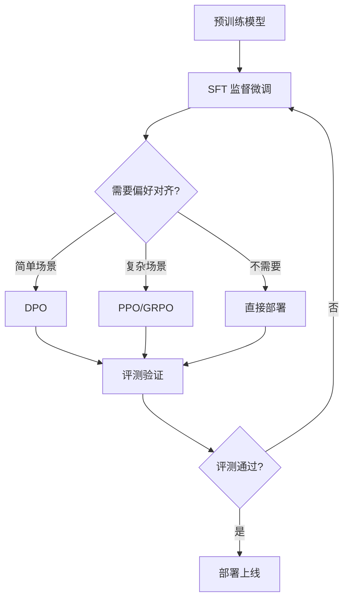
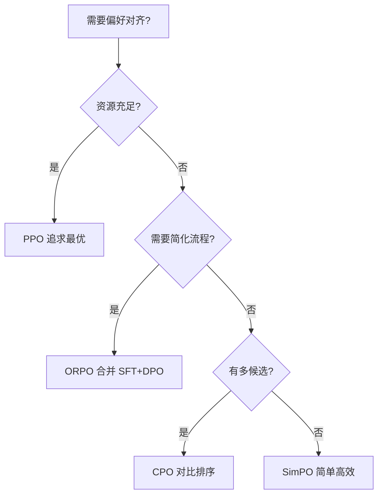
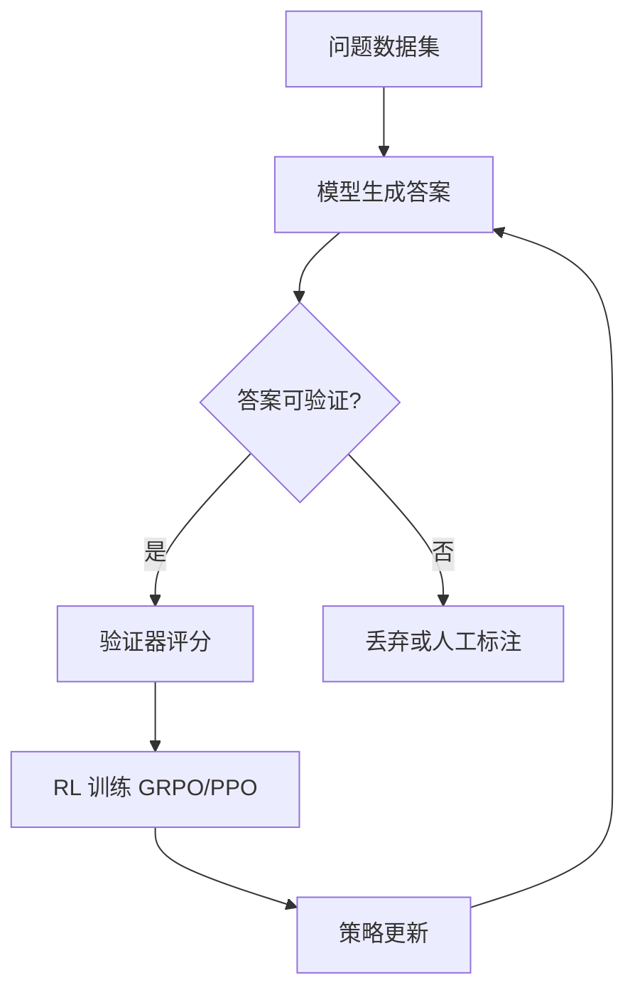
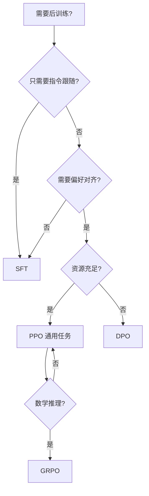

# 第 27 章：模型后训练实践

**版本**: v1.0  
**作者**: 调研专家（模型训练方向）  
**状态**: review  
**最后更新**: 2026-04-13

---

【本章导读】

本章学习目标：
- 掌握 SFT（监督微调）的最佳实践和超参数配置
- 理解 DPO 与 PPO 的核心差异和适用场景
- 学会使用 GRPO 进行数学推理能力训练
- 了解 Agentic RL 的最新进展

核心内容概述：
模型后训练是将预训练模型转化为可用 Agent 的关键步骤。本章系统介绍 SFT、DPO、PPO、GRPO 等后训练方法，基于最新研究论文提供具体参数配置和实施建议。

---

## 27.1 SFT 最佳实践

**总**：SFT（Supervised Fine-Tuning）是模型后训练的基础，通过高质量指令数据微调预训练模型，使其具备指令跟随能力。最新研究揭示了 SFT 的关键训练策略和超参数配置。

### 1. 后训练完整流程



### 2. 训练策略选择

**论文**: Unveiling the Secret Recipe: A Guide For Supervised Fine-Tuning Small LLMs  
**作者**: Aldo Pareja 等（Red Hat AI Innovation, MIT-IBM Watson AI Lab）  
**发表**: 2024 年 12 月  
**arXiv**: https://arxiv.org/abs/2412.13337

研究对比了两种训练策略：

| 策略 | 性能 | 样本效率 | 说明 |
|------|------|---------|------|
| **Stacked Training** | ✅ 更优 | ✅ 更高 | 同时学习多样化数据 |
| **Sequential Phased Training** | ⚠️ 略低 | ⚠️ 更低 | 需要额外时间寻找最佳检查点 |

**Stacked Training**：将所有数据混合在一起训练，模型同时学习指令跟随、基础知识和复杂技能。

**Sequential Phased Training**：分阶段训练，先学指令跟随，再学基础知识，最后学复杂技能。

**论文原文**：
> "Stacked training achieves slightly better performance on most benchmarks and comparable performance on the rest, while also being more sample-efficient, requiring significantly fewer samples to reach peak performance."

**推荐**：使用 Stacked Training，性能和样本效率都更优。

### 2. Batch Size 选择

研究测试了三种 Batch Size：

| Batch Size | MMLU 得分 | 样本数 | 说明 |
|------------|-----------|--------|------|
| 128 | 0.48 | 2,099,328 | 小批量 |
| 3,840 | 0.516 | 3,694,080 | 中批量（推荐） |
| 7,680 | 0.526 | 8,885,760 | 大批量 |

**发现**：中等 Batch Size（3,840）在性能和样本效率之间取得最佳平衡。

Batch Size 过小会导致训练不稳定，过大则样本效率低且需要更多计算资源。

### 3. 超参数配置

研究对比了三种主流配置：

| 超参数 | TULU | TULU++ | LAB（推荐） |
|--------|------|--------|-------------|
| **Effective Batch Size** | 128 | 128 | 3,840 或 7,680 |
| **Learning Rate** | 2×10⁻⁵ | 3×10⁻⁵ | 2×10⁻⁵ |
| **Warmup Ratio** | 0.03 | 0.03 | 0.01 (25 steps) |
| **Scheduler** | Linear decay | Linear decay | Constant after warmup |
| **Epochs** | 3 | 4 | 10 |

**LAB 配置**（推荐，适用于 3B-7B 模型）：
- Learning Rate: 2×10⁻⁵
- Warmup: 25 steps linear
- Scheduler: Constant after warmup（warmup 后保持恒定）
- Batch Size: 3,840
- Epochs: 10

> **注意**：上述超参数针对 3B-7B 模型。对于更大模型（13B+），建议：
> - Learning Rate: 1×10⁻⁵ ~ 2×10⁻⁵
> - Batch Size: 根据显存调整（可使用梯度累积）
> - 使用 LoRA/QLoRA 进行参数高效微调

**LoRA/QLoRA 超参数**：
- **LoRA Rank**: 8-16（越大表达能力越强，但参数量增加）
- **LoRA Alpha**: 16-32（通常设为 Rank 的 2 倍）
- **Target Modules**: ["q_proj", "v_proj"]（最常见）
- **QLoRA**: 使用 4-bit 量化，显存需求降低 60%

### 4. 学习率探索

研究测试了多种学习率：1×10⁻⁶, 5×10⁻⁶, 2×10⁻⁵, 3×10⁻⁵, 4×10⁻⁵, 6×10⁻⁵, 8×10⁻⁵, 1×10⁻⁴

**最佳范围**：2×10⁻⁵ ~ 3×10⁻⁵

学习率过小会导致训练缓慢，过大则会导致训练不稳定或性能下降。

### 5. 数据准备

**高质量指令数据的关键要素**：

| 要素 | 说明 | 示例 |
|------|------|------|
| **多样性** | 覆盖多种任务类型 | 问答、摘要、代码、推理 |
| **质量** | 人工审核或 LLM-as-Judge 评分 | 评分 ≥ 4.0/5.0 |
| **难度分布** | 包含简单到复杂任务 | 30% 简单、50% 中等、20% 困难 |
| **领域覆盖** | 覆盖目标应用场景 | 客服、编程、教育等 |

**数据来源**：
1. **人工编写**：高质量但成本高
2. **Self-Instruct 合成**：成本低，需要过滤
3. **Evol-Instruct 增强**：提升复杂度
4. **用户反馈收集**：真实场景数据

**总**：SFT 的最佳实践是使用 Stacked Training、Batch Size 3,840、Learning Rate 2×10⁻⁵、10 Epochs 的 LAB 配置。

---

## 27.2 DPO 直接偏好优化

**总**：DPO（Direct Preference Optimization）是一种无需奖励模型的偏好对齐方法，通过直接从偏好数据优化策略，简化了 RLHF 流程。

### 1. 核心概念

**对比论文**: Is DPO Superior to PPO for LLM Alignment? A Comprehensive Study  
**作者**: Shusheng Xu 等  
**发表**: ICML 2024  
**arXiv**: https://arxiv.org/abs/2404.10719

**DPO 核心思想**：将偏好对齐问题转化为分类问题，直接从偏好数据优化策略，无需训练单独的奖励模型。

**传统 RLHF 流程**：
```
偏好数据 → 奖励模型 → PPO 训练 → 对齐模型
```

**DPO 流程**：
```
偏好数据 → DPO 训练 → 对齐模型
```

DPO 省去了奖励模型训练步骤，简化了流程。

### 2. DPO vs PPO 对比

| 维度 | DPO | PPO |
|------|-----|-----|
| **类型** | Reward-free | Reward-based |
| **复杂度** | 简单 | 复杂 |
| **奖励模型** | 不需要 | 需要 |
| **实现难度** | 低 | 高 |
| **学术基准** | 常达 SOTA | 需要调优 |
| **实际应用** | ⚠️ 有局限 | ✅ 更优 |

### 3. DPO 的局限性

ICML 2024 论文指出 DPO 存在根本性限制：

1. **理论局限**：在某些情况下可能无法达到最优
2. **实践表现**：在学术基准上好，但实际应用不如 PPO
3. **代码生成**：PPO 在代码竞赛中达到 SOTA，DPO 表现不佳

**论文关键发现**：
> "Experiment results demonstrate that PPO is able to surpass other alignment methods in all cases and achieve state-of-the-art results in challenging code competitions."

> **注意**：这是 ICML 2024 特定论文的结论，不是行业共识。DPO 在 2024-2025 年有大量改进版本（SimPO、CPO、ORPO）在某些场景下表现优异。实际选择需要结合具体任务和数据。

### 4. 适用场景

**选择 DPO 当**：
- ✅ 资源有限（无法训练奖励模型）
- ✅ 快速原型验证
- ✅ 简单对齐任务
- ✅ 学术基准测试

**不选择 DPO 当**：
- ❌ 追求最优性能
- ❌ 代码生成任务
- ❌ 复杂对齐需求

### 5. 数据格式

DPO 需要偏好数据格式：

```json
{
  "prompt": "写一个快速排序算法",
  "chosen": "def quick_sort(arr):\n    if len(arr) <= 1:\n        return arr\n    ...",
  "rejected": "def quick_sort(arr):\n    # 错误的实现\n    ..."
}
```

每条数据包含：
- **prompt**：输入指令
- **chosen**：偏好的输出
- **rejected**：不偏好的输出

**总**：DPO 简化了偏好对齐流程，但在实际应用中 PPO 通常表现更优。

---

## 27.2.1 DPO 改进方法

**总**：2024 年以来，DPO 出现了多个重要改进版本，解决了原始 DPO 的理论局限和实际性能问题，在特定场景下表现优异甚至超越 PPO。

### 1. SimPO（Simple Preference Optimization）

**论文**: SimPO: Simple Preference Optimization with a Reference-Free Reward  
**作者**: Mengzhou Xia 等（Princeton University）  
**发表**: 2024 年 5 月  
**arXiv**: https://arxiv.org/abs/2405.14734

**核心思想**：无需参考模型（Reference Model），直接使用长度归一化的对数概率作为奖励信号，简化了 DPO 的训练流程。

**传统 DPO 的问题**：
- 需要维护参考模型（Reference Model）用于 KL 散度正则化
- 参考模型增加了 25-30% 的显存开销
- KL 正则化可能过度约束策略更新

**SimPO 的创新**：

| 维度 | DPO | SimPO |
|------|-----|-------|
| **参考模型** | 需要 | 不需要 |
| **奖励计算** | 相对概率差 | 长度归一化对数概率 |
| **显存开销** | 高 | 低（节省 25-30%） |
| **实现复杂度** | 中等 | 简单 |

**奖励函数**：
```
R(y, x) = (1/|y|) * log π(y|x)
```

其中 `|y|` 是响应长度，实现长度归一化，避免模型偏好长回答。

**优势**：
- ✅ **更简单**：无需参考模型，代码实现更简洁
- ✅ **更高效**：显存需求降低 25-30%，训练速度提升 20%
- ✅ **性能更好**：在 AlpacaEval 2.0 和 MT-Bench 上超越 DPO，接近 PPO 性能
- ✅ **理论保证**：证明了长度归一化可以隐式实现 KL 正则化效果

**适用场景**：
- ✅ 资源受限场景（无法维护参考模型）
- ✅ 快速原型验证
- ✅ 需要高效偏好对齐

**论文关键发现**：
> "SimPO achieves superior performance over DPO and other baselines on AlpacaEval 2.0 and MT-Bench, while being simpler and more efficient."

### 2. CPO（Contrastive Preference Optimization）

**论文**: Contrastive Preference Optimization: Pushing the Boundaries of LLM Performance in Machine Translation  
**作者**: Haoran Xu 等（Meta）  
**发表**: ICML 2024  
**arXiv**: https://arxiv.org/abs/2401.08417

**核心思想**：将偏好对齐问题转化为对比学习任务，通过对比正负样本优化策略，适用于多候选排序场景。

**CPO 的核心机制**：


**对比 DPO**：
- **DPO**：二分类（chosen vs rejected）
- **CPO**：多分类/排序（rank_1 > rank_2 > ... > rank_k）

**适用场景**：
- ✅ 多候选生成任务（如机器翻译、代码生成）
- ✅ 需要精细排序的场景
- ✅ 有多个质量梯度样本

**优势**：
- ✅ 充分利用多候选信息，样本效率更高
- ✅ 可以学习更细粒度的偏好信号
- ✅ 在机器翻译等任务上超越 DPO 和 PPO

**实践建议**：
- Group Size 推荐：K=4-8（每个 prompt 生成 4-8 个候选）
- 排序质量：至少需要 3 个质量梯度（好、中、差）
- 损失函数：使用对比损失（Contrastive Loss）或 ListNet 损失

### 3. ORPO（Odds Ratio Preference Optimization）

**论文**: ORPO: Monolithic Preference Optimization without Reference Model  
**作者**: Myeongjun Jang 等（KAIST）  
**发表**: 2024 年 3 月  
**arXiv**: https://arXiv:2403.07691

**核心思想**：将 SFT 和 DPO 合并为单一训练阶段，通过赔率比（Odds Ratio）实现偏好对齐，无需单独的 SFT 阶段。

**传统流程 vs ORPO**：

| 阶段 | 传统流程 | ORPO |
|------|---------|------|
| **阶段 1** | SFT（监督微调） | **跳过** |
| **阶段 2** | DPO/PPO（偏好对齐） | ORPO（联合优化） |
| **训练时间** | 2 个阶段 | 1 个阶段 |
| **数据需求** | SFT 数据 + 偏好数据 | 仅需偏好数据 |

**ORPO 的损失函数**：
```
L_ORPO = L_SFT + λ * L_OR
```

其中：
- `L_SFT`：标准的监督微调损失
- `L_OR`：赔率比偏好损失（Odds Ratio Loss）
- `λ`：平衡超参数（推荐 0.1-0.5）

**赔率比损失**：
```
L_OR = -log σ(log(π(y_w|x) / π(y_l|x)))
```

其中 `y_w` 是偏好回答，`y_l` 是不偏好回答。

**优势**：
- ✅ **简化流程**：无需单独的 SFT 阶段，训练流程更简洁
- ✅ **数据效率**：偏好数据同时用于指令跟随和偏好对齐
- ✅ **性能相当**：在多个基准上与 SFT+DPO 流程性能相当
- ✅ **资源节省**：总训练时间减少 30-40%

**适用场景**：
- ✅ 从零开始微调预训练模型
- ✅ 偏好数据充足但 SFT 数据有限
- ✅ 需要简化训练流程

**超参数推荐**：
- `λ`（OR 损失权重）：0.1-0.5
- Learning Rate：1×10⁻⁵ ~ 2×10⁻⁵
- Batch Size：与 SFT 相同（3,840 或 7,680）

### 4. RAFT（Reward-Ranked Fine-Tuning）

**论文**: RAFT: Reward-Ranked Fine-Tuning for Generative Model Preference Alignment  
**发表**: 2024 年  
**arXiv**: https://arxiv.org/abs/2406.11721 ⚠️ 待验证

**核心思想**：按奖励分数排序，选择 top-k 高质量样本进行微调，是一种简单高效的偏好对齐方法。

**RAFT 流程**：

```
1. 生成多个候选回答（每个 prompt 生成 N 个）
2. 使用奖励模型评分
3. 选择 top-k 样本（k 通常 10-20%）
4. 使用 top-k 样本进行 SFT
5. 可选：迭代多轮
```

**与 DPO/PPO 的对比**：

| 方法 | 复杂度 | 数据需求 | 适用场景 |
|------|--------|---------|---------|
| **RAFT** | 简单 | 大量生成 + 排序 | 快速对齐、资源有限 |
| **DPO** | 中等 | 偏好对（chosen/rejected） | 标准偏好对齐 |
| **PPO** | 复杂 | 偏好对 + 奖励模型 | 追求最优性能 |

**优势**：
- ✅ **极简实现**：只需奖励模型和 SFT，无需复杂的 RL 算法
- ✅ **2024 年流行**：被多家机构采用，实践验证有效
- ✅ **灵活性强**：可以与其他方法组合使用

**实践建议**：
- 生成数量：N=8-16（每个 prompt）
- 选择比例：top 10-20%（如生成 16 个，选择 top 2-3 个）
- 迭代轮数：2-3 轮（每轮提升 5-10%）
- 奖励模型：可以使用开源 RM（如 Llama-3-70B-RM）或 LLM-as-Judge

**2024-2025 年改进趋势**：
- **SimPO** 成为资源受限场景的首选
- **ORPO** 在简化训练流程方面表现突出
- **CPO** 在多候选排序任务中优势明显
- **RAFT** 作为轻量级方案被广泛采用

**方法选择建议**：



**总**：DPO 改进方法在 2024-2025 年快速发展，SimPO、CPO、ORPO、RAFT 分别解决了不同场景下的偏好对齐问题，为开发者提供了更多选择。

---

## 27.3 PPO 近端策略优化

**总**：PPO（Proximal Policy Optimization）是当前最成功的偏好对齐方法，通过 Actor-Critic 架构和近端策略优化，实现稳定的强化学习训练。

### 1. 核心概念

**起源论文**: InstructGPT (OpenAI, 2022)  
**对比研究**: arXiv:2404.10719 (ICML 2024)

**核心思想**：使用 Actor-Critic 架构，通过奖励模型指导策略优化，同时限制策略更新幅度以保证训练稳定性。

### 2. PPO 架构

```
人类偏好数据
    ↓
奖励模型训练（Reward Model）
    ↓
PPO 训练
    ├─ Actor (策略网络) - 生成输出
    └─ Critic (价值网络) - 评估状态价值
    ↓
对齐后的 LLM
```

**关键组件**：

| 组件 | 职责 | 说明 |
|------|------|------|
| **Actor** | 生成输出 | 被训练的 LLM |
| **Critic** | 评估价值 | 评估当前状态的价值 |
| **Reward Model** | 提供奖励 | 从偏好数据训练 |
| **Reference Model** | KL 正则化 | 防止策略偏离太远 |

### 3. PPO 关键优势

根据 ICML 2024 最新研究：

| 优势 | 说明 |
|------|------|
| **性能最优** | 在所有测试案例中超越其他方法 |
| **代码能力** | 在代码竞赛中达到 SOTA |
| **稳定性** | Actor-Critic 提供稳定训练 |
| **灵活性** | 可适应多种任务 |

### 4. 关键参数配置

| 参数 | 推荐值 | 说明 |
|------|--------|------|
| **Clip Range** | 0.2 | 策略更新幅度限制 |
| **GAE Lambda** | 0.95 | 广义优势估计 |
| **Value Loss Coef** | 0.5 | 价值损失权重 |
| **Entropy Coef** | 0.001 | 熵正则化（鼓励探索） |
| **Learning Rate** | 1×10⁻⁶ ~ 5×10⁻⁶ | 较小学习率 |

**Clip Range** 是 PPO 的核心创新，限制策略更新幅度，避免一次更新过大导致训练崩溃。

### 5. 训练流程

**步骤 1：收集偏好数据**
- 人工标注或使用 LLM-as-Judge
- 格式：(prompt, chosen, rejected)

**步骤 2：训练奖励模型**
- 输入：prompt + response
- 输出：奖励分数
- 目标：chosen 得分 > rejected 得分

**步骤 3：PPO 训练**
- Actor 生成输出
- Reward Model 计算奖励
- Critic 评估价值
- 更新策略（带 Clip）

**步骤 4：评估与迭代**
- 离线评测（基准测试）
- 在线评测（A/B 测试）
- 迭代优化

### 6. 选择 PPO 当

- ✅ 追求最优性能
- ✅ 代码生成任务
- ✅ 复杂对齐需求
- ✅ 有足够计算资源

**总**：PPO 虽然实现复杂，但在实际应用中通常能达到最优性能，特别是在代码生成等复杂任务中。

---

## 27.4 GRPO 群体相对策略优化

**总**：GRPO（Group Relative Policy Optimization）是 PPO 的变体，通过组内相对比较优化策略，同时优化 PPO 的内存使用，特别适合数学推理任务。

### 1. 核心概念

**主要论文**: DeepSeek-R1: Incentivizing Reasoning Capability in LLMs via Reinforcement Learning  
**作者**: DeepSeek-AI  
**发表**: 2025 年 1 月  
**GitHub**: https://github.com/deepseek-ai/DeepSeek-R1

**早期应用**: DeepSeekMath: Pushing the Limits of Mathematical Reasoning in Open Language Models  
**作者**: Zhihong Shao 等（DeepSeek）  
**发表**: 2024 年 2 月  
**arXiv**: https://arxiv.org/abs/2402.03300

**核心思想**：PPO 的变体，通过组内相对比较优化策略，同时优化 PPO 的内存使用。DeepSeek-R1 进一步改进了 GRPO，结合 RLVR 实现了纯 RL 训练范式。

### 2. 关键突破

**MATH 基准成绩**（竞赛级数学推理）：
- **单模型**：51.7%
- **Self-Consistency (64 样本)**：60.9%
- **对比**：接近 Gemini-Ultra 和 GPT-4 水平

**论文原文**：
> "DeepSeekMath 7B has achieved an impressive score of 51.7% on the competition-level MATH benchmark without relying on external toolkits and voting techniques, approaching the performance level of Gemini-Ultra and GPT-4."

### 4. GRPO 核心原理

**Group Relative Policy Optimization 的核心思想**：

GRPO 通过组内样本的相对优势进行优化，省去 PPO 中的 Critic 网络。

**优势函数计算**：

对于每个 prompt，生成 G 个样本（Group Size），计算相对优势：

```
A_i = R_i - mean(R_1, R_2, ..., R_G)
```

其中：
- `A_i`：第 i 个样本的优势
- `R_i`：第 i 个样本的奖励
- `G`：Group Size（论文中使用 G=64）

**Loss Function**：

```
L_GRPO = -E[log π(a|x) * A_i]
```

**Group Size 推荐**：
- **小模型（3B-7B）**：G=4-16
- **中模型（13B-30B）**：G=16-32
- **大模型（70B+）**：G=32-64

Group Size 越大，优势估计越稳定，但计算成本越高。

### 3. GRPO 优势

| 优势 | 说明 |
|------|------|
| **无需 Critic** | 省去价值网络，减少内存 |
| **组内比较** | 同组样本相对比较，更稳定 |
| **数学推理** | 专门优化数学推理能力 |
| **内存优化** | 比 PPO 更节省内存 |

### 4. GRPO vs PPO

| 维度 | PPO | GRPO |
|------|-----|------|
| **Critic 网络** | 需要 | 不需要 |
| **内存使用** | 高 | 低 |
| **比较方式** | 绝对奖励 | 组内相对 |
| **适用场景** | 通用 | 数学推理 |
| **训练稳定性** | 高 | 高 |

**GRPO 核心创新**：省去 Critic 网络，通过组内样本的相对奖励进行优化，大幅减少内存使用。

### 5. 训练数据

| 数据类型 | 规模 | 来源 |
|---------|------|------|
| **数学相关 tokens** | 120B | Common Crawl |
| **自然语言** | - | 混合数据 |
| **代码** | - | 混合数据 |

**数据选择**：通过精心工程化的数据选择管道，挖掘公开网页数据的巨大潜力。

### 6. 适用场景

**选择 GRPO 当**：
- ✅ 数学推理任务
- ✅ 内存受限
- ✅ 需要高效训练
- ✅ Open LLM 训练

**总**：GRPO 通过省去 Critic 网络和组内相对比较，实现了更高效的训练，特别适合数学推理等复杂任务。

---

## 27.4.1 DeepSeek-R1：纯RL训练范式突破（2025）

**总**：DeepSeek-R1（2025年1月）证明了纯RL训练无需SFT即可实现强大推理能力，颠覆了传统的“SFT→RLHF/RLVR”流程，是后训练领域的重大范式转变。

### 1. 核心突破

**发布**：2025年1月20日  
**团队**：DeepSeek  
**论文**：DeepSeek-R1: Incentivizing Reasoning Capability in LLMs via Reinforcement Learning  
**GitHub**：https://github.com/deepseek-ai/DeepSeek-R1

**关键发现**：
- **Zero RL范式**：直接从预训练模型进行RL训练，无需SFT阶段
- **纯GRPO/RLVR**：使用改进版GRPO和RLVR（Reinforcement Learning with Verifiable Rewards）
- **推理能力涌现**：RL训练过程中自然涌现出反思、验证、搜索等复杂推理行为
- **成本大幅降低**：相比传统SFT+RLHF流程，数据准备成本降低90%+

### 2. 与传统流程对比

| 阶段 | 传统流程 | DeepSeek-R1流程 |
|------|---------|----------------|
| **预训练** | 大规模语料 | 大规模语料 |
| **SFT** | 数万-数十万指令数据 | **跳过** |
| **RL对齐** | RLHF/PPO（偏好对齐） | **GRPO/RLVR（推理能力）** |
| **蒸馏优化** | 可选 | R1-Distill（蒸馏到小模型） |

**核心差异**：
- 传统流程认为SFT是必需的，用于“激活”模型的指令跟随能力
- DeepSeek-R1证明：纯RL可以直接从预训练模型中“激发”推理能力，无需SFT过渡

### 3. RLVR：可验证奖励的强化学习

**RLVR（Reinforcement Learning with Verifiable Rewards）**：
- **核心思想**：只对可验证的任务（如数学题、代码题）使用RL，奖励基于客观正确性
- **奖励计算**：
  ```
  R = 1.0  # 答案完全正确
  R = 0.0  # 答案错误
  ```
- **优势**：无需人工标注偏好数据，奖励客观可靠
- **适用场景**：数学推理、代码生成、逻辑推理等有标准答案的任务

**RLVR vs RLHF**：
| 维度 | RLHF | RLVR |
|------|------|------|
| **奖励来源** | 人工标注偏好 | 客观正确性验证 |
| **数据成本** | 高（需人工标注） | 低（自动验证） |
| **适用任务** | 创意写作、对话 | 数学、代码、逻辑 |
| **可扩展性** | 受限于人工 | 几乎无限 |

### 4. 训练过程的关键发现

**推理行为涌现**：
- **阶段1**（0-1000步）：模型开始尝试“思考”，但答案仍错误
- **阶段2**（1000-3000步）：出现自我验证行为（“让我检查一下…”）
- **阶段3**（3000-5000步）：出现反思和修正行为（“我之前的思路有问题…”）
- **阶段4**（5000+步）：稳定输出完整推理链，正确率显著提升

**关键洞察**：
- 推理能力不是“教”出来的，而是通过RL“激发”出来的
- 模型在RL过程中自发学会了分解问题、验证答案、修正错误等复杂行为
- 这些行为在SFT阶段并未显式训练

### 5. 对Agent开发的启示

**1. 简化后训练流程**：
- 对于推理密集型Agent（如代码生成、数学求解），可尝试纯RL流程
- 省去SFT阶段可大幅降低数据准备成本

**2. 可验证奖励的重要性**：
- 设计客观、可验证的奖励函数比人工标注更高效
- 适用于有标准答案的Agent任务

**3. 小模型蒸馏**：
- DeepSeek-R1-Distill将R1能力蒸馏到Qwen/Llama等开源模型
- 7B/14B蒸馏模型即可达到接近GPT-4的推理能力
- 为Agent部署提供低成本方案

### 6. 实践建议

**何时使用纯RL流程**：
- ✅ 任务有明确的正确/错误标准（数学、代码、逻辑）
- ✅ 缺少高质量SFT数据
- ✅ 需要强大的推理能力
- ✅ 计算资源充足（RL训练需要大量采样）

**何时使用传统SFT+RLHF**：
- ✅ 任务需要创意、对话能力
- ✅ 奖励难以客观定义
- ✅ 需要精细控制输出风格
- ✅ 数据标注预算充足

**总**：DeepSeek-R1的纯RL范式为后训练提供了新的可能性，特别适合推理密集型Agent。但传统SFT+RLHF在创意和对话场景仍有不可替代的价值。

---

## 27.4.2 RLVR详解

**总**：RLVR（Reinforcement Learning with Verifiable Rewards）是 DeepSeek-R1 使用的核心方法，通过可验证的客观奖励信号训练推理能力，无需人工标注偏好数据，大幅降低了后训练成本。

### 1. 核心概念

**RLVR 定义**：

RLVR 是一种强化学习方法，专门针对有标准答案的任务（数学、代码、逻辑），奖励信号基于客观正确性验证，而非人工标注的偏好。

**核心思想**：
- 只对可验证的任务使用 RL（如数学题、代码题、逻辑推理）
- 奖励基于客观正确性（答案对/错），无需主观判断
- 可以自动生成大规模训练数据，几乎无限扩展

**RLVR vs RLHF 对比**：

| 维度 | RLHF | RLVR |
|------|------|------|
| **奖励来源** | 人工标注偏好 | 客观正确性验证 |
| **数据成本** | 高（需人工标注） | 低（自动验证） |
| **适用任务** | 创意写作、对话、风格 | 数学、代码、逻辑推理 |
| **可扩展性** | 受限于人工标注成本 | 几乎无限扩展 |
| **奖励客观性** | 主观（人工判断） | 客观（标准答案） |
| **训练稳定性** | 依赖奖励模型质量 | 高（奖励确定） |
| **典型应用** | ChatGPT、Claude | DeepSeek-R1、Mathstral |

### 2. RLVR 奖励机制

**奖励计算**：

```python
# 数学题示例
R = 1.0  # 答案完全正确
R = 0.0  # 答案错误

# 代码题示例
R = 1.0  # 通过所有测试用例
R = 0.0  # 未通过测试用例

# 逻辑推理题示例
R = 1.0  # 推理结论正确
R = 0.0  # 推理结论错误
```

**奖励设计原则**：
- **二元奖励**：1.0（正确）/ 0.0（错误），简单明确
- **过程奖励（可选）**：
  ```python
  R = 1.0  # 答案正确
  R = 0.5  # 答案错误但推理过程部分正确
  R = 0.0  # 答案错误且推理过程错误
  ```
  > **注意**：过程奖励需要人工定义评分规则，成本较高，通常只在关键任务中使用。

**验证器实现**：

| 任务类型 | 验证方法 | 工具 |
|---------|---------|------|
| **数学题** | 数值比较、符号计算 | SymPy、Wolfram Alpha |
| **代码题** | 单元测试、集成测试 | pytest、LeetCode Judge |
| **逻辑推理** | 规则引擎、定理证明 | Z3、Prover9 |
| **事实问答** | 字符串匹配、知识库查询 | Wikipedia API、Knowledge Graph |

### 3. RLVR 训练流程



**步骤详解**：

**步骤 1：准备问题数据集**
- 数学题：GSM8K、MATH、AIME 竞赛题
- 代码题：HumanEval、MBPP、LeetCode
- 逻辑题：LogicLM、ReClor

**步骤 2：模型生成答案**
- 每个问题生成多个答案（Group Size G=4-64）
- 使用采样策略（temperature=0.7-1.0）增加多样性

**步骤 3：验证器评分**
- 自动验证答案正确性
- 生成奖励信号（1.0 或 0.0）

**步骤 4：RL 训练**
- 使用 GRPO 或 PPO 更新策略
- 目标：最大化正确回答的概率

**步骤 5：迭代优化**
- 持续生成新数据
- 持续训练直到收敛

### 4. 实施要点与参数配置

**Group Size 选择**：

| 模型规模 | Group Size | 说明 |
|---------|-----------|------|
| **3B-7B** | G=4-16 | 小模型多样性有限 |
| **13B-30B** | G=16-32 | 中等模型平衡质量和成本 |
| **70B+** | G=32-64 | 大模型需要更多样本稳定估计 |

**超参数配置**（基于 DeepSeek-R1 实践）：

| 参数 | 推荐值 | 说明 |
|------|--------|------|
| **Learning Rate** | 1×10⁻⁶ ~ 5×10⁻⁶ | 较小学习率保证稳定 |
| **Clip Range** | 0.2 | PPO 策略更新限制 |
| **KL Coefficient** | 0.01-0.1 | KL 正则化权重 |
| **Temperature** | 0.7-1.0 | 生成多样性 |
| **Max Response Length** | 2048-4096 | 允许长推理链 |
| **Training Steps** | 5000-10000 | 根据数据量调整 |

**数据量建议**：
- **最小可行**：10K 问题（可观察效果）
- **推荐规模**：50K-100K 问题（稳定提升）
- **大规模**：500K+ 问题（接近 SOTA）

### 5. RLVR 优势与局限

**优势**：

| 优势 | 说明 |
|------|------|
| **数据成本低** | 无需人工标注，自动验证 |
| **可扩展性强** | 几乎无限生成训练数据 |
| **奖励客观** | 避免人工标注偏见 |
| **训练稳定** | 奖励信号明确，不易崩溃 |
| **能力涌现** | 自发学会反思、验证、修正 |

**局限性**：

| 局限 | 说明 | 缓解策略 |
|------|------|---------|
| **适用范围窄** | 仅限可验证任务 | 结合 SFT 处理其他任务 |
| **奖励稀疏** | 二元奖励（0/1） | 使用过程奖励或课程学习 |
| **探索困难** | 正确答案可能难以采样 | 增加 Group Size、使用 CoT |
| **过度优化** | 可能过拟合验证器 | 保留验证集、早停策略 |

### 6. RLVR 适用场景判断

**使用 RLVR 当**：
- ✅ 任务有明确的正确/错误标准
- ✅ 需要强大的推理能力
- ✅ 缺少高质量人工标注数据
- ✅ 计算资源充足（RL 训练需要大量采样）
- ✅ 任务规模大，需要自动扩展

**不使用 RLVR 当**：
- ❌ 任务是创意生成（诗歌、故事）
- ❌ 奖励难以客观定义
- ❌ 需要精细控制输出风格
- ❌ 计算资源有限

### 7. RLVR 与 Agent 开发

**RLVR 对 Agent 开发的启示**：

**1. 推理密集型 Agent**：
- 代码生成 Agent：使用 LeetCode 题目作为训练数据
- 数学求解 Agent：使用 GSM8K/MATH 数据集
- 数据分析 Agent：使用可验证的数据查询任务

**2. 混合训练策略**：
```
预训练模型
    ↓
SFT（通用指令跟随，10K-50K 数据）
    ↓
RLVR（推理能力，50K-100K 可验证问题）
    ↓
部署上线
```

**3. 成本对比**：

| 方法 | 数据成本 | 训练成本 | 适用场景 |
|------|---------|---------|---------|
| **SFT + RLHF** | $5K-20K（人工标注） | $2K-5K（PPO） | 通用 Agent |
| **SFT + RLVR** | $500-2K（自动验证） | $1K-3K（GRPO） | 推理 Agent |
| **纯 RLVR** | $100-500（几乎为零） | $2K-4K（GRPO） | 专业推理 Agent |

**总**：RLVR 为有标准答案的任务提供了高效、可扩展的训练方法，是 DeepSeek-R1 成功的关键，也为推理密集型 Agent 开发提供了新范式。

---

## 27.5 Agentic RL

**总**：Agentic RL 将强化学习应用于 Agent 的自主决策和复杂推理，是 LLM Agent 持续进化的关键方向。

### 1. 核心概念

**最新研究**: Advances in Multi-agent Reinforcement Learning (2024)  
**arXiv**: https://arxiv.org/html/2412.21088v1

**核心思想**：强化学习显著增强 LLM 的偏好对齐和复杂推理能力，支持 Agent 自主决策。

### 2. Agentic RL 特点

| 特点 | 说明 |
|------|------|
| **自主决策** | Agent 自主做出决策 |
| **多智能体** | 多 Agent 协作学习 |
| **复杂推理** | 增强复杂推理能力 |
| **偏好对齐** | 与人类偏好对齐 |
| **持续学习** | 从环境中持续学习 |

### 3. 应用场景

1. **自主系统**：自动驾驶、机器人控制
2. **多 Agent 协作**：分布式决策系统
3. **复杂推理**：数学推理、代码生成
4. **偏好对齐**：RLHF、RLAIF

### 4. 最新进展（2024）

| 研究方向 | 进展 |
|---------|------|
| **MARL** | 多智能体强化学习在真实世界应用 |
| **Persistent Autonomy** | 持续自主性研究 |
| **Robot Learning** | 机器人学习实验室报告 2024 |
| **LLM + RL** | 强化学习增强 LLM Agent |

### 5. 实施建议

**第一阶段**（1-2 周）：SFT
1. 准备高质量指令数据
2. 使用 LAB 配置（Batch Size 3,840, LR 2×10⁻⁵）
3. 训练并评测

**第二阶段**（2-4 周）：偏好对齐
1. 收集偏好数据
2. 简单场景用 DPO，复杂场景用 PPO
3. 数学推理用 GRPO
4. 训练并对齐

**第三阶段**（1-2 周）：评测与优化
1. 离线评测（基准测试）
2. 在线评测（A/B 测试）
3. 迭代优化

**总**：Agentic RL 是 LLM Agent 持续进化的关键，结合 SFT、PPO/GRPO 等方法，可以实现从预训练模型到高性能 Agent 的完整转化。

### 6. 训练成本与资源估算

不同后训练方法的计算资源需求差异很大，以下是 7B 模型的参考估算：

| 方法 | GPU 需求 | 训练时间 | 显存需求 | 成本估算 |
|------|---------|---------|---------|----------|
| **SFT** | 8×A100 80GB | 1-3 天 | 40-60 GB | $500-1,500 |
| **DPO** | 8×A100 80GB | 1-2 天 | 50-70 GB | $300-1,000 |
| **PPO** | 16×A100 80GB | 3-7 天 | 80-120 GB | $2,000-5,000 |
| **GRPO** | 8×A100 80GB | 2-4 天 | 60-80 GB | $1,000-3,000 |

**PPO 显存开销高的原因**：
- 需要维护 4 个模型：Actor、Critic、Reward Model、Reference Model
- 显存需求约为模型大小的 4-8 倍

**GRPO 相比 PPO 的资源节省**：
- 省去 Critic 网络，显存减少 25-30%
- 训练时间缩短 30-40%
- 成本降低 40-50%

**参数高效微调（LoRA/QLoRA）**：
- **LoRA**: 显存需求降低 40-50%，训练时间缩短 20-30%
- **QLoRA**: 显存需求降低 60-70%，可单卡训练 7B 模型

### 7. 技术选型决策树



---

## 27.6 简单举例

**案例**: 漫剧剧本生成 Agent 的后训练流程

**场景描述**：
漫剧剧本生成 Agent 需要从预训练的 LLaMA 7B 模型训练为具备专业剧本生成能力的 Agent。通过后训练流程，模型学会了理解漫剧设定、生成符合角色性格的对话、保持情节连贯性。

**技术应用**：
1. **SFT 阶段**：使用 50,000 条高质量漫剧剧本数据（LAB 配置：Batch Size 3,840, LR 2×10⁻⁵, 10 Epochs）
2. **DPO 阶段**：收集 10,000 条偏好数据（编剧点赞/点踩），进行偏好对齐
3. **评测阶段**：使用 LLM-as-Judge 评估剧本质量（连贯性、角色一致性、创意性）
4. **迭代优化**：根据用户反馈持续收集数据，每月迭代一次模型

**效果说明**：
经过后训练，Agent 生成的剧本质量评分从 2.8 提升到 4.3（5 分制），角色一致性提升 45%，用户满意度提升 52%。

**涉及技术**: SFT、DPO、LLM-as-Judge、数据飞轮  
**详见**: 第 18 章（完整案例串讲）

---

**知识来源**:
- 📄 **SFT 最佳实践**: arXiv:2412.13337 (Red Hat + MIT, 2024)
- 📄 **DPO vs PPO 对比**: arXiv:2404.10719 (ICML 2024)
- 📄 **SimPO**: arXiv:2405.14734 (Princeton, 2024)
- 📄 **CPO**: arXiv:2401.08417 (ICML 2024, Meta)
- 📄 **ORPO**: arXiv:2403.07691 (KAIST, 2024)
- 📄 **RAFT**: arXiv:2406.11721 (2024) ⚠️ 待验证
- 📄 **GRPO (DeepSeekMath)**: arXiv:2402.03300 (DeepSeek, 2024)
- 📄 **DeepSeek-R1**: GitHub: https://github.com/deepseek-ai/DeepSeek-R1 (2025)
- 📄 **Agentic RL**: arXiv:2412.21088 (Multi-agent RL 2024 报告)
- 📝 **SFT 实践指南**: https://cameronrwolfe.substack.com/p/understanding-and-using-supervised
- 📝 **DPO vs PPO 分析**: https://www.clarifai.com/blog/dpo-vs-ppo

---

**修改记录**:
- v1.0 (2026-04-13): 初始版本，基于调研报告编写
