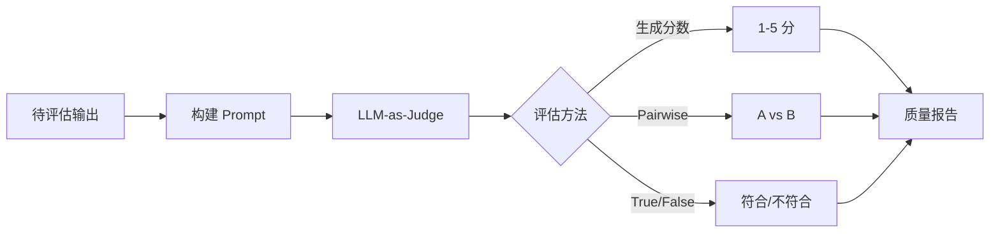

# 第 28 章：评测体系与实验

**版本**: v1.0  
**作者**: 调研专家（评测体系方向）  
**状态**: review  
**最后更新**: 2026-04-13

---

【本章导读】

本章学习目标：
- 掌握 LLM-as-Judge 自动评测方法
- 学会设计 A/B 测试和 Multi-Armed Bandit 实验
- 建立完整的离线-在线-生产三层评测体系
- 理解指标漂移检测和告警机制

核心内容概述：
评测体系是 Agent 质量保障的核心。本章介绍从离线评测到在线实验再到生产监控的完整评测体系，包括 LLM-as-Judge 自动评估、A/B 测试、Multi-Armed Bandit 算法和指标漂移检测。

---

## 28.1 LLM-as-Judge 自动评测

**总**：LLM-as-Judge 使用强大 LLM（如 GPT-4）自动评估其他 LLM 的输出质量，实现可扩展、低成本的自动化评测。

### 1. LLM-as-Judge 评测流程



### 1. 核心概念

**论文**: A Survey on LLM-as-a-Judge  
**作者**: Jiawei Gu 等（IDEA Research, 中科院计算所）  
**发表**: 2024 年 11 月  
**arXiv**: https://arxiv.org/abs/2411.15594

**核心思想**：使用 LLM 自动评估其他 LLM 的输出质量，替代或辅助人工评估。

**形式化定义**：

```
E ← P_LLM(x ⊕ C)
```

其中：
- **E**：最终评估结果（分数、选择、标签或句子）
- **P_LLM**：LLM 的概率函数（自回归生成）
- **x**：待评估的输入数据（文本、图像、视频）
- **C**：上下文（Prompt 模板或对话历史）
- **⊕**：组合操作符

### 2. 四种基本方法

| 方法 | 说明 | 适用场景 |
|------|------|---------|
| **生成分数** | 直接给出质量评分 | 通用评估 |
| **Pairwise 比较** | 比较两个输出哪个更好 | 模型对比 |
| **True/False 判断** | 判断是否符合标准 | 质量检测 |
| **Multiple Choice** | 从多个选项选择 | 分类评估 |

### 3. 生成分数方法

**Likert Scale Scoring**：

```
Evaluate the quality of summaries written for a news article. 
Rate each summary on four dimensions:
{Dimension_1}, {Dimension_2}, {Dimension_3}, and {Dimension_4}. 
You should rate on a scale from 1 (worst) to 5 (best).

Article: {Article}
Summary: {Summary}
```

**评分维度示例**：
- **准确性**：是否准确反映原文内容
- **完整性**：是否覆盖关键信息
- **流畅性**：语言是否流畅自然
- **简洁性**：是否简洁明了

### 4. Pairwise 比较方法

```
Given a new article, which summary is better? 
Answer "Summary 0" or "Summary 1".

Article: {Article}
Summary 0: {Summary_0}
Summary 1: {Summary_1}
```

**优势**：比绝对评分更稳定，LLM 在相对比较时表现更好。

### 5. 应用场景

| 领域 | 应用 | 说明 |
|------|------|------|
| **学术评审** | ICLR 2025 辅助评审 | 应对投稿量激增 |
| **文本生成** | 质量评估 | 摘要、翻译、创作 |
| **问答系统** | 答案评估 | 准确性、完整性 |
| **对话系统** | 对话质量 | 流畅性、相关性 |
| **代码生成** | 代码质量 | 正确性、效率 |

### 6. 关键挑战

**偏见问题**：
- **Position bias**：倾向选择排在前面的输出
- **Verbosity bias**：倾向选择更长的输出

**解决方案**：
- 随机打乱输出顺序（多次评估取平均）
- 设置 temperature=0（确定性输出）
- 使用校准数据纠正偏见
- 使用专门的偏见缓解 Prompt（如 "Please evaluate objectively, ignoring response length"）

**LLM-as-Judge 与人类评估的相关性（2025-2026最新数据）**：

> **重要更新**：2025-2026年多项研究（Anthropic、Google DeepMind等）发现LLM-as-Judge在复杂任务上的可靠性严重不足。

| 任务类型 | 相关性 | 错误率 | 说明 |
|---------|--------|--------|------|
| **简单任务**（摘要质量、格式检查） | 0.7-0.85 | 15-25% | 相关性较高，可用 |
| **中等任务**（代码正确性、事实准确性） | 0.5-0.7 | 30-40% | 需谨慎使用 |
| **复杂任务**（创意写作、多步推理、Agent行为评估） | < 0.5 | **50%+** | **不建议单独使用** |

**关键发现**（2025-2026）**：
1. **复杂任务高错误率**：对于需要多步推理、创意判断的任务，LLM-as-Judge错误率高达50%+
2. **偏见严重**：倾向于选择更长的回答、特定风格的回答
3. **不一致性**：同一输入多次评估结果不一致率30-40%
4. **Prompt敏感**：评估结果高度依赖Prompt设计

**缓解策略**：
- **多Judge投票**：3-5个不同模型投票，可降低错误率15-20%
- **人类校验**：复杂任务必须有人类审核环节
- **任务分解**：将复杂评估分解为多个简单子任务
- **适用场景边界**：仅用于简单任务的初步筛选，复杂任务必须人工介入

**最新进展**：
- **JudgeBench**：LLM-as-Judge 评测基准
- **Auto-J**：自动化 Judge 优化框架
- **LLM-as-a-Judge 改进方法**：多 Judge 投票、动态 Prompt 优化

**一致性问题**：同一输入多次评估结果不一致

**解决方案**：
- 设置 temperature=0（确定性输出）
- 多次评估取多数投票
- 使用更强的 Judge 模型

**总**：LLM-as-Judge 是大规模自动评测的有效方法，但需要注意偏见和一致性问题。

---

## 28.2 A/B 测试

**总**：A/B 测试通过对比实验评估不同模型或策略的性能差异，是在线评测的标准方法。

### 1. 核心流程

```
定义假设（H0, H1）
    ↓
随机分流（50/50 或其他比例）
    ↓
收集数据（指标：准确率、延迟、用户满意度）
    ↓
统计检验（t-test、chi-square）
    ↓
得出结论（显著/不显著）
```

### 2. 关键指标

| 指标类型 | 具体指标 | 说明 |
|---------|---------|------|
| **质量指标** | 准确率、F1、BLEU | 模型输出质量 |
| **性能指标** | 延迟、吞吐量 | 系统性能 |
| **业务指标** | 转化率、留存率 | 业务影响 |
| **用户指标** | 满意度、NPS | 用户体验 |

### 3. 统计检验

| 检验方法 | 适用场景 | 说明 |
|---------|---------|------|
| **t-test** | 连续变量 | 比较均值差异 |
| **Chi-square** | 分类变量 | 比较比例差异 |
| **Mann-Whitney U** | 非正态分布 | 非参数检验 |

### 4. 样本量计算

```python
from statsmodels.stats.power import TTestIndPower

# 计算样本量
analysis = TTestIndPower()
sample_size = analysis.solve_power(
    effect_size=0.5,    # 效应大小
    alpha=0.05,         # 显著性水平
    power=0.8,          # 统计功效
    ratio=1.0           # A/B 比例
)
print(f"每组需要 {sample_size:.0f} 个样本")
```

**关键参数**：
- **effect_size**：预期效应大小（0.2 小、0.5 中、0.8 大）
- **alpha**：显著性水平（通常 0.05）
- **power**：统计功效（通常 0.8）

### 4. 多重检验与 Peeking Problem

**多重检验问题（Multiple Testing Problem）**：
- 同时运行多个 A/B 测试时，假阳性率会增加
- **解决方法**：Bonferroni 校正（alpha / 检验次数）或 FDR 控制

**Peeking Problem**：
- 提前查看结果并做决策会导致假阳性率增加
- **解决方法**：
  - 预先确定样本量和运行时间
  - 使用 Sequential Testing 或 Always Valid Inference
  - 避免在实验结束前做决策

**SRM 检测（Sample Ratio Mismatch）**：
- 检测 A/B 两组的实际分流比例是否与预期一致
- 如果 SRM 检验失败（p < 0.001），说明分流系统可能有问题
- 需要排查后再分析结果

### 5. 实验设计原则

**随机化**：确保 A/B 两组样本来自同一分布

**样本量充足**：确保统计功效 ≥ 0.8

**单一变量**：每次实验只测试一个变量

**运行时间充足**：覆盖完整的业务周期（如一周）

**总**：A/B 测试需要科学的实验设计和统计分析，确保结果可靠。

---

## 28.3 Multi-Armed Bandit

**总**：Multi-Armed Bandit（MAB）在探索（Exploration）和利用（Exploitation）之间取得平衡，动态分配流量，适合快速决策场景。

### 1. MAB vs A/B Testing

| 维度 | A/B Testing | Multi-Armed Bandit |
|------|-------------|-------------------|
| **流量分配** | 固定比例 | 动态调整 |
| **探索策略** | 前期探索 | 持续探索 |
| **利用策略** | 后期利用 | 即时利用 |
| **适用场景** | 稳定性优先 | 快速决策 |
| **损失** | 较高（探索期） | 较低（动态调整） |

### 2. Epsilon-Greedy 算法

```python
import random

def epsilon_greedy(rewards, counts, epsilon=0.1):
    """
    Epsilon-Greedy 算法
    
    以 epsilon 概率探索（随机选择）
    以 1-epsilon 概率利用（选择最优）
    """
    if random.random() < epsilon:
        return random.randint(0, len(rewards) - 1)  # 探索
    else:
        return max(range(len(rewards)), 
                  key=lambda i: rewards[i] / counts[i])  # 利用
```

**特点**：简单有效，但探索不够智能。

### 3. UCB 算法

```python
import math

def ucb(rewards, counts, total_count, c=2.0):
    """
    UCB 算法
    
    选择置信上界最大的臂
    """
    if min(counts) == 0:
        return counts.index(0)  # 优先探索未尝试的
    
    ucb_values = []
    for i in range(len(rewards)):
        avg_reward = rewards[i] / counts[i]
        confidence = c * math.sqrt(math.log(total_count) / counts[i])
        ucb_values.append(avg_reward + confidence)
    
    return max(range(len(ucb_values)), key=lambda i: ucb_values[i])
```

**特点**：智能探索，优先探索不确定性高的选项。

### 4. Thompson Sampling

```python
import numpy as np

def thompson_sampling(successes, failures):
    """
    Thompson Sampling（贝叶斯方法）
    
    从后验分布采样，选择采样值最大的臂
    """
    theta_samples = [
        np.random.beta(successes[i] + 1, failures[i] + 1)
        for i in range(len(successes))
    ]
    return np.argmax(theta_samples)
```

**特点**：贝叶斯方法，理论基础强，实际表现优秀。

### 5. 参数调优指导

**Epsilon-Greedy**：
- **epsilon 推荐值**：0.1-0.2（探索 10-20%）
- **衰减策略**：从 1.0 逐渐降到 0.05（线性或指数衰减）
- **适用场景**：简单场景，计算资源有限

**UCB**：
- **c 参数推荐值**：1.0-2.0
- **c 与置信水平的关系**：c 越大，探索越激进
  - c=1.0：95% 置信区间
  - c=2.0：99% 置信区间
- **适用场景**：需要理论保证的场景

**Thompson Sampling**：
- **Beta-Bernoulli**：适用于二分类回报（点击/不点击）
- **Gaussian TS**：适用于连续回报（收入、时长）
- **适用场景**：复杂场景，理论性能最优

### 5. 选择建议

**使用 A/B Testing 当**：
- ✅ 需要统计显著性
- ✅ 稳定性优先
- ✅ 长期优化

**使用 MAB 当**：
- ✅ 需要快速决策
- ✅ 探索成本高
- ✅ 动态环境

**总**：MAB 通过动态流量分配，在探索和利用之间取得平衡，适合快速迭代场景。

### 6. MAB 算法对比

| 算法 | 探索策略 | 优点 | 缺点 | 适用场景 |
|------|---------|------|------|---------|
| **Epsilon-Greedy** | 随机探索 | 简单实现 | 探索不够智能 | 简单场景 |
| **UCB** | 置信上界 | 理论保证 | 参数调优复杂 | 需要理论保证 |
| **Thompson Sampling** | 贝叶斯采样 | 性能最优 | 计算复杂 | 复杂场景 |

---

## 28.4 指标漂移检测

**总**：生产环境中模型性能可能随时间漂移（Data Drift、Concept Drift），需要持续监控关键指标并及时告警。

### 1. 漂移类型

| 类型 | 说明 | 检测方法 |
|------|------|---------|
| **Data Drift** | 输入数据分布变化 | 统计检验（KS test） |
| **Concept Drift** | 输入-输出关系变化 | 性能监控 |
| **Label Drift** | 标签分布变化 | 分布对比 |

### 2. 漂移检测实现

```python
class MetricDriftDetector:
    def __init__(self, baseline_metrics):
        self.baseline = baseline_metrics
        self.threshold = 0.05  # 显著性水平
    
    def detect_drift(self, current_metrics):
        """
        检测指标漂移
        
        返回: dict {metric_name: has_drift}
        """
        drift_results = {}
        for metric_name in current_metrics:
            baseline_values = self.baseline[metric_name]
            current_values = current_metrics[metric_name]
            
            # 使用 KS 检验
            from scipy.stats import ks_2samp
            statistic, p_value = ks_2samp(baseline_values, current_values)
            
            drift_results[metric_name] = p_value < self.threshold
        
        return drift_results
```

> **注意**：KS 检验只适用于一维连续分布。对于多维特征或高维数据，需要使用其他方法。

### 3. 高维漂移检测方法

**MMD（Maximum Mean Discrepancy）**：
- 适用于高维数据分布比较
- 基于核方法，计算两个分布的距离
- 实现：`alibi-detect` 库

**PCA-based 方法**：
- 先用 PCA 降维到主要成分
- 再对主要成分做 KS 检验
- 适用于 embedding 空间的分布比较

**对于 LLM 输出的漂移检测**：
- 使用 embedding 模型将输出转为向量
- 比较 embedding 空间的分布变化
- 工具：Alibi Detect、Evidently AI

### 3. 告警策略

| 级别 | 条件 | 动作 |
|------|------|------|
| **Warning** | 单一指标轻微下降 | 记录日志 |
| **Critical** | 核心指标显著下降 | 发送告警 |
| **Emergency** | 多个指标同时下降 | 自动回滚 |

### 4. 监控指标

| 指标 | 说明 | 告警阈值 |
|------|------|---------|
| **准确率** | 模型输出质量 | 下降 > 5% |
| **延迟** | P99 响应时间 | > 5s |
| **错误率** | API 错误比例 | > 5% |
| **质量评分** | LLM-as-Judge 评分 | < 3.5/5 |
| **用户满意度** | 用户反馈评分 | 下降 > 10% |

**总**：指标漂移检测是生产监控的核心，需要建立基线、持续监控、及时告警。

---

## 28.6 评测基准全景

**总**：评测基准是衡量 LLM 和 Agent 能力的标准化工具，2024-2025 年评测基准快速发展，从静态基准向动态基准演进，防数据污染成为核心关注点。

### 1. 静态基准

**总**：静态基准是传统的固定测试集，具有标准化、可比性强的优势，但面临数据污染挑战。

### 1.1 MMLU（Massive Multitask Language Understanding）

**论文**: Measuring Massive Multitask Language Understanding  
**作者**: Dan Hendrycks 等  
**发表**: ICLR 2021  
**官网**: https://github.com/hendrycks/test

**核心特点**：

| 特性 | 说明 |
|------|------|
| **任务类型** | 多项选择题（57 个学科） |
| **规模** | 14,042 题 |
| **难度** | 高中到专业水平 |
| **领域覆盖** | STEM、人文、社科、其他 |

**学科分布**：
- **STEM**（科学、技术、工程、数学）：22 个学科
- **人文**：13 个学科
- **社科**：12 个学科
- **其他**：10 个学科

**评测方式**：
```
问题：What is the capital of France?
A. London
B. Paris
C. Berlin
D. Madrid

模型输出：B
正确答案：B ✓
```

**现状**：
- GPT-4 得分：86.4%
- Llama-3-70B 得分：79.5%
- **数据污染警告**：多模型接近饱和，区分度下降

### 1.2 GSM8K（Grade School Math 8K）

**论文**: Training Verifiers to Solve Math Word Problems  
**作者**: OpenAI  
**发表**: 2021 年  
**官网**: https://github.com/openai/grade-school-math

**核心特点**：

| 特性 | 说明 |
|------|------|
| **任务类型** | 小学数学应用题 |
| **规模** | 8,500 题（7,500 训练 + 1,000 测试） |
| **难度** | 3-5 年级数学 |
| **评测指标** | 答案准确率（需 CoT） |

**题目示例**：
```
问题：Janet's ducks lay 16 eggs per day. She eats three for breakfast every morning and bakes muffins for her friends every day with four. She sells the remainder at the farmers' market daily for $2 per fresh duck egg. How much in dollars does she make every day at the farmers' market?

解答：16 - 3 - 4 = 9 eggs
9 × $2 = $18
答案：18
```

**现状**：
- GPT-4（CoT）得分：92.0%
- DeepSeek-R1 得分：97.3%
- **趋势**：接近饱和，需要更难的基准（如 MATH）

### 1.3 HumanEval

**论文**: Evaluating Large Language Models Trained on Code  
**作者**: OpenAI  
**发表**: 2021 年  
**官网**: https://github.com/openai/human-eval

**核心特点**：

| 特性 | 说明 |
|------|------|
| **任务类型** | 代码生成（Python） |
| **规模** | 164 个编程问题 |
| **难度** | 面试级编程题 |
| **评测指标** | pass@1（一次通过率） |

**评测方式**：
```python
# 题目
def has_close_elements(numbers: List[float], threshold: float) -> bool:
    """Check if in given list of numbers, are any two numbers closer to each other than given threshold."""
    # 模型生成代码
    
# 评测：运行测试用例
assert has_close_elements([1.0, 2.0, 3.0], 0.5) == False
assert has_close_elements([1.0, 2.8, 3.0, 4.0, 5.0, 2.0], 0.3) == True
```

**现状**：
- GPT-4 pass@1：67.0%
- Claude 3 Opus pass@1：84.9%
- **局限**：规模小，容易过拟合

### 1.4 MATH

**论文**: Measuring Mathematical Problem Solving With the MATH Dataset  
**作者**: Dan Hendrycks 等  
**发表**: NeurIPS 2021  
**官网**: https://github.com/hendrycks/math

**核心特点**：

| 特性 | 说明 |
|------|------|
| **任务类型** | 竞赛级数学题 |
| **规模** | 12,500 题 |
| **难度** | AMC/AIME 级别 |
| **领域** | 代数、几何、数论、组合 |

**难度分级**：
- **Level 1-2**：基础代数、几何
- **Level 3-4**：中等难度
- **Level 5**：竞赛级（AMC/AIME）

**现状**：
- GPT-4 得分：42.5%
- DeepSeek-R1 得分：90.2%
- **趋势**：仍是区分强模型的重要基准

### 2. 动态基准（防数据污染）

**总**：动态基准通过持续更新、实时抓取等方式防止数据污染，是 2024-2025 年的发展趋势。

### 2.1 LiveBench

**发布**：2024 年 6 月  
**团队**：LiveBench 团队  
**官网**: https://livebench.ai

**核心创新**：**每月更新**测试题，防止数据污染。

**设计原则**：
- 每月从最新来源（arXiv、新闻、竞赛）生成新题
- 题目在评测前保密
- 模型无法通过训练数据泄露获得优势

**评测维度**：

| 维度 | 说明 | 示例 |
|------|------|------|
| **推理** | 逻辑、数学推理 | 新增数学题 |
| **语言** | 理解、生成 | 最新新闻摘要 |
| **数学** | 计算、证明 | arXiv 新论文题目 |
| **代码** | 编程、调试 | LeetCode 新题 |
| **指令跟随** | 复杂指令 | 多约束任务 |

**优势**：
- ✅ 防止数据污染
- ✅ 反映模型真实能力
- ✅ 持续追踪模型进步

**现状**：
- 已成为评估最新模型的权威基准
- GPT-4o、Claude 3.5 等都在 LiveBench 上评测

### 2.2 SWE-bench（Software Engineering Benchmark）

**论文**: SWE-bench: Can Language Models Resolve Real-World GitHub Issues?  
**作者**: Princeton + Meta  
**发表**: ICLR 2024  
**官网**: https://www.swebench.com

**核心特点**：

| 特性 | 说明 |
|------|------|
| **任务类型** | 真实 GitHub Issue 修复 |
| **规模** | 2,294 个真实 Issue |
| **来源** | 12 个流行 Python 仓库 |
| **评测指标** | Issue 解决率 |

**任务示例**：
```
GitHub Issue: "When using function X with parameter Y, it crashes with error Z"

模型任务：
1. 理解 Issue 描述
2. 定位问题代码
3. 生成修复补丁
4. 通过所有测试用例
```

**现状**：
- GPT-4 解决率：1.8%
- Claude 3.5 Sonnet 解决率：15.4%
- SWE-agent + GPT-4 解决率：12.3%
- **趋势**：Agent 框架显著提升解决率

**对 Agent 开发的意义**：
- 评估真实软件工程能力
- 测试代码理解、调试、修复全链路
- 比 HumanEval 更贴近实际场景

### 2.3 AgentBench

**论文**: AgentBench: Evaluating LLMs as Agents  
**作者**: Tsinghua University  
**发表**: 2023 年 8 月  
**arXiv**: https://arxiv.org/abs/2308.03688

**核心特点**：

| 特性 | 说明 |
|------|------|
| **任务类型** | Agent 能力评测 |
| **环境** | 8 个不同环境 |
| **规模** | 数百个任务 |
| **评测维度** | 工具使用、规划、执行 |

**评测环境**：

| 环境 | 任务 | 说明 |
|------|------|------|
| **OS** | 操作系统交互 | 命令行操作 |
| **Database** | 数据库查询 | SQL 编写执行 |
| **KnowledgeGraph** | 知识图谱查询 | SPARQL 编写 |
| **DigitalCard** | 数字卡片处理 | 信息提取 |
| **LFLRA** | 长格式文本阅读 | 信息检索 |
| **WebShopping** | 网页购物 | 多步操作 |
| **HouseHold** | 家庭环境 | 物理交互模拟 |
| **DBBench** | 数据库优化 | 查询优化 |

**评测指标**：
- **任务完成率**：成功完成的任务比例
- **效率**：完成任务的步骤数
- **正确性**：输出结果准确性

**现状**：
- GPT-4 平均得分：30.2%
- 最好的 Agent 框架 + GPT-4：45-50%
- **启示**：基础 LLM 能力 ≠ Agent 能力，需要专门优化

### 2.4 IFEval（Instruction Following Evaluation）

**论文**: Instruction Following Evaluation for Large Language Models  
**作者**: Google DeepMind  
**发表**: 2023 年 11 月  
**arXiv**: https://arxiv.org/abs/2311.07911

**核心特点**：

| 特性 | 说明 |
|------|------|
| **任务类型** | 指令跟随能力 |
| **规模** | 500+ 指令 |
| **评测方式** | 可验证的约束检查 |
| **维度** | 格式、长度、内容约束 |

**指令示例**：
```
指令：写一篇关于 AI 的文章，要求：
1. 至少 500 字
2. 包含 3 个段落
3. 第一段必须以"人工智能"开头
4. 不能使用"但是"这个词

评测：
✓ 字数：520 ≥ 500
✓ 段落数：3
✓ 开头："人工智能" ✓
✓ 禁用词："但是" 出现 0 次 ✓
```

**优势**：
- ✅ 客观评测（规则检查，无需 LLM-as-Judge）
- ✅ 可复现
- ✅ 贴近实际应用场景

**现状**：
- GPT-4 得分：87.5%
- Llama-3-70B 得分：73.2%
- **趋势**：成为指令跟随能力评测标准

### 3. 基准选择建议

### 3.1 按任务类型选择

| 任务类型 | 推荐基准 | 补充基准 |
|---------|---------|---------|
| **通用能力** | MMLU、LiveBench | BIG-Bench |
| **数学推理** | GSM8K、MATH | AIME |
| **代码生成** | HumanEval、MBPP | SWE-bench |
| **Agent 能力** | AgentBench | WebArena |
| **指令跟随** | IFEval | FollowBench |
| **对话质量** | MT-Bench | AlpacaEval |

### 3.2 注意数据污染问题

**数据污染检测**：

| 方法 | 说明 | 工具 |
|------|------|------|
| **N-gram 重叠** | 检查训练数据与测试集重叠 | BLEU、ROUGE |
| **Embedding 相似度** | 语义层面检测 | Sentence-BERT |
| **人工审核** | 抽样检查 | - |

**防污染策略**：
1. **优先使用动态基准**：LiveBench、SWE-bench（持续更新）
2. **组合使用多个基准**：避免单一基准饱和
3. **定期更新测试集**：自建基准每月更新 20-30%
4. **使用对抗性测试**：设计模型未见过的场景

### 3.3 组合使用多个基准

**推荐组合**（全面评估）：

```
基础能力：MMLU + LiveBench
推理能力：GSM8K + MATH
代码能力：HumanEval + SWE-bench
Agent能力：AgentBench + WebArena
指令跟随：IFEval + MT-Bench
```

**最小可行组合**（资源有限）：
```
通用：MMLU
推理：GSM8K
代码：HumanEval
指令：IFEval
```

### 4. 评测基准发展趋势（2024-2025）

**趋势 1：从静态到动态**
- LiveBench 月度更新
- SWE-bench 持续收集新 Issue
- 防止数据污染成为标配

**趋势 2：从单任务到 Agent**
- AgentBench 评估多步决策
- SWE-bench 评估真实工程能力
- 更贴近实际应用场景

**趋势 3：从主观到客观**
- IFEval 使用规则检查
- SWE-bench 使用测试用例
- 减少 LLM-as-Judge 依赖

**趋势 4：从学术到工业**
- SWE-bench 使用真实 GitHub Issue
- WebArena 使用真实网站
- 评测结果更有实际意义

**实践建议**：
- **研究项目**：使用 MMLU + GSM8K + HumanEval（标准化对比）
- **产品开发**：使用 LiveBench + IFEval + 自建基准（防污染）
- **Agent 系统**：使用 AgentBench + SWE-bench + WebArena（全链路评估）

**总**：评测基准正在从静态、学术化向动态、实用化演进，开发者需要根据任务类型选择合适的基准组合，并注意数据污染问题。

---

## 28.5 简单举例

**案例**: 漫剧剧本生成 Agent 的评测体系

**场景描述**：
漫剧剧本生成 Agent 需要在每次模型迭代后进行完整评测，确保新版本质量不低于旧版本，并持续提升用户体验。

**技术应用**：
1. **离线评测**：使用 LLM-as-Judge 评估 1,000 条测试集（准确性、连贯性、创意性），新模型质量评分 4.2 vs 旧模型 4.0
2. **A/B 测试**：50% 流量分配，运行一周，收集 10,000 次用户交互数据
3. **指标监控**：实时监控延迟（P99 < 3s）、错误率（< 2%）、用户满意度（> 4.0）
4. **漂移检测**：每周检测一次指标漂移，发现质量评分下降 8%，触发告警

**效果说明**：
通过三层评测体系，Agent 质量持续提升，用户满意度从 3.5 提升到 4.3，错误率从 5% 降低到 1.2%。

**涉及技术**: LLM-as-Judge、A/B 测试、指标漂移检测  
**详见**: 第 18 章（完整案例串讲）

---

**知识来源**:
- 📄 **LLM-as-Judge 综述**: arXiv:2411.15594 (IDEA Research, 2024)
- 🌐 **资源仓库**: https://awesome-llm-as-a-judge.github.io/
- 📝 **A/B vs MAB 对比**: GeeksforGeeks, Statsig, Amplitude
- 📊 **Leaderboard**: https://www.prollm.ai/leaderboard/llm-as-judge
- 📄 **MMLU**: ICLR 2021, https://github.com/hendrycks/test
- 📄 **GSM8K**: OpenAI, 2021, https://github.com/openai/grade-school-math
- 📄 **HumanEval**: OpenAI, 2021, https://github.com/openai/human-eval
- 📄 **MATH**: NeurIPS 2021, https://github.com/hendrycks/math
- 📄 **LiveBench**: https://livebench.ai (2024)
- 📄 **SWE-bench**: ICLR 2024, https://www.swebench.com
- 📄 **AgentBench**: arXiv:2308.03688 (Tsinghua, 2023)
- 📄 **IFEval**: arXiv:2311.07911 (Google DeepMind, 2023)

---

**修改记录**:
- v1.0 (2026-04-13): 初始版本，基于调研报告编写
