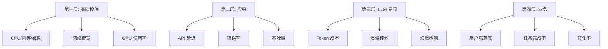
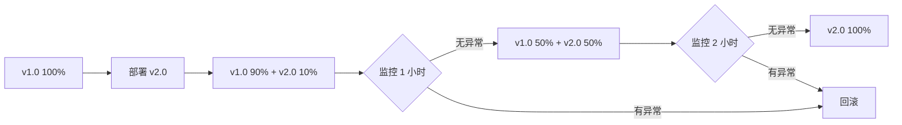

# 第 29 章：生产交付与运营

**版本**: v1.0  
**作者**: 调研专家（生产运维方向）  
**状态**: review  
**最后更新**: 2026-04-13

---

【本章导读】

本章学习目标：
- 掌握 Langfuse 和 LangSmith 可观测性平台的使用
- 学会实现兜底机制和熔断器模式
- 建立完整的四层监控体系
- 理解灰度发布和自动回滚策略

核心内容概述：
生产交付与运营是 Agent 从开发到价值的关键环节。本章介绍 LLM 可观测性平台（Langfuse、LangSmith）、兜底机制、熔断器模式、监控体系架构和灰度发布策略。

---

## 29.1 LLM 可观测性平台

**总**：当 AI Agent 失败时，需要理解失败原因：是糟糕的 Prompt？慢速的工具调用？还是幻觉？LLM 可观测性平台提供完整的追踪、监控和告警能力。

### 1. 两大主流平台

**对比研究**: Langfuse vs LangSmith (ZenML Blog, 2024)  
**链接**: https://www.zenml.io/blog/langfuse-vs-langsmith

| 维度 | Langfuse | LangSmith |
|------|----------|-----------|
| **类型** | 开源、框架无关 | 托管、LangChain 原生 |
| **GitHub Stars** | 20.5k+ | 670+ |
| **PyPI Downloads** | 6.3M | 105M |
| **核心哲学** | 开源、框架无关 | LangChain 原生、生态优先 |
| **代表用户** | Hugging Face, Cohere | LangChain + LangGraph 团队 |

> **注意**：上述数据截至 2026-04，GitHub Stars 和 PyPI Downloads 会动态变化。其他主流可观测性平台还包括 Arize Phoenix、WhyLabs 等。

### 2. 追踪能力对比

**Langfuse Tracing**：

追踪模型：Hierarchical traces composed of 'observations'

| Observation 类型 | 说明 |
|-----------------|------|
| **Span** | 工作单元，如函数调用或 RAG 检索步骤 |
| **Generation** | LLM 调用，包含输入输出、token 数、成本 |
| **Event** | 时间点事件，如用户点击 |

**优势**：基于 OpenTelemetry，支持分布式追踪，框架无关。

**LangSmith Tracing**：

追踪模型：Run Tree（LangChain Expression Language 原生）

| Run 类型 | 说明 |
|---------|------|
| **Parent Run** | 整个 Agent 执行 |
| **Child Runs** | 工具调用、Prompt 格式化、LLM 调用、输出解析 |

**优势**：LangChain 集成自动追踪，`@traceable` 装饰器支持自定义函数。

**对比结论**：Langfuse 在灵活性上胜出（OpenTelemetry + 框架无关）。

### 3. 监控与告警对比

**Langfuse 监控**：
- ✅ 实时分析仪表板（成本、延迟、质量评分）
- ✅ 按用户、会话、Prompt 版本过滤
- ⚠️ 原生告警能力有限（仅成本告警）
- ⚠️ 需要通过 Metrics API 或 Webhooks 构建自定义告警

**LangSmith 监控**：
- ✅ 预建仪表板（自动为每个项目生成）
- ✅ 自定义仪表板
- ✅ **原生告警**：可配置阈值告警
  - 例如：>5% 错误率超过 5 分钟
  - 通知：Slack、Email、Webhooks
- ✅ Insights 部分（异常检测和主动告警）

**对比结论**：LangSmith 在告警方面胜出（开箱即用的告警系统）。

### 4. 平台选择建议

**选择 Langfuse 当**：
- ✅ 需要开源方案
- ✅ 使用多框架（不只是 LangChain）
- ✅ 需要自定义和扩展
- ✅ 重视数据隐私（自托管）

**选择 LangSmith 当**：
- ✅ 全栈 LangChain/LangGraph
- ✅ 需要开箱即用的告警
- ✅ 重视集成便利性
- ✅ 团队规模较小

**总**：Langfuse 和 LangSmith 各有优势，选择取决于技术栈和需求。

---

## 29.2 兜底机制

**总**：生产系统需要持续监控 LLM 端点健康状态，并实现兜底机制，确保服务在异常情况下仍能正常运行。

### 1. 兜底策略

| 策略 | 说明 | 适用场景 |
|------|------|---------|
| **模型降级** | 从 GPT-4 降级到 GPT-4o-mini | API 故障 |
| **缓存响应** | 返回缓存的类似响应 | 高延迟 |
| **简化 Prompt** | 使用更简单的 Prompt | 复杂请求失败 |
| **规则引擎** | 使用规则-based 系统 | LLM 完全不可用 |
| **排队重试** | 将请求排队等待重试 | 临时故障 |

### 2. 实现示例

```python
class LLMFallbackHandler:
    def __init__(self):
        self.primary_model = "gpt-4"
        self.fallback_model = "gpt-4o-mini"
        self.cache = {}
        self.circuit_breaker = CircuitBreaker(
            failure_threshold=5,
            recovery_timeout=60
        )
    
    def generate(self, prompt, **kwargs):
        """
        带兜底的 LLM 调用
        """
        try:
            # 尝试主模型
            response = self.circuit_breaker.call(
                self._call_primary_model,
                prompt, **kwargs
            )
            return response
        except CircuitBreakerError:
            # 熔断器触发，使用兜底
            return self._fallback_to_secondary(prompt, **kwargs)
        except Exception as e:
            # 其他异常，尝试缓存
            return self._fallback_to_cache(prompt)
    
    def _fallback_to_secondary(self, prompt, **kwargs):
        """降级到次要模型"""
        return self._call_model(self.fallback_model, prompt, **kwargs)
    
    def _fallback_to_cache(self, prompt):
        """使用缓存响应"""
        # 查找最相似的缓存响应
        similar_prompt = self._find_similar_prompt(prompt)
        if similar_prompt:
            # 检查语义相似度（embedding cosine similarity > 0.85）
            similarity = self._calculate_similarity(prompt, similar_prompt)
            if similarity > 0.85:
                return self.cache[similar_prompt]
        raise Exception("No fallback available")
```

### 3. 兜底层级

**第一层**：主模型（GPT-4）
- 最佳质量
- 成本较高

**第二层**：降级模型（GPT-4o-mini）
- 质量可接受
- 成本较低

**第三层**：缓存响应
- 快速响应
- 可能不够准确
- **语义一致性保证**：使用 embedding cosine similarity > 0.85 阈值

**第四层**：规则引擎
- 保证基本功能
- 质量有限

**降级时的 Prompt 调整策略**：
- 从 GPT-4 降级到 GPT-4o-mini 时，简化输出格式要求
- 减少复杂指令，使用更明确的格式约束
- 增加 output schema 定义，保证输出结构一致

**总**：兜底机制是生产系统的保险，确保在任何异常情况下服务都能正常运行。

---

## 29.3 熔断器模式

**总**：熔断器模式在大约 10-15 次失败请求后触发阈值，快速失败，避免级联故障，是微服务和 LLM API 调用的标准容错模式。

### 1. 状态机

```
Closed (关闭)
    ↓ 失败次数达到阈值
Open (打开) - 快速失败
    ↓ 恢复超时后
Half-Open (半开) - 试探请求
    ↓ 成功 → Closed
    ↓ 失败 → Open
```

### 2. 状态说明

| 状态 | 行为 | 说明 |
|------|------|------|
| **Closed** | 正常请求 | 监控失败次数 |
| **Open** | 快速失败 | 不调用后端，直接返回错误 |
| **Half-Open** | 试探请求 | 允许少量请求测试恢复 |

### 3. 实现示例

> **注意**：以下示例是单线程实现。生产环境需要使用成熟的熔断器库（如 PyBreaker、resilience4j），或基于 Redis 实现分布式熔断器状态同步。

```python
import time
from enum import Enum

class CircuitState(Enum):
    CLOSED = "closed"
    OPEN = "open"
    HALF_OPEN = "half_open"

class CircuitBreaker:
    def __init__(self, failure_threshold=5, recovery_timeout=60):
        """
        初始化熔断器
        
        参数：
        - failure_threshold: 失败阈值（需根据 QPS 动态调整）
          - 低 QPS（<100）：5-10
          - 中 QPS（100-1000）：10-50
          - 高 QPS（>1000）：50-100
        - recovery_timeout: 恢复超时（秒）
        """
        self.failure_threshold = failure_threshold
        self.recovery_timeout = recovery_timeout
        self.failure_count = 0
        self.state = CircuitState.CLOSED
        self.last_failure_time = None
    
    def call(self, func, *args, **kwargs):
        if self.state == CircuitState.OPEN:
            if self._should_attempt_reset():
                self.state = CircuitState.HALF_OPEN
            else:
                raise CircuitBreakerError("Circuit breaker is open")
        
        try:
            result = func(*args, **kwargs)
            self._on_success()
            return result
        except Exception as e:
            self._on_failure()
            raise
    
    def _should_attempt_reset(self):
        return (time.time() - self.last_failure_time) > self.recovery_timeout
    
    def _on_success(self):
        self.failure_count = 0
        self.state = CircuitState.CLOSED
    
    def _on_failure(self):
        self.failure_count += 1
        self.last_failure_time = time.time()
        
        if self.failure_count >= self.failure_threshold:
            self.state = CircuitState.OPEN

class CircuitBreakerError(Exception):
    pass
```

### 4. 应用场景

- API 调用（OpenAI、Anthropic）
- 数据库查询
- 外部服务调用
- 工具执行

**总**：熔断器模式是生产系统容错的标准实践，有效避免级联故障。

---

## 29.4 监控体系架构

**总**：完整的监控体系需要覆盖基础设施、应用、LLM 专项和业务四个层级，确保全方位可观测性。

### 1. 四层监控体系



```
第一层：基础设施监控
    ├─ CPU、内存、磁盘
    ├─ 网络带宽
    └─ GPU 使用率
    ↓
第二层：应用监控
    ├─ API 延迟
    ├─ 错误率
    ├─ 吞吐量
    └─ 并发数
    ↓
第三层：LLM 专项监控
    ├─ Token 使用量
    ├─ 成本追踪
    ├─ 模型响应质量
    └─ 幻觉检测
    ↓
第四层：业务监控
    ├─ 用户满意度
    ├─ 任务完成率
    ├─ 转化率
    └─ 业务指标
```

### 2. LLM 专项指标

| 指标 | 说明 | 告警阈值 |
|------|------|---------|
| **Token 成本** | 每次调用的 token 成本 | > $0.01/次 |
| **响应延迟** | P99 延迟 | > 5s |
| **错误率** | API 错误比例 | > 5% |
| **质量评分** | LLM-as-Judge 评分 | < 3.5/5 |
| **幻觉率** | 事实错误比例 | > 10% |

### 3. 告警策略

> **注意**：以下阈值是示例值，需要根据业务场景和 SLO 调整。不同业务场景的阈值差异很大（客服 Agent vs 代码生成 Agent）。

| 级别 | 条件 | 动作 | 通知方式 |
|------|------|------|---------|
| **Info** | 成本接近预算 | 记录日志 | Dashboard |
| **Warning** | 错误率 > 3% | 准备兜底 | Email |
| **Critical** | 错误率 > 5% | 触发兜底 | Slack + Email |
| **Emergency** | 服务不可用 | 全面降级 | Phone + Slack |

### 3.5 SLO/SLI/SLA 设计

**概念说明**：
- **SLI（Service Level Indicator）**：服务等级指标，如错误率、延迟
- **SLO（Service Level Objective）**：服务等级目标，如错误率 < 1%
- **SLA（Service Level Agreement）**：服务等级协议，对外承诺

**SLO 设计方法**：
1. **基于用户满意度**：调研用户对延迟/错误的容忍度
2. **基于历史数据**：分析过去 3-6 个月的 P95/P99 值
3. **基于业务目标**：根据业务 KPI 反推技术指标

**示例 SLO**：
- 可用性：99.9%（每月宕机时间 < 43 分钟）
- 延迟 P99：< 3 秒
- 错误率：< 1%
- 质量评分：> 4.0/5.0

### 4. 监控工具栈

```
数据采集:
    ├─ Langfuse / LangSmith (LLM 追踪)
    ├─ Prometheus (指标采集)
    └─ OpenTelemetry (分布式追踪)
    ↓
数据存储:
    ├─ VictoriaMetrics / InfluxDB (时序数据)
    └─ Elasticsearch (日志)
    ↓
可视化:
    ├─ Grafana (仪表板)
    └─ Kibana (日志分析)
    ↓
告警:
    ├─ AlertManager (告警管理)
    ├─ PagerDuty (紧急告警)
    └─ Slack / Email (通知)
```

**总**：四层监控体系覆盖从基础设施到业务的全方位可观测性，是生产运营的基础。

---

## 29.5 灰度发布与回滚

**总**：灰度发布通过逐步增加新版本流量比例，降低发布风险；自动回滚在检测到异常时快速恢复到稳定版本。

### 1. 灰度发布策略

**基础策略**：



**基于用户分群的灰度策略**：
1. **内部用户**（1%）：公司员工、开发团队
2. **Beta 用户**（5%）：活跃用户、愿意尝鲜
3. **付费用户**（20%）：高价值用户，重点监控
4. **全量用户**（100%）：逐步放量

**每个阶段的关键验证指标**：
- 错误率：< 2%
- 延迟 P99：< 5s
- 用户满意度：> 4.0
- 业务指标：无显著下降

### 2. 回滚策略

| 触发条件 | 动作 | 时间 |
|---------|------|------|
| 错误率 > 5% | 自动回滚 | 立即 |
| 延迟 P99 > 10s | 自动回滚 | 5 分钟内 |
| 质量评分 < 3.0 | 人工决策 | 30 分钟内 |

### 3. 实施建议

**第一阶段**（1-2 周）：可观测性基础
1. 部署 Langfuse 或 LangSmith
2. 配置基本追踪
3. 建立仪表板

**第二阶段**（2-4 周）：告警与兜底
1. 配置告警规则
2. 实现熔断器
3. 实现兜底机制

**第三阶段**（持续）：优化与自动化
1. 自动化灰度发布
2. 自动化回滚
3. 持续优化指标

**总**：灰度发布和自动回滚是安全发布的保障，通过逐步验证和快速恢复降低发布风险。

---

## 29.6 简单举例

**案例**: 漫剧剧本生成 Agent 的生产运营

**场景描述**：
漫剧剧本生成 Agent 上线后，需要持续监控服务质量，及时处理异常，并在模型迭代时安全发布新版本。

**技术应用**：
1. **可观测性**：部署 Langfuse，追踪每次剧本生成的 Prompt、工具调用、LLM 响应和成本
2. **兜底机制**：GPT-4 故障时自动降级到 GPT-4o-mini，确保服务不中断
3. **熔断器**：API 错误率 > 5% 时触发熔断，快速失败并告警
4. **监控告警**：实时监控延迟（P99 < 3s）、错误率（< 2%）、质量评分（> 4.0）
5. **灰度发布**：新模型 10% → 50% → 100%，每个阶段监控 1-2 小时

**效果说明**：
通过完整的生产运营体系，Agent 可用性达到 99.9%，平均故障恢复时间 < 5 分钟，每次发布零事故。

**涉及技术**: Langfuse、熔断器、兜底机制、灰度发布  
**详见**: 第 18 章（完整案例串讲）

---

**知识来源**:
- 📝 **Langfuse vs LangSmith**: https://www.zenml.io/blog/langfuse-vs-langsmith
- 📝 **LLMOps 对比**: https://kanerika.com/blogs/llmops-observability/
- 📝 **兜底机制**: https://www.zenml.io/llmops-database/implementing-llm-fallback-mechanisms-for-production-incident-response-system
- 📝 **LLM API 弹性**: https://tianpan.co/blog/2026-03-11-llm-api-resilience-production
- 📝 **Agent 可靠性**: https://platformengineering.org/blog/the-agent-reliability-score-what-your-ai-platform-must-guarantee-before-agents-go-live

---

**修改记录**:
- v1.0 (2026-04-13): 初始版本，基于调研报告编写
