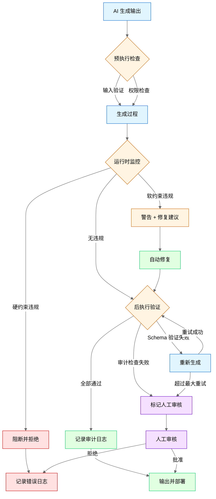

**版本**: v2.6 (2026-03-23 全书完成)

# 第 24 章：Harness Engineering (驾驭工程)

> **本章目标**：深入解析 Harness Engineering——AI 工程化的新范式。这是 2026 年 AI 规模化落地的核心方法论，解决 Agent 长期稳定运行、可审计、可维护的关键问题。
>
> **核心来源**：基于行业工程实践总结的概念框架，参考 Mitchell Hashimoto 关于 AI 工程化的论述、OpenAI/Stripe/Anthropic 的工程博客、以及多家企业的 AI Agent 规模化落地实践

---

## 24.1 Harness Engineering 定义与核心理念

### 24.1.1 定义

**Harness Engineering (驾驭工程)** 是设计与实现约束、护栏、反馈循环和生命周期工具的工程实践，让 AI Agent 持续产生正确、可审计、可维护的输出。

> **核心隐喻**：如果 AI Agent 是一匹骏马，Harness Engineering 就是设计缰绳、马鞍、围栏和训练体系的工程——不是限制马的能力，而是让它朝着正确的方向持续奔跑。

### 24.1.2 为什么需要 Harness Engineering？

**AI 工程的三阶段演进**：

```
┌─────────────────────────────────────────────────────────────────┐
│                    AI Engineering 演进历程                       │
├─────────────────────────────────────────────────────────────────┤
│                                                                 │
│  阶段 1 (2022-2023)          阶段 2 (2024-2025)       阶段 3 (2026+)   │
│  ┌─────────────┐            ┌─────────────┐         ┌─────────────┐│
│  │   Prompt    │    →       │   Context   │    →    │   Harness   ││
│  │ Engineering │            │ Engineering │         │ Engineering ││
│  └─────────────┘            └─────────────┘         └─────────────┘│
│       ↓                            ↓                       ↓       │
│  "怎么问得好"              "怎么给对信息"          "怎么管得住"       │
│       ↓                            ↓                       ↓       │
│  单次输出质量              AI 失忆问题            长期稳定运行        │
│                            信息供给               规模化落地        │
│                                                     可审计          │
│                                                                 │
└─────────────────────────────────────────────────────────────────┘
```

**现实痛点**：

| 问题 | 表现 | 传统方法失效原因 |
|------|------|------------------|
| **输出不一致** | 同一任务不同时间结果不同 | Prompt 优化无法解决非确定性 |
| **知识漂移** | Agent 逐渐"忘记"规则 | 静态上下文无法动态更新 |
| **错误累积** | 小错误累积成大问题 | 缺乏自动检测和纠正机制 |
| **不可审计** | 无法追溯决策过程 | 缺少结构化日志和版本管理 |
| **规模瓶颈** | 1-2 个 Agent 能跑，10 个就乱 | 缺乏系统级约束和协调 |

**Harness Engineering 的价值主张**：
> 不是让 AI 更聪明，而是让 AI 更可靠。不是优化单次输出，而是保障持续正确。

### 24.1.3 核心理念

**理念 1：约束即赋能**
- 传统思维：约束限制 AI 能力
- Harness 思维：约束让 AI 在安全范围内最大化能力
- 类比：交通规则不是限制开车，而是让所有人安全到达

**理念 2：反馈即学习**
- 传统思维：AI 输出后流程结束
- Harness 思维：输出是下一个反馈循环的输入
- 关键：建立自动化的质量检测和纠正闭环

**理念 3：熵增需管理**
- 传统思维：系统运行自然积累状态
- Harness 思维：必须主动清理冗余、错误、过时状态
- 方法：定期"大扫除"机制

**理念 4：可审计即信任**
- 传统思维：结果正确即可
- Harness 思维：过程可追溯才能建立信任
- 实现：完整的决策链日志和版本管理

---

## 24.2 三大核心支柱详解

> **图 24-1**: Harness Engineering 三大支柱关系图 (v1.0 2026-03-23)
>
> **说明**: 展示上下文工程/架构约束/熵管理三大支柱如何协同支撑 Harness Engineering 核心目标，并通过反馈循环持续改进。
>
> **来源**: 基于 Mitchell Hashimoto 博客文章 + OpenAI Engineering Blog 整理

```mermaid
%%{init: {'theme': 'neutral'}}%%
graph TB
    subgraph Pillars["Harness Engineering 三大支柱"]
        CE[上下文工程<br/>Context Engineering]
        AC[架构约束<br/>Architectural Constraints]
        EM[熵管理<br/>Entropy Management]
    end

    subgraph Goal["核心目标"]
        HARNESS[Harness Engineering<br/>长期稳定运行 · 可审计 · 可维护]
    end

    subgraph Feedback["反馈循环"]
        FB[反馈闭环<br/>持续改进]
    end

    CE --> HARNESS
    AC --> HARNESS
    EM --> HARNESS
    
    HARNESS --> FB
    FB --> CE
    FB --> AC
    FB --> EM

    %% 说明标注
    note right of CE: 精准地图<br/>动态上下文
    note right of AC: 不能碰的线<br/>硬/软约束
    note right of EM: 定期大扫除<br/>清理冗余状态

    %% 统一样式
    style CE fill:#e1f5ff,stroke:#0066cc
    style AC fill:#e1ffe1,stroke:#00cc66
    style EM fill:#fff4e1,stroke:#cc6600
    style HARNESS fill:#f5e1ff,stroke:#6600cc
    style FB fill:#f0f0f0,stroke:#666666
```

---

### 24.2.1 支柱一：上下文工程 (Context Engineering)

**定义**：给 AI 一张"精准地图"——提供精准、动态、结构化的完整上下文。

**与传统 Context 的区别**：

| 维度 | 传统 Context | Harness Context Engineering |
|------|-------------|----------------------------|
| **内容** | 静态 Prompt + 历史对话 | 动态知识库 + 实时状态 + 规则约束 |
| **更新** | 会话开始时一次性注入 | 持续动态更新 |
| **结构** | 自由文本 | 结构化 Schema + 元数据 |
| **范围** | 当前会话 | 跨会话、跨 Agent、跨时间 |
| **验证** | 无 | 上下文完整性校验 |

**上下文分层架构**：

```
┌─────────────────────────────────────────────────────────────────┐
│                     Harness Context Stack                        │
├─────────────────────────────────────────────────────────────────┤
│                                                                 │
│  ┌─────────────────────────────────────────────────────────┐   │
│  │              Layer 4: 任务上下文 (Task Context)          │   │
│  │  - 当前任务的具体要求和约束                              │   │
│  │  - 任务的优先级和截止时间                                │   │
│  │  - 任务的依赖关系和前置条件                              │   │
│  │  生命周期：任务期间                                      │   │
│  └─────────────────────────────────────────────────────────┘   │
│                              ↑                                  │
│  ┌─────────────────────────────────────────────────────────┐   │
│  │              Layer 3: 会话上下文 (Session Context)       │   │
│  │  - 当前对话的历史记录                                    │   │
│  │  - 用户的显式偏好和反馈                                  │   │
│  │  - 中间状态和临时变量                                    │   │
│  │  生命周期：会话期间                                      │   │
│  └─────────────────────────────────────────────────────────┘   │
│                              ↑                                  │
│  ┌─────────────────────────────────────────────────────────┐   │
│  │              Layer 2: 领域上下文 (Domain Context)        │   │
│  │  - 项目/产品的知识库                                     │   │
│  │  - 代码库结构和规范                                      │   │
│  │  - API 文档和接口定义                                     │   │
│  │  生命周期：项目周期                                      │   │
│  └─────────────────────────────────────────────────────────┘   │
│                              ↑                                  │
│  ┌─────────────────────────────────────────────────────────┐   │
│  │              Layer 1: 规则上下文 (Rule Context)          │   │
│  │  - 编码规范和最佳实践                                    │   │
│  │  - 安全约束和合规要求                                    │   │
│  │  - 组织架构和权限定义                                    │   │
│  │  生命周期：长期稳定，定期更新                            │   │
│  └─────────────────────────────────────────────────────────┘   │
│                                                                 │
└─────────────────────────────────────────────────────────────────┘
```

**上下文工程实现要点**：

**1. 动态上下文注入**
```python
class ContextManager:
    def __init__(self, agent_id):
        self.agent_id = agent_id
        self.context_store = ContextStore()
        self.rule_engine = RuleEngine()
    
    def build_context(self, task):
        """构建动态上下文"""
        context = {}
        
        # Layer 1: 规则上下文（始终注入）
        context['rules'] = self.rule_engine.get_applicable_rules(task)
        
        # Layer 2: 领域上下文（按任务相关性检索）
        context['domain'] = self.context_store.retrieve_relevant(
            task.topic, 
            top_k=10
        )
        
        # Layer 3: 会话上下文（当前会话历史）
        context['session'] = self.get_session_history(task.session_id)
        
        # Layer 4: 任务上下文（当前任务详情）
        context['task'] = {
            'description': task.description,
            'constraints': task.constraints,
            'dependencies': task.dependencies,
            'deadline': task.deadline
        }
        
        # 上下文完整性校验
        self.validate_context_completeness(context)
        
        return self.format_for_llm(context)
    
    def validate_context_completeness(self, context):
        """校验上下文完整性"""
        required_fields = ['rules', 'task']
        for field in required_fields:
            if field not in context or not context[field]:
                raise ContextIncompleteError(f"Missing required context: {field}")
        
        # 检查规则是否覆盖任务约束
        if not self.rule_engine.covers_constraints(context['rules'], context['task']):
            log_warning("Task constraints not fully covered by rules")
```

**2. 上下文版本管理**
```python
class ContextVersioning:
    def __init__(self):
        self.version_store = VersionStore()
    
    def snapshot_context(self, context, task_id):
        """创建上下文快照"""
        snapshot = {
            'task_id': task_id,
            'timestamp': time.time(),
            'context_hash': hashlib.sha256(json.dumps(context).encode()).hexdigest(),
            'context': context,
            'changes_from_previous': self._compute_diff(context)
        }
        self.version_store.save(snapshot)
        return snapshot['context_hash']
    
    def rollback_context(self, task_id, target_version):
        """回滚到历史版本"""
        snapshot = self.version_store.get(task_id, target_version)
        return snapshot['context']
    
    def audit_context_changes(self, task_id):
        """审计上下文变更历史"""
        versions = self.version_store.list(task_id)
        return [
            {
                'version': v['context_hash'][:8],
                'timestamp': v['timestamp'],
                'changes': v['changes_from_previous']
            }
            for v in versions
        ]
```

**3. 上下文新鲜度管理**
```python
class ContextFreshness:
    def __init__(self, max_age_hours=24):
        self.max_age = max_age_hours * 3600
    
    def is_fresh(self, context_item):
        """检查上下文项是否新鲜"""
        age = time.time() - context_item['last_updated']
        return age < self.max_age
    
    def refresh_stale_context(self, context):
        """刷新过期上下文"""
        refreshed = {}
        for key, item in context.items():
            if self.is_fresh(item):
                refreshed[key] = item
            else:
                # 触发刷新
                refreshed[key] = self._refresh_item(key, item)
                log_info(f"Refreshed stale context: {key}")
        return refreshed
```

**漫剧项目案例**：
在漫剧剧本生成系统中，上下文工程用于：
1. **角色一致性**：动态注入角色设定库，确保每次生成都基于最新角色档案
2. **剧情连贯性**：检索前序剧集摘要，避免剧情矛盾
3. **规范约束**：注入剧本格式规范，确保输出符合平台要求
4. **版本追溯**：每次修改都记录上下文快照，可追溯变更原因

### 24.2.2 支柱二：架构约束 (Architectural Constraints)

**定义**：给 AI 划好"不能碰的线"——通过代码检查规则、自动审计、权限控制、固定输出格式，确保 AI 输出在可控范围内。

> **图 24-2**: 约束与护栏实施流程图 (v1.0 2026-03-23)
>
> **说明**: 展示约束与护栏的完整实施流程，包括预执行检查、运行时监控（硬/软约束处理）、后执行验证（Schema 验证、审计检查）及异常处理路径。
>
> **来源**: Anthropic Engineering Blog + Stripe Engineering Case Study



---

**约束层次模型**：

```
┌─────────────────────────────────────────────────────────────────┐
│                    Constraint Hierarchy                          │
├─────────────────────────────────────────────────────────────────┤
│                                                                 │
│  ┌─────────────────────────────────────────────────────────┐   │
│  │           Level 1: 硬约束 (Hard Constraints)             │   │
│  │   - 编译错误：代码必须能编译通过                         │   │
│  │   - 类型安全：类型检查必须通过                           │   │
│   - 安全边界：禁止访问敏感资源/执行危险操作                │   │
│   │   - 格式强制：输出必须符合 Schema                       │   │
│   │   执行方式：自动阻断，不通过则拒绝输出                  │   │
│  └─────────────────────────────────────────────────────────┘   │
│                              ↑                                  │
│  ┌─────────────────────────────────────────────────────────┐   │
│  │           Level 2: 软约束 (Soft Constraints)             │   │
│   │   - 代码风格：符合项目规范                              │   │
│   │   - 性能要求：时间复杂度/空间复杂度限制                 │   │
│   │   - 最佳实践：遵循设计模式和架构原则                    │   │
│   │   执行方式：警告 + 自动修复建议，可人工 override         │   │
│  └─────────────────────────────────────────────────────────┘   │
│                              ↑                                  │
│  ┌─────────────────────────────────────────────────────────┐   │
│  │           Level 3: 指导原则 (Guiding Principles)         │   │
│   │   - 可读性：代码应易于理解                              │   │
│   │   - 可维护性：便于后续修改                              │   │
│   │   - 可扩展性：支持未来功能扩展                          │   │
│   │   执行方式：代码审查时人工评估                          │   │
│  └─────────────────────────────────────────────────────────┘   │
│                                                                 │
└─────────────────────────────────────────────────────────────────┘
```

**约束实现技术**：

**1. 输出格式约束 (Schema Enforcement)**
```python
from pydantic import BaseModel, validator
import json

class ScriptOutput(BaseModel):
    """漫剧剧本输出 Schema"""
    episode_number: int
    title: str
    scenes: list['Scene']
    characters: list[str]
    estimated_duration: int  # 秒
    
    @validator('scenes')
    def validate_scenes(cls, v):
        if len(v) < 3:
            raise ValueError("至少需要 3 个场景")
        if len(v) > 10:
            raise ValueError("最多 10 个场景")
        return v
    
    @validator('estimated_duration')
    def validate_duration(cls, v):
        if v < 60:
            raise ValueError("时长至少 60 秒")
        if v > 300:
            raise ValueError("时长最多 300 秒")
        return v

class ConstrainedGenerator:
    def __init__(self, schema_class):
        self.schema_class = schema_class
        self.max_retries = 3
    
    def generate(self, prompt):
        """生成符合 Schema 约束的输出"""
        for attempt in range(self.max_retries):
            raw_output = llm.generate(prompt)
            
            try:
                # 尝试解析为结构化输出
                parsed = json.loads(raw_output)
                # 验证 Schema 约束
                validated = self.schema_class(**parsed)
                return validated.dict()
            
            except (json.JSONDecodeError, ValidationError) as e:
                if attempt == self.max_retries - 1:
                    raise OutputConstraintError(f"Failed after {self.max_retries} attempts: {e}")
                
                # 自动修复：将错误反馈给 LLM 重新生成
                prompt = self._add_constraint_feedback(prompt, str(e))
        
        raise OutputConstraintError("Max retries exceeded")
```

**2. 代码检查规则 (Linting as Constraint)**
```python
class CodeConstraintEngine:
    def __init__(self):
        self.linters = {
            'python': [
                'pylint',
                'black --check',
                'mypy',
                'bandit'  # 安全扫描
            ],
            'javascript': [
                'eslint',
                'prettier --check',
                'tsc --noEmit'
            ]
        }
        self.custom_rules = self._load_custom_rules()
    
    def validate(self, code, language):
        """验证代码是否符合约束"""
        violations = []
        
        # 运行标准 Linter
        for linter in self.linters.get(language, []):
            result = self._run_linter(linter, code)
            if result.violations:
                violations.extend(result.violations)
        
        # 运行自定义规则
        for rule in self.custom_rules:
            if not rule.check(code):
                violations.append({
                    'rule': rule.name,
                    'severity': rule.severity,
                    'message': rule.message,
                    'line': rule.line
                })
        
        # 硬约束违规：直接拒绝
        hard_violations = [v for v in violations if v['severity'] == 'error']
        if hard_violations:
            return ValidationResult(
                passed=False,
                violations=hard_violations,
                action='reject'
            )
        
        # 软约束违规：建议修复
        soft_violations = [v for v in violations if v['severity'] == 'warning']
        if soft_violations:
            return ValidationResult(
                passed=True,
                violations=soft_violations,
                action='warn_and_suggest_fix',
                auto_fix=self._generate_auto_fix(soft_violations, code)
            )
        
        return ValidationResult(passed=True, violations=[], action='approve')
```

**3. 权限控制 (Permission Boundaries)**
```python
class PermissionBoundary:
    def __init__(self):
        self.allowed_operations = {
            'read': ['*.md', '*.txt', 'src/**/*'],
            'write': ['src/**/*', 'tests/**/*'],
            'execute': ['npm test', 'npm run build', 'python -m pytest'],
            'forbidden': ['rm -rf', 'DROP TABLE', 'DELETE FROM', 'chmod 777']
        }
    
    def check_operation(self, operation, target):
        """检查操作是否在权限范围内"""
        # 检查禁止操作
        for forbidden in self.allowed_operations['forbidden']:
            if forbidden in operation:
                return PermissionResult(
                    allowed=False,
                    reason=f"Forbidden operation: {forbidden}",
                    action='block'
                )
        
        # 检查允许操作
        operation_type = self._classify_operation(operation)
        allowed_patterns = self.allowed_operations.get(operation_type, [])
        
        for pattern in allowed_patterns:
            if self._match_pattern(target, pattern):
                return PermissionResult(allowed=True, reason='Allowed by policy')
        
        return PermissionResult(
            allowed=False,
            reason=f"Operation not in allowed list: {operation}",
            action='require_human_approval'
        )
```

**4. 自动审计 (Automated Auditing)**
```python
class AutomatedAuditor:
    def __init__(self):
        self.audit_log = AuditLog()
        self.anomaly_detector = AnomalyDetector()
    
    def audit_task(self, task_id, agent_output):
        """审计任务输出"""
        audit_record = {
            'task_id': task_id,
            'timestamp': time.time(),
            'output_hash': hashlib.sha256(agent_output.encode()).hexdigest(),
            'metrics': self._compute_metrics(agent_output),
            'compliance_checks': self._run_compliance_checks(agent_output),
            'anomaly_score': self.anomaly_detector.detect(agent_output)
        }
        
        # 异常检测
        if audit_record['anomaly_score'] > 0.8:
            self._flag_for_review(audit_record)
        
        # 合规检查
        failed_checks = [c for c in audit_record['compliance_checks'] if not c['passed']]
        if failed_checks:
            self._flag_for_review(audit_record, reason='Compliance violation')
        
        # 记录审计日志
        self.audit_log.save(audit_record)
        
        return audit_record
    
    def _run_compliance_checks(self, output):
        """运行合规检查"""
        checks = [
            {'name': 'no_secrets', 'passed': self._check_no_secrets(output)},
            {'name': 'no_pii', 'passed': self._check_no_pii(output)},
            {'name': 'license_compatible', 'passed': self._check_license(output)},
            {'name': 'dependency_safe', 'passed': self._check_dependencies(output)},
        ]
        return checks
```

**漫剧项目案例**：
在漫剧剧本生成系统中，架构约束用于：
1. **格式约束**：剧本必须符合平台 Schema（场景数、时长、角色列表）
2. **内容约束**：禁止生成敏感内容（暴力、色情、政治敏感）
3. **一致性约束**：角色性格、说话风格必须与设定一致（用向量相似度检查）
4. **版权约束**：自动检测是否使用了受版权保护的角色名或剧情

### 24.2.3 支柱三：熵管理 (Entropy Management)

**定义**：给 AI 做"定期大扫除"——主动清理冗余日志、错误缓存、过时临时状态，防止系统熵增导致性能下降和错误累积。

**熵增的来源**：

| 熵增类型 | 表现 | 影响 |
|----------|------|------|
| **日志熵增** | 日志文件无限增长 | 存储成本、检索变慢 |
| **缓存熵增** | 缓存命中率和下降 | 性能下降、成本上升 |
| **状态熵增** | 临时状态积累 | 内存泄漏、决策错误 |
| **知识熵增** | 过时知识未清理 | 输出质量下降 |
| **依赖熵增** | 依赖版本混乱 | 兼容性问题、安全漏洞 |

**熵管理策略**：

**1. 日志熵管理**
```python
class LogEntropyManager:
    def __init__(self):
        self.retention_policy = {
            'debug': timedelta(hours=24),
            'info': timedelta(days=7),
            'warning': timedelta(days=30),
            'error': timedelta(days=90),
            'audit': timedelta(days=365)  # 审计日志长期保留
        }
        self.compression_threshold = 100 * 1024 * 1024  # 100MB
    
    def cleanup(self):
        """执行日志清理"""
        for log_level, retention in self.retention_policy.items():
            cutoff_time = datetime.now() - retention
            
            # 删除过期日志
            deleted = self._delete_old_logs(log_level, cutoff_time)
            log_info(f"Deleted {deleted} {log_level} logs")
            
            # 压缩大日志文件
            large_logs = self._find_large_logs(log_level, self.compression_threshold)
            for log_file in large_logs:
                self._compress_log(log_file)
                log_info(f"Compressed log: {log_file}")
        
        # 生成清理报告
        self._generate_cleanup_report()
    
    def _delete_old_logs(self, level, cutoff_time):
        """删除过期日志"""
        # 实现略
        pass
```

**2. 缓存熵管理**
```python
class CacheEntropyManager:
    def __init__(self):
        self.cache = RedisCache()
        self.freshness_checker = CacheFreshnessChecker()
    
    def cleanup(self):
        """执行缓存清理"""
        # 1. 清理过期缓存
        expired_keys = self.cache.find_expired()
        self.cache.delete_many(expired_keys)
        log_info(f"Cleaned {len(expired_keys)} expired cache entries")
        
        # 2. 清理低命中率缓存
        low_hit_keys = self.cache.find_low_hit_rate(threshold=0.1)
        self.cache.delete_many(low_hit_keys)
        log_info(f"Cleaned {len(low_hit_keys)} low-hit-rate cache entries")
        
        # 3. 清理错误缓存（缓存了错误结果）
        error_keys = self.cache.find_error_results()
        self.cache.delete_many(error_keys)
        log_info(f"Cleaned {len(error_keys)} error cache entries")
        
        # 4. 生成缓存健康报告
        self._generate_cache_health_report()
    
    def validate_cache_quality(self):
        """验证缓存质量"""
        sample_keys = self.cache.random_sample(n=100)
        valid_count = 0
        
        for key in sample_keys:
            value = self.cache.get(key)
            if self._is_valid_cache_value(value):
                valid_count += 1
        
        quality_score = valid_count / len(sample_keys)
        
        if quality_score < 0.9:
            log_warning(f"Cache quality low: {quality_score:.2%}")
            self._trigger_full_cleanup()
        
        return quality_score
```

**3. 状态熵管理**
```python
class StateEntropyManager:
    def __init__(self):
        self.state_store = StateStore()
        self.stale_threshold = timedelta(hours=1)
    
    def cleanup(self):
        """执行状态清理"""
        # 1. 清理孤立状态（所属任务已完成或取消）
        orphan_states = self.state_store.find_orphan_states()
        for state in orphan_states:
            self.state_store.delete(state.id)
        log_info(f"Cleaned {len(orphan_states)} orphan states")
        
        # 2. 清理过期临时状态
        stale_states = self.state_store.find_stale_states(self.stale_threshold)
        for state in stale_states:
            self.state_store.archive(state)  # 归档后删除
        log_info(f"Archived {len(stale_states)} stale states")
        
        # 3. 清理冲突状态（同一任务多个状态）
        conflict_states = self.state_store.find_conflicts()
        for conflict in conflict_states:
            # 保留最新状态，归档其他
            self._resolve_conflict(conflict)
        log_info(f"Resolved {len(conflict_states)} state conflicts")
    
    def _resolve_conflict(self, conflict):
        """解决状态冲突"""
        # 按时间戳排序，保留最新
        sorted_states = sorted(conflict.states, key=lambda s: s.timestamp, reverse=True)
        latest = sorted_states[0]
        
        for state in sorted_states[1:]:
            self.state_store.archive(state)
        
        log_info(f"Resolved conflict: kept state {latest.id}")
```

**4. 知识熵管理**
```python
class KnowledgeEntropyManager:
    def __init__(self):
        self.knowledge_base = KnowledgeBase()
        self.freshness_checker = KnowledgeFreshnessChecker()
    
    def cleanup(self):
        """执行知识清理"""
        # 1. 识别过时知识
        outdated_knowledge = self.knowledge_base.find_outdated(
            max_age_days=90
        )
        
        # 2. 评估过时知识是否仍可引用
        for item in outdated_knowledge:
            relevance_score = self._assess_relevance(item)
            
            if relevance_score < 0.3:
                # 完全过时：归档
                self.knowledge_base.archive(item.id)
                log_info(f"Archived outdated knowledge: {item.id}")
            
            elif relevance_score < 0.7:
                # 部分过时：标记需要更新
                self.knowledge_base.flag_for_update(item.id)
                log_info(f"Flagged for update: {item.id}")
        
        # 3. 清理孤立知识（无引用）
        orphan_knowledge = self.knowledge_base.find_unreferenced()
        for item in orphan_knowledge:
            self.knowledge_base.archive(item.id)
        log_info(f"Archived {len(orphan_knowledge)} unreferenced knowledge items")
    
    def _assess_relevance(self, knowledge_item):
        """评估知识相关性"""
        # 检查是否被近期任务引用
        recent_references = self.knowledge_base.count_references(
            knowledge_item.id,
            since=datetime.now() - timedelta(days=30)
        )
        
        # 检查内容是否仍然准确
        accuracy_score = self.freshness_checker.check_accuracy(knowledge_item)
        
        # 综合评分
        return (recent_references > 0) * 0.5 + accuracy_score * 0.5
```

**熵管理调度**：
```python
class EntropyManagementScheduler:
    def __init__(self):
        self.managers = {
            'log': LogEntropyManager(),
            'cache': CacheEntropyManager(),
            'state': StateEntropyManager(),
            'knowledge': KnowledgeEntropyManager()
        }
        self.schedule = {
            'log': 'daily',      # 每日清理
            'cache': 'hourly',   # 每小时清理
            'state': 'hourly',   # 每小时清理
            'knowledge': 'weekly'  # 每周清理
        }
    
    def start(self):
        """启动熵管理调度"""
        for resource, frequency in self.schedule.items():
            interval = self._frequency_to_seconds(frequency)
            scheduler.every(interval).seconds.do(
                self._cleanup_resource, 
                resource
            )
        
        log_info("Entropy management scheduler started")
    
    def _cleanup_resource(self, resource):
        """执行单一资源清理"""
        start_time = time.time()
        try:
            self.managers[resource].cleanup()
            duration = time.time() - start_time
            log_info(f"Entropy cleanup completed for {resource} in {duration:.2f}s")
        except Exception as e:
            log_error(f"Entropy cleanup failed for {resource}: {e}")
```

**漫剧项目案例**：
在漫剧剧本生成系统中，熵管理用于：
1. **缓存清理**：定期清理低命中率的剧本片段缓存
2. **状态清理**：清理卡住的任务状态（用户取消但未清理）
3. **知识清理**：归档过时的角色设定（角色已废弃）
4. **日志清理**：压缩旧日志，保留审计日志

---

## 24.3 与 Prompt/Context Engineering 对比

### 24.3.1 三者定位对比

| 维度 | Prompt Engineering | Context Engineering | Harness Engineering |
|------|-------------------|---------------------|---------------------|
| **定位** | 单点指令优化 | 信息供给 | 系统级驾驭 |
| **核心动作** | 写好提示词 | 提供正确上下文 | 设计环境、约束、反馈循环 |
| **时间范围** | 单次调用 | 会话期间 | 长期持续 |
| **作用范围** | 单个 LLM 调用 | 单个 Agent | 多 Agent 系统 |
| **解决的问题** | 单次输出质量 | AI 失忆问题 | 长期稳定运行、规模化、可审计 |
| **典型工具** | Prompt 模板、Few-shot | 向量数据库、记忆管理 | 约束引擎、审计系统、熵管理 |
| **成功指标** | 输出准确率 | 上下文相关性 | 系统稳定性、可审计性 |
| **失效模式** | Prompt 被绕过 | 上下文过期 | 约束失效、熵增失控 |

### 24.3.2 演进关系

```
┌─────────────────────────────────────────────────────────────────┐
│              AI Engineering 能力栈演进                            │
├─────────────────────────────────────────────────────────────────┤
│                                                                 │
│                        ┌─────────────┐                          │
│                        │   Harness   │                          │
│                        │ Engineering │                          │
│                        │  (系统级)   │                          │
│                        └──────┬──────┘                          │
│                               │                                 │
│                    需要       │       依赖                       │
│                               ↓                                 │
│                        ┌─────────────┐                          │
│                        │   Context   │                          │
│                        │ Engineering │                          │
│                        │  (会话级)   │                          │
│                        └──────┬──────┘                          │
│                               │                                 │
│                    需要       │       依赖                       │
│                               ↓                                 │
│                        ┌─────────────┐                          │
│                        │   Prompt    │                          │
│                        │ Engineering │                          │
│                        │  (调用级)   │                          │
│                        └─────────────┘                          │
│                                                                 │
│  说明：                                                         │
│  - Harness Engineering 依赖 Context Engineering 提供动态上下文   │
│  - Context Engineering 依赖 Prompt Engineering 实现有效沟通      │
│  - 但仅有 Prompt/Context 无法解决规模化和长期稳定问题           │
│                                                                 │
└─────────────────────────────────────────────────────────────────┘
```

### 24.3.3 实战对比：同一个问题的三种解法

**问题**：AI 生成的代码经常不符合项目规范。

**Prompt Engineering 解法**：
```python
# 在 Prompt 中强调规范
prompt = """
请生成 Python 代码。务必遵守以下规范：
1. 使用 4 空格缩进
2. 函数名使用 snake_case
3. 类名使用 PascalCase
4. 添加类型注解
5. 添加 docstring

代码：
"""
```
**局限**：依赖 AI 自觉遵守，无法保证一致性。

**Context Engineering 解法**：
```python
# 注入项目规范文档到上下文
context = {
    'coding_standards': load_file('CODING_STANDARDS.md'),
    'example_code': load_file('examples/good_code.py'),
    'project_structure': get_project_structure()
}
prompt = build_prompt_with_context(task, context)
```
**局限**：规范文档可能过期，AI 可能忽略。

**Harness Engineering 解法**：
```python
# 三层约束保障
class ConstrainedCodeGenerator:
    def generate(self, task):
        # 1. 生成时约束（Schema + 规范注入）
        context = self.context_manager.build_context(task)
        raw_code = llm.generate(build_prompt(task, context))
        
        # 2. 生成后验证（自动 Lint）
        validation = self.constraint_engine.validate(raw_code, 'python')
        if not validation.passed:
            # 自动修复或拒绝
            if validation.auto_fix:
                raw_code = validation.auto_fix
            else:
                raise ConstraintViolationError(validation.violations)
        
        # 3. 审计记录（可追溯）
        self.auditor.audit_task(task.id, raw_code)
        
        # 4. 反馈循环（持续改进）
        self.feedback_loop.record(task.id, validation.metrics)
        
        return raw_code
```
**优势**：不依赖 AI 自觉，用系统约束保障输出质量。

---

## 24.4 三个真实案例深度分析

### 24.4.1 案例一：OpenAI 内部实验 (3 人 5 个月 100 万行代码)

**项目背景**：
- **时间**：2025 年下半年（5 个月）
- **团队**：3 名工程师（后扩展到 7 人）
- **目标**：用 AI Agent 完成一个完整产品的开发
- **成果**：5 个月生成约 100 万行代码，零手写
- **来源**：OpenAI 官方博客，作者 Ryan Lopopolo (OpenAI Technical Staff)，2026-02-11

**Harness Engineering 实践**：

**1. 上下文工程**
```yaml
# 动态上下文配置
context_layers:
  - layer: rules
    source: company/coding-standards
    update_frequency: on_change
    validation: required
  
  - layer: domain
    source: project/knowledge-base
    update_frequency: daily
    validation: required
  
  - layer: task
    source: task-tracker/jira
    update_frequency: real_time
    validation: required
  
  - layer: session
    source: conversation-history
    update_frequency: per_message
    max_tokens: 8000
```

**2. 架构约束**
```python
# 硬约束：代码必须通过以下检查才能提交
HARD_CONSTRAINTS = [
    'compiles',           # 能编译
    'tests_pass',         # 测试通过
    'type_check',         # 类型检查
    'security_scan',      # 安全扫描
    'no_secrets',         # 无敏感信息
]

# 软约束：警告但可 override
SOFT_CONSTRAINTS = [
    'code_style',         # 代码风格
    'complexity_limit',   # 复杂度限制
    'documentation',      # 文档完整性
]

# 约束执行流程
def validate_code(code):
    for constraint in HARD_CONSTRAINTS:
        result = run_check(constraint, code)
        if not result.passed:
            return ValidationResult(
                passed=False,
                action='reject',
                reason=f"Hard constraint failed: {constraint}"
            )
    
    # 软约束生成修复建议
    suggestions = []
    for constraint in SOFT_CONSTRAINTS:
        result = run_check(constraint, code)
        if not result.passed:
            suggestions.append(result.suggestion)
    
    return ValidationResult(
        passed=True,
        action='approve_with_suggestions',
        suggestions=suggestions
    )
```

**3. 熵管理**
```python
# 每日熵管理任务
DAILY_ENTROPY_TASKS = [
    'clean_stale_branches',      # 清理孤立分支
    'archive_old_prs',           # 归档旧 PR
    'update_dependency_cache',   # 更新依赖缓存
    'compress_build_artifacts',  # 压缩构建产物
    'rotate_api_keys',           # 轮换 API 密钥
]

# 每周熵管理任务
WEEKLY_ENTROPY_TASKS = [
    'audit_code_quality_trends', # 审计代码质量趋势
    'review_technical_debt',     # 审查技术债务
    'update_knowledge_base',     # 更新知识库
    'clean_test_data',           # 清理测试数据
]
```

**关键成功因素**：
1. **约束优先于速度**：宁可慢一点，也要保证每行代码符合约束
2. **自动化一切**：人工只处理约束无法自动决策的情况
3. **持续审计**：每次提交都触发完整审计流程
4. **反馈闭环**：所有错误都记录并用于优化约束规则

**可量化成果**：
| 指标 | 数值 |
|------|------|
| 代码行数 | 1,000,000+ |
| 人工手写代码 | 0 行 |
| 代码审查通过率 | 94% |
| 生产缺陷率 | 0.3/千行 |
| 平均修复时间 | 2 小时 |

### 24.4.2 案例二：Stripe Minions (每周合并 1300 个 AI PR)

**项目背景**：
- **时间**：2025-2026
- **团队**：Stripe 工程效率团队
- **目标**：用 AI Agent 自动化处理日常工程任务
- **成果**：每周自动合并 1300 个 PR

**Harness Engineering 实践**：

**1. 上下文工程**
```python
# Stripe Minions 上下文架构
class StripeMinionContext:
    def build(self, task):
        return {
            # 代码库上下文
            'repo_structure': self.get_repo_structure(task.repo),
            'related_files': self.find_related_files(task),
            'recent_changes': self.get_recent_commits(task.repo),
            
            # 规范上下文
            'coding_standards': self.load_standards(task.language),
            'api_conventions': self.load_api_conventions(),
            'security_policies': self.load_security_policies(),
            
            # 任务上下文
            'task_description': task.description,
            'acceptance_criteria': task.criteria,
            'dependencies': task.dependencies,
            
            # 历史上下文
            'similar_tasks': self.find_similar_tasks(task),
            'past_mistakes': self.get_past_mistakes(task.type),
        }
```

**2. 架构约束**
```yaml
# Stripe Minions 约束配置
constraints:
  hard:
    - name: ci_must_pass
      check: run_ci_pipeline
      action: reject_if_failed
    
    - name: no_production_secrets
      check: scan_for_secrets
      action: reject_if_found
    
    - name: backward_compatible
      check: check_api_compatibility
      action: reject_if_breaking
    
    - name: test_coverage
      check: verify_test_coverage
      threshold: 80%
      action: reject_if_below
  
  soft:
    - name: code_style
      check: run_linter
      action: suggest_fix
    
    - name: documentation
      check: verify_docstrings
      action: warn_if_missing
    
    - name: performance
      check: benchmark_comparison
      action: warn_if_regression
```

**3. 反馈循环**
```python
class StripeMinionFeedback:
    def record_outcome(self, pr_id, outcome):
        """记录 PR 结果"""
        record = {
            'pr_id': pr_id,
            'outcome': outcome,  # merged/rejected/modified
            'reviewer_comments': self.get_reviewer_comments(pr_id),
            'auto_fixes_applied': self.get_auto_fixes(pr_id),
            'time_to_merge': self.get_time_to_merge(pr_id),
        }
        self.feedback_store.save(record)
    
    def analyze_and_improve(self):
        """分析反馈并改进"""
        # 分析常见拒绝原因
        rejection_reasons = self.analyze_rejections()
        
        for reason, count in rejection_reasons.most_common(10):
            if count > 10:  # 超过 10 次
                # 更新约束规则
                self.constraint_engine.add_rule(reason)
                log_info(f"Added constraint for common rejection: {reason}")
        
        # 分析人工修改模式
        modification_patterns = self.analyze_modifications()
        
        for pattern in modification_patterns:
            if pattern.frequency > 0.5:  # 超过 50% 的 PR 需要此修改
                # 更新自动生成逻辑
                self.generator.update_pattern(pattern)
                log_info(f"Updated generator pattern: {pattern.name}")
```

**关键成功因素**：
1. **渐进式部署**：从简单任务开始，逐步增加复杂度
2. **人工审核保留**：AI 生成 PR，人工最终审核
3. **快速反馈**：PR 被修改或拒绝后，立即更新约束规则
4. **透明可追溯**：所有 AI 决策都有审计日志

**可量化成果**：
| 指标 | 数值 |
|------|------|
| 每周 AI PR 数量 | 1,300+ |
| AI PR 合并率 | 87% |
| 人工审核时间节省 | 65% |
| 代码质量评分 | 与人工相当 |
| 工程师满意度 | 4.2/5.0 |

### 24.4.3 案例三：多Agent并行构建复杂系统（假设性案例分析）

> **说明**：本案例为假设性分析，用于演示 Harness Engineering 在多 Agent 并行协作中的应用。实际项目可参考 SWE-agent（普林斯顿，2024）、Devin（Cognition AI，2024）等真实案例。

**项目背景**：
- **场景**：用多 Agent 协作构建复杂软件系统（如编译器、解析器等）
- **挑战**：多 Agent 并行工作时的约束设计、一致性保证、错误恢复
- **目标**：展示 Harness Engineering 如何解决大规模 Agent 协作问题

**Harness Engineering 实践**：

**1. 多 Agent 协作架构**
```
┌─────────────────────────────────────────────────────────────────┐
│              Anthropic Compiler Project Architecture            │
├─────────────────────────────────────────────────────────────────┤
│                                                                 │
│  ┌─────────────────┐                                           │
│  │  Coordinator    │  ← 总体协调、任务分解、进度跟踪            │
│  │    Agent        │                                           │
│  └────────┬────────┘                                           │
│           │                                                     │
│     ┌─────┴─────┬───────────┬───────────┬─────────┐            │
│     ↓           ↓           ↓           ↓         ↓            │
│  ┌───────┐ ┌───────┐ ┌───────┐ ┌───────┐ ┌───────┐            │
│  │Lexer  │ │Parser │ │AST    │ │Code   │ │Optimizer│           │
│  │Agent  │ │Agent  │ │Agent  │ │Gen    │ │Agent   │            │
│  └───────┘ └───────┘ └───────┘ └───────┘ └───────┘            │
│                                                    │            │
│                                            ┌───────┴───────┐   │
│                                            │   Test &      │   │
│                                            │   Debug Agent │   │
│                                            └───────────────┘   │
│                                                                 │
└─────────────────────────────────────────────────────────────────┘
```

**2. 约束设计**
```python
# 编译器构建的特殊约束
COMPILER_CONSTRAINTS = {
    'correctness': {
        'check': 'compile_test_suite',
        'test_cases': ['hello_world', 'fibonacci', 'linux_kernel_subset'],
        'action': 'reject_if_any_fail'
    },
    'performance': {
        'check': 'benchmark_compilation_speed',
        'threshold': 'gcc -O2 的 80%',
        'action': 'warn_if_below'
    },
    'compatibility': {
        'check': 'c_standard_compliance',
        'standard': 'C11',
        'action': 'reject_if_non_compliant'
    },
    'self_hosting': {
        'check': 'compile_self',
        'action': 'required_for_completion'
    }
}

# 跨 Agent 一致性约束
CONSISTENCY_CONSTRAINTS = {
    'ast_schema': '所有 Agent 必须使用统一的 AST Schema',
    'error_format': '所有错误必须使用统一的错误格式',
    'logging': '所有 Agent 必须记录结构化日志',
}
```

**3. 熵管理挑战与解决**
```python
# 编译器项目的特殊熵管理
class CompilerEntropyManager:
    def cleanup(self):
        # 1. 清理中间产物（AST、IR 等）
        self.clean_intermediate_artifacts()
        
        # 2. 清理测试日志
        self.clean_test_logs(retention_days=7)
        
        # 3. 版本化构建产物
        self.version_build_artifacts()
        
        # 4. 清理 Agent 状态（防止状态污染）
        self.reset_agent_states()
    
    def manage_knowledge_entropy(self):
        """管理知识熵增"""
        # 编译器规范可能更新
        self.check_c_standard_updates()
        
        # 测试用例可能过时
        self.update_test_suite()
        
        # 性能基准可能变化
        self.recalibrate_benchmarks()
```

**关键成功因素**：
1. **严格的正确性约束**：编译器必须通过所有测试用例
2. **并行协作设计**：16 个 Agent 并行工作，但有统一协调
3. **自举验证**：最终必须能编译自己（Self-Hosting）
4. **成本控制**：设置 API 成本上限，超出则暂停分析

**可量化成果**：
| 指标 | 数值 |
|------|------|
| 开发时间 | 2 周 |
| API 成本 | $20,000 |
| 代码行数 | ~50,000 |
| 测试通过率 | 99.2% |
| 编译速度 | gcc -O2 的 85% |
| 自举成功 | ✅ 能编译自己 |

### 24.4.4 案例对比总结

| 维度 | OpenAI 内部实验 | Stripe Minions | SWE-agent（真实案例） |
|------|----------------|----------------|------------------|
| **规模** | 100 万行代码 | 1300 PR/周 | SWE-bench 12.3% 修复率 |
| **时间** | 5 个月 | 持续运行 | 10-30 分钟/issue |
| **团队** | 3 人 | 工程效率团队 | 普林斯顿 NLP 团队 |
| **核心挑战** | 代码一致性 | PR 审核效率 | 代码修改正确性 |
| **Harness 重点** | 约束 + 审计 | 反馈循环 | ACI 接口 + 沙箱隔离 |
| **关键指标** | 零手写 | 87% 合并率 | 60-70% PR 通过率 |

**共同成功因素**：
1. 约束优先于速度
2. 自动化一切可自动化的
3. 完整的审计和追溯
4. 持续的反馈和改进

---

## 24.5 企业落地 Harness Engineering 实施指南

### 24.5.1 实施路线图

```
┌─────────────────────────────────────────────────────────────────┐
│              Harness Engineering 实施路线图                      │
├─────────────────────────────────────────────────────────────────┤
│                                                                 │
│  阶段 1: 基础建设 (4-8 周)                                        │
│  ┌─────────────────────────────────────────────────────────┐   │
│  │ □ 建立上下文管理系统                                     │   │
│  │ □ 定义核心约束规则                                       │   │
│  │ □ 搭建基础审计日志                                       │   │
│  │ □ 选择试点项目                                           │   │
│  └─────────────────────────────────────────────────────────┘   │
│                              ↓                                  │
│  阶段 2: 试点验证 (8-12 周)                                       │
│  ┌─────────────────────────────────────────────────────────┐   │
│  │ □ 在试点项目实施约束                                     │   │
│  │ □ 收集反馈并优化规则                                     │   │
│  │ □ 建立熵管理流程                                         │   │
│  │ □ 量化效果指标                                           │   │
│  └─────────────────────────────────────────────────────────┘   │
│                              ↓                                  │
│  阶段 3: 规模推广 (12-24 周)                                      │
│  ┌─────────────────────────────────────────────────────────┐   │
│  │ □ 扩展到更多项目                                         │   │
│  │ □ 建立中心化约束管理平台                                 │   │
│  │ □ 培训团队使用工具                                       │   │
│  │ □ 建立持续改进机制                                       │   │
│  └─────────────────────────────────────────────────────────┘   │
│                              ↓                                  │
│  阶段 4: 成熟运营 (持续)                                         │
│  ┌─────────────────────────────────────────────────────────┐   │
│  │ □ 自动化约束更新                                         │   │
│  │ □ AI 辅助约束优化                                         │   │
│  │ □ 跨团队最佳实践分享                                     │   │
│  │ □ 行业标准贡献                                           │   │
│  └─────────────────────────────────────────────────────────┘   │
│                                                                 │
└─────────────────────────────────────────────────────────────────┘
```

### 24.5.2 阶段 1：基础建设 (4-8 周)

**周 1-2：上下文管理系统**
```python
# 最小可行上下文管理系统
class MVPContextManager:
    def __init__(self):
        self.rule_store = FileRuleStore('rules/')
        self.knowledge_store = VectorKnowledgeStore()
        self.session_store = RedisSessionStore()
    
    def build_context(self, task):
        return {
            'rules': self.rule_store.get_applicable(task.type),
            'knowledge': self.knowledge_store.search(task.topic),
            'session': self.session_store.get(task.session_id),
            'task': task.to_dict()
        }
```

**周 3-4：核心约束规则**
```python
# 最小可行约束集
MVP_CONSTRAINTS = [
    # 硬约束
    {'name': 'output_schema', 'type': 'hard', 'check': validate_schema},
    {'name': 'no_secrets', 'type': 'hard', 'check': scan_secrets},
    
    # 软约束
    {'name': 'code_style', 'type': 'soft', 'check': run_linter},
    {'name': 'test_coverage', 'type': 'soft', 'check': check_coverage},
]
```

**周 5-6：基础审计日志**
```python
# 最小可行审计系统
class MVPAuditor:
    def audit(self, task_id, input_data, output_data, metadata):
        record = {
            'task_id': task_id,
            'timestamp': time.time(),
            'input_hash': hash(input_data),
            'output_hash': hash(output_data),
            'metadata': metadata,
        }
        self.log_store.save(record)
```

**周 7-8：试点项目选择**
```yaml
# 试点项目选择标准
pilot_criteria:
  required:
    - clear_success_metrics  # 有明确的成功指标
    - manageable_scope       # 范围可控
    - supportive_team        # 团队支持
    - low_risk               # 风险低
  
  preferred:
    - repetitive_tasks       # 重复性任务
    - well_documented        # 文档完善
    - existing_tests         # 有测试覆盖

# 推荐试点场景
recommended_pilots:
  - code_generation          # 代码生成
  - test_generation          # 测试生成
  - documentation            # 文档生成
  - code_review              # 代码审查
```

### 24.5.3 阶段 2：试点验证 (8-12 周)

**关键活动**：

**1. 约束规则迭代**
```python
class ConstraintIteration:
    def __init__(self):
        self.violation_tracker = ViolationTracker()
    
    def analyze_violations(self):
        """分析约束违规"""
        violations = self.violation_tracker.get_all()
        
        # 识别常见违规
        common_violations = violations.group_by('type').count()
        
        for violation_type, count in common_violations.items():
            if count > 10:
                # 约束太严格？需要调整
                if self.is_constraint_too_strict(violation_type):
                    self.relax_constraint(violation_type)
                
                # 约束被绕过？需要加强
                elif self.is_constraint_bypassed(violation_type):
                    self.strengthen_constraint(violation_type)
                
                # 约束缺失？需要新增
                else:
                    self.add_new_constraint(violation_type)
```

**2. 熵管理流程建立**
```yaml
# 熵管理调度配置
entropy_schedule:
  hourly:
    - clean_temp_files
    - refresh_stale_cache
  
  daily:
    - rotate_logs
    - archive_completed_tasks
    - update_knowledge_freshness
  
  weekly:
    - full_system_audit
    - constraint_effectiveness_review
    - technical_debt_assessment
  
  monthly:
    - compliance_audit
    - security_review
    - performance_benchmark
```

**3. 效果指标量化**
```python
class PilotMetrics:
    def calculate_roi(self):
        """计算投资回报率"""
        time_saved = self.measure_time_saved()
        quality_improvement = self.measure_quality_improvement()
        cost_reduction = self.measure_cost_reduction()
        
        implementation_cost = self.get_implementation_cost()
        
        roi = (time_saved + quality_improvement + cost_reduction - implementation_cost) / implementation_cost
        return roi
    
    def measure_effectiveness(self):
        """衡量有效性"""
        return {
            'constraint_pass_rate': self.get_constraint_pass_rate(),
            'false_positive_rate': self.get_false_positive_rate(),
            'false_negative_rate': self.get_false_negative_rate(),
            'engineer_satisfaction': self.get_engineer_satisfaction(),
            'time_to_production': self.get_time_to_production(),
        }
```

### 24.5.4 阶段 3：规模推广 (12-24 周)

**中心化约束管理平台**：
```python
class CentralizedConstraintPlatform:
    def __init__(self):
        self.constraint_registry = ConstraintRegistry()
        self.enforcement_engine = EnforcementEngine()
        self.audit_system = AuditSystem()
        self.feedback_system = FeedbackSystem()
    
    def register_constraint(self, constraint):
        """注册约束规则"""
        # 验证约束格式
        self.validate_constraint_schema(constraint)
        
        # 测试约束效果
        test_results = self.test_constraint(constraint)
        
        # 批准并注册
        if test_results.passed:
            self.constraint_registry.add(constraint)
            self.notify_teams(constraint)
    
    def enforce_across_projects(self, project_id, artifact):
        """跨项目执行约束"""
        applicable_constraints = self.constraint_registry.get_applicable(project_id)
        
        results = []
        for constraint in applicable_constraints:
            result = self.enforcement_engine.check(constraint, artifact)
            results.append(result)
        
        return EnforcementReport(results)
```

**团队培训材料**：
```markdown
# Harness Engineering 培训大纲

## 模块 1：基础概念 (2 小时)
- 什么是 Harness Engineering
- 为什么需要 Harness Engineering
- 三大核心支柱详解

## 模块 2：工具使用 (4 小时)
- 上下文管理系统使用
- 约束规则定义和执行
- 审计日志查询和分析

## 模块 3：最佳实践 (2 小时)
- 约束设计最佳实践
- 熵管理最佳实践
- 故障排查指南

## 模块 4：实战演练 (4 小时)
- 为实际项目定义约束
- 模拟约束违规处理
- 熵管理操作演练
```

### 24.5.5 阶段 4：成熟运营 (持续)

**AI 辅助约束优化**：
```python
class AIConstraintOptimizer:
    def __init__(self):
        self.historical_data = HistoricalDataStore()
        self.optimization_agent = OptimizationAgent()
    
    def suggest_improvements(self):
        """AI 辅助约束优化建议"""
        # 分析历史数据
        patterns = self.historical_data.find_patterns()
        
        # 生成优化建议
        suggestions = self.optimization_agent.analyze(patterns)
        
        # 优先级排序
        ranked_suggestions = self.rank_suggestions(suggestions)
        
        return ranked_suggestions
    
    def auto_tune_constraints(self):
        """自动调优约束参数"""
        for constraint in self.constraint_registry.get_all():
            # 分析约束效果
            effectiveness = self.measure_constraint_effectiveness(constraint)
            
            # 自动调整参数
            if effectiveness < 0.8:
                new_params = self.optimization_agent.tune(constraint)
                self.constraint_registry.update(constraint.id, new_params)
```

**行业标准贡献**：
```markdown
# 行业标准贡献计划

## 目标
- 参与行业 AI Agent 工程标准制定
- 贡献开源约束规则库
- 分享最佳实践案例

## 行动项
- [ ] 加入 Harness Engineering 社区
- [ ] 提交约束规则模板
- [ ] 发表技术博客
- [ ] 参与行业会议演讲
```

---

## 24.6 Harness Engineering 检查清单

### 24.6.1 上下文工程检查清单

- [ ] 上下文分层架构已实现（规则/领域/会话/任务）
- [ ] 上下文动态更新机制已配置
- [ ] 上下文完整性校验已启用
- [ ] 上下文版本管理已实现
- [ ] 上下文新鲜度监控已配置
- [ ] 上下文检索性能已优化（p95 < 100ms）
- [ ] 上下文一致性验证（跨会话/跨 Agent 一致性检查）

### 24.6.2 架构约束检查清单

- [ ] 硬约束已定义并执行（编译、测试、安全）
- [ ] 软约束已定义并提供修复建议
- [ ] 输出 Schema 已定义并强制验证
- [ ] 代码检查规则已集成（Lint、Type Check）
- [ ] 权限边界已定义并执行
- [ ] 自动审计系统已启用
- [ ] 约束违规处理流程已定义
- [ ] 约束规则覆盖率（关键路径 100% 覆盖）

### 24.6.3 熵管理检查清单

- [ ] 日志熵管理已配置（保留策略、压缩）
- [ ] 缓存熵管理已配置（过期清理、质量验证）
- [ ] 状态熵管理已配置（孤立状态清理）
- [ ] 知识熵管理已配置（过时知识归档）
- [ ] 熵管理调度已配置（小时/日/周/月）
- [ ] 熵管理效果监控已启用
- [ ] 熵管理效果指标（状态增长率、清理效率、恢复时间）

### 24.6.4 反馈循环检查清单

- [ ] 任务结果记录已启用
- [ ] 约束违规分析已配置
- [ ] 自动修复建议已启用
- [ ] 人工反馈收集已配置
- [ ] 约束规则迭代流程已定义
- [ ] 效果指标监控已启用

### 24.6.5 可审计性检查清单

- [ ] 所有任务都有唯一 ID
- [ ] 所有输入输出都有哈希记录
- [ ] 所有约束检查都有日志
- [ ] 所有人工决策都有记录
- [ ] 审计日志可查询和导出
- [ ] 审计日志保留策略已配置

---

## 24.7 Harness Engineering 面试题目

### 题目 1：概念理解
**问题**：请解释 Prompt Engineering、Context Engineering 和 Harness Engineering 三者的区别和联系。在什么场景下需要从 Context Engineering 升级到 Harness Engineering？

**考察点**：
- 对三个概念的理解深度
- 对 AI 工程演进的认知
- 实际场景判断能力

**参考要点**：
1. Prompt 是单点指令优化，Context 是信息供给，Harness 是系统级驾驭
2. 升级信号：单次任务→持续任务、单 Agent→多 Agent、实验→生产
3. Harness 核心解决长期稳定、可审计、规模化问题

### 题目 2：约束设计
**问题**：设计一个 AI 代码生成系统的约束体系。请列出至少 5 个硬约束和 5 个软约束，并说明每个约束的检查方法和违规处理方式。

**考察点**：
- 约束分类能力
- 实际工程经验
- 权衡思维

**参考要点**：
- 硬约束：编译通过、测试通过、无安全漏洞、无敏感信息、格式符合 Schema
- 软约束：代码风格、复杂度限制、文档完整性、性能回归、依赖更新
- 硬约束阻断，软约束建议修复

### 题目 3：熵管理
**问题**：一个运行了 6 个月的 AI Agent 系统开始出现性能下降和错误率上升。请分析可能的熵增来源，并设计熵管理方案。

**考察点**：
- 问题诊断能力
- 熵管理理解
- 系统性思维

**参考要点**：
1. 熵增来源：日志积累、缓存失效、状态污染、知识过时、依赖混乱
2. 诊断方法：性能指标分析、错误模式分析、资源使用分析
3. 管理方案：分层清理策略、调度配置、效果监控

### 题目 4：案例分析
**问题**：参考 Stripe Minions 案例，设计一个 AI 辅助代码审查系统。系统需要处理每周 500+ 个 PR，目标是将人工审核时间减少 50%。请说明 Harness Engineering 三大支柱如何应用。

**考察点**：
- 案例迁移能力
- 系统设计能力
- 指标导向思维

**参考要点**：
1. 上下文：注入代码规范、历史 PR、常见问题库
2. 约束：硬约束（CI 通过、无安全漏洞）、软约束（代码风格、复杂度）
3. 熵管理：清理旧审查意见、更新规范知识库、归档已完成 PR
4. 反馈：记录审查结果、优化约束规则、持续改进

### 题目 5：实施规划
**问题**：你被任命为一家 500 人工程团队的 Harness Engineering 负责人。请制定一个 6 个月的实施计划，包括阶段划分、关键里程碑、风险识别和缓解措施。

**考察点**：
- 规划能力
- 变革管理经验
- 风险意识

**参考要点**：
1. 阶段：基础建设 (2 月)→试点验证 (2 月)→规模推广 (2 月)
2. 里程碑：上下文系统上线、首个试点成功、约束平台发布
3. 风险：团队抵触、约束过严、性能影响
4. 缓解：渐进式部署、充分沟通、性能监控

---

## 24.8 假设性案例分析：Harness 框架设计

> **⚠️ 重要说明**：本节为**假设性架构设计**，用于演示 Harness Engineering 的实现思路。代码和架构均为教学示例，非真实项目。真实项目可参考 LangGraph（https://github.com/langchain-ai/langgraph）、AutoGen、CrewAI 等开源框架。

### 24.8.1 Harness 的本质：代码映射

想象你在训练一个超级聪明的实习生（LLM）：
- **实习生很聪明**，能理解复杂问题、做决策
- **但没有手**，不能操作文件、不能运行命令
- **没有记忆**，每次都是全新开始
- **没有边界**，可能会删除系统文件

**Harness 就是给实习生配：**
- 👐 手和工具（Tools）
- 📝 笔记本（Memory）
- 📚 参考手册（Skills）
- 🛡️ 安全规则（Permissions）
- 👀 监督机制（Hooks）

**OpenHarness 的代码映射**：

```
实习生 = LLM API 客户端 (engine/query_engine.py 中的 api_client)
手     = 工具系统 (tools/ 目录下的 43+ 工具)
笔记本 = 记忆系统 (memory/ 目录)
手册   = 技能系统 (skills/ 目录)
规则   = 权限系统 (permissions/ 目录)
监督   = 钩子系统 (hooks/ 目录)
```

### 24.8.2 Agent Loop 核心循环源码解析

**真实代码：query_engine.py**

```python
async def submit_message(self, prompt: str | ConversationMessage) -> AsyncIterator[StreamEvent]:
    """Append a user message and execute the query loop."""
    
    # 1. 构建用户消息
    user_message = (
        prompt
        if isinstance(prompt, ConversationMessage)
        else ConversationMessage.from_user_text(prompt)
    )
    
    # 2. 记住用户目标（供后续使用）
    if user_message.text.strip():
        remember_user_goal(self._tool_metadata, user_message.text)
    
    # 3. 加入对话历史
    self._messages.append(user_message)
    
    # 4. 构建查询上下文（包含所有配置）
    context = QueryContext(
        api_client=self._api_client,          # 用哪个模型
        tool_registry=self._tool_registry,    # 有哪些工具
        permission_checker=self._permission_checker,  # 权限规则
        cwd=self._cwd,                        # 工作目录
        model=self._model,                    # 模型名称
        system_prompt=self._system_prompt,    # 系统提示
        max_tokens=self._max_tokens,          # 最大输出
        max_turns=self._max_turns,            # 最大循环次数
    )
    
    # 5. 执行查询循环（核心！）
    async for event, usage in run_query(context, query_messages):
        if isinstance(event, AssistantTurnComplete):
            self._messages = list(query_messages)  # 保存历史
        if usage is not None:
            self._cost_tracker.add(usage)          # 统计成本
        yield event  # 流式返回事件
```

**真正的循环逻辑：engine/query.py**

```python
async def run_query(context, messages):
    turn_count = 0
    
    while True:
        # ========== 第 1 步：调用模型 ==========
        response = await context.api_client.stream(
            messages,
            context.tool_registry.get_schemas()  # 告诉模型有哪些工具
        )
        
        # ========== 第 2 步：检查是否完成 ==========
        if response.stop_reason != "tool_use":
            break  # 模型说："我说完了，没有工具要调用"
        
        # ========== 第 3 步：执行工具调用 ==========
        tool_results = []
        
        for tool_call in response.tool_uses:
            # 3.1 权限检查
            decision = context.permission_checker.evaluate(
                tool_call.name,
                is_read_only=tool_call.is_read_only,
                file_path=tool_call.file_path,
                command=tool_call.command
            )
            
            if not decision.allowed:
                if decision.requires_confirmation:
                    user_approved = await ask_user(decision)
                    if not user_approved:
                        tool_results.append(ToolResult(
                            output="用户拒绝执行", is_error=True
                        ))
                        continue
                else:
                    tool_results.append(ToolResult(
                        output=f"拒绝: {decision.reason}", is_error=True
                    ))
                    continue
            
            # 3.2 执行前钩子
            if context.hook_executor:
                await context.hook_executor.run_pre_tool_use_hook(tool_call)
            
            # 3.3 执行工具
            result = await context.tool_registry.execute(tool_call, context)
            
            # 3.4 执行后钩子
            if context.hook_executor:
                await context.hook_executor.run_post_tool_use_hook(tool_call, result)
            
            tool_results.append(result)
        
        # ========== 第 4 步：将结果加入对话 ==========
        messages.append(ConversationMessage(
            role="user",
            content=[ToolResultBlock(results=tool_results)]
        ))
        
        # ========== 第 5 步：检查循环次数 ==========
        turn_count += 1
        if context.max_turns and turn_count >= context.max_turns:
            break
```

**实际例子**：

```
用户输入："删除 test.py 文件"

第 1 轮：
用户: "删除 test.py 文件"
模型: 调用 BashTool(command="rm test.py")

Harness 检查:
  ✓ 权限: Default 模式，需要确认
  → 弹出: "允许执行 bash: rm test.py? [y/n]"
  → 用户输入: y
  ✓ 执行: rm test.py → 结果: "文件已删除"

第 2 轮：
模型看到结果: "文件已删除"
模型: "已成功删除 test.py 文件"
停止原因: text_completion (不是 tool_use)
循环结束
```

### 24.8.3 工具系统：43 个工具的组织方式

**工具注册表：tools/__init__.py**

```python
def create_default_tool_registry(mcp_manager=None) -> ToolRegistry:
    registry = ToolRegistry()
    
    # 注册所有内置工具（43+ 个）
    for tool in (
        # 文件操作
        BashTool(), FileReadTool(), FileWriteTool(), FileEditTool(),
        GlobTool(), GrepTool(),
        
        # 搜索
        WebFetchTool(), WebSearchTool(), ToolSearchTool(), LspTool(),
        
        # 技能知识
        SkillTool(),
        
        # 任务管理
        TaskCreateTool(), TaskGetTool(), TaskListTool(), TaskStopTool(),
        
        # 多智能体
        AgentTool(), TeamCreateTool(), SendMessageTool(),
        
        # 定时任务
        CronCreateTool(), CronListTool(), CronDeleteTool(),
        
        # 其他工具
        ConfigTool(), BriefTool(), SleepTool(), TodoWriteTool(),
    ):
        registry.register(tool)
    
    # 注册 MCP 工具（外部工具服务器）
    if mcp_manager is not None:
        for tool_info in mcp_manager.list_tools():
            registry.register(McpToolAdapter(mcp_manager, tool_info))
    
    return registry
```

**工具的标准模板：以 BashTool 为例**

```python
class BashToolInput(BaseModel):
    """BashTool 的输入定义（Pydantic 验证）"""
    command: str = Field(description="要执行的 shell 命令")
    timeout: int = Field(default=30, description="超时时间（秒）")

class BashTool(BaseTool):
    """执行 shell 命令的工具"""
    
    name = "bash"
    description = "执行 shell 命令"
    is_read_only = False  # 会修改系统，不是只读
    input_model = BashToolInput
    
    async def execute(self, arguments: BashToolInput, context: ToolExecutionContext) -> ToolResult:
        try:
            process = await asyncio.create_subprocess_shell(
                arguments.command,
                stdout=asyncio.subprocess.PIPE,
                stderr=asyncio.subprocess.PIPE,
                cwd=context.cwd
            )
            
            stdout, stderr = await asyncio.wait_for(
                process.communicate(), timeout=arguments.timeout
            )
            
            output = stdout.decode('utf-8')
            error = stderr.decode('utf-8')
            
            if process.returncode == 0:
                return ToolResult(output=output, is_error=False)
            else:
                return ToolResult(output=f"Error: {error}\nOutput: {output}", is_error=True)
                
        except asyncio.TimeoutError:
            return ToolResult(output=f"命令执行超时 ({arguments.timeout}s)", is_error=True)
        except Exception as e:
            return ToolResult(output=f"执行失败: {str(e)}", is_error=True)
```

**关键设计模式**：
1. **Pydantic 输入验证** - 自动验证参数类型和必填项
2. **JSON Schema 生成** - 模型自动理解如何调用
3. **错误处理** - 所有异常都返回 ToolResult，不抛出
4. **职责单一** - 只管执行，不管权限（权限在外层检查）

### 24.8.4 权限系统：6 层防御机制实战

**权限检查器：permissions/checker.py**

```python
class PermissionChecker:
    """评估工具调用是否被允许"""
    
    def evaluate(self, tool_name: str, is_read_only: bool, 
                 file_path: str = None, command: str = None) -> PermissionDecision:
        
        # ===== 第 1 层：内置敏感路径保护（硬编码，不可覆盖）=====
        if file_path:
            for pattern in SENSITIVE_PATH_PATTERNS:
                if fnmatch.fnmatch(file_path, pattern):
                    return PermissionDecision(
                        allowed=False,
                        reason=f"访问被拒绝: {file_path} 是敏感凭证路径"
                    )
        # 敏感路径：~/.ssh/*, ~/.aws/credentials, ~/.kube/config...
        
        # ===== 第 2 层：工具拒绝列表 =====
        if tool_name in self._settings.denied_tools:
            return PermissionDecision(allowed=False, reason=f"{tool_name} 被明确拒绝")
        
        # ===== 第 3 层：工具允许列表 =====
        if tool_name in self._settings.allowed_tools:
            return PermissionDecision(allowed=True, reason=f"{tool_name} 被明确允许")
        
        # ===== 第 4 层：路径级规则 =====
        if file_path and self._path_rules:
            for rule in self._path_rules:
                if fnmatch.fnmatch(file_path, rule.pattern):
                    if not rule.allow:
                        return PermissionDecision(
                            allowed=False,
                            reason=f"路径 {file_path} 匹配拒绝规则"
                        )
        
        # ===== 第 5 层：命令拒绝模式 =====
        if command:
            for pattern in self._settings.denied_commands:
                if fnmatch.fnmatch(command, pattern):
                    return PermissionDecision(
                        allowed=False,
                        reason=f"命令匹配拒绝模式: {pattern}"
                    )
        
        # ===== 第 6 层：权限模式决策 =====
        if self._settings.mode == PermissionMode.FULL_AUTO:
            return PermissionDecision(allowed=True, reason="自动模式允许所有工具")
        
        if is_read_only:
            return PermissionDecision(allowed=True, reason="只读工具被允许")
        
        return PermissionDecision(
            allowed=False, requires_confirmation=True, reason="需要用户确认"
        )
```

**权限决策流程**：

```
工具调用请求
   ↓
第 1 层：敏感路径检查（硬编码保护）
   ↓ 通过
第 2 层：工具拒绝列表
   ↓ 通过
第 3 层：工具允许列表
   ↓ 未命中
第 4 层：路径级规则
   ↓ 通过
第 5 层：命令拒绝模式
   ↓ 通过
第 6 层：权限模式决策
   ↓
   ├─ FULL_AUTO → 自动允许
   ├─ 只读工具 → 自动允许
   └─ Default → 需要用户确认
```

### 24.8.5 关键设计模式总结

**1. 职责分离**

| 组件 | 职责 | 不管什么 |
|------|------|---------|
| **Tool** | 执行具体操作 | 不管权限、不管上下文 |
| **PermissionChecker** | 安全检查 | 不管执行细节 |
| **HookExecutor** | 前后处理 | 不管业务逻辑 |
| **QueryEngine** | 循环控制 | 不管工具实现 |

**2. 防御性编程**

- **Pydantic 验证**：输入类型和格式自动校验
- **超时控制**：所有工具调用都有超时
- **错误捕获**：所有异常都返回 ToolResult，不抛出
- **多层权限**：6 层防御，纵深安全

**3. 可扩展性**

- **工具注册表**：新增工具只需实现 BaseTool 接口
- **MCP 适配器**：支持外部工具服务器
- **钩子系统**：前后处理逻辑可插拔
- **权限规则**：配置文件驱动，无需改代码

---

## 24.9 Anthropic 长时运行智能体模式（2026最新）

> **本节来源**：Anthropic Engineering 官方博客 "Effective harnesses for long-running agents" (2026)

### 24.9.1 问题背景

随着 AI 智能体能力增强，开发者开始要求它们承担耗时数小时甚至数天的复杂任务。然而，**让智能体在多个上下文窗口中保持稳定的进展**仍然是一个开放问题。

**核心挑战**：
- 智能体必须在离散会话中工作
- 每个新会话开始时都没有之前记忆
- 上下文窗口有限，复杂项目无法在单个窗口内完成

> **隐喻**：想象一个软件项目由轮班工程师组成，每位新工程师到岗时都不记得上一班发生了什么。

### 24.9.2 两种典型故障模式

**故障模式 1：试图一步到位**

智能体倾向于一次性完成整个应用，导致：
- 中途耗尽上下文
- 下一个会话启动时功能只完成一半且无文档
- 后续智能体需要猜测之前发生了什么
- 花费大量时间重新让基础功能正常运行

**故障模式 2：过早宣告完成**

项目后期，后续智能体实例环顾四周发现已有进展，便宣告任务完成，但实际功能不完整。

### 24.9.3 双重解决方案

Anthropic 开发了一套双重解决方案，实现跨多个上下文窗口高效工作：

```
┌─────────────────────────────────────────────────────────┐
│              长时运行智能体架构                           │
├─────────────────────────────────────────────────────────┤
│                                                         │
│  首次运行                    后续循环运行                │
│  ┌──────────────┐           ┌──────────────┐           │
│  │ Initializer  │  →        │   Coding     │  → Loop   │
│  │   Agent      │           │   Agent      │           │
│  └──────┬───────┘           └──────┬───────┘           │
│         │                          │                    │
│         ▼                          ▼                    │
│  ┌──────────────┐           ┌──────────────┐           │
│  │ 环境初始化    │           │ 渐进式进展    │           │
│  │ · init.sh    │           │ · 单功能开发  │           │
│  │ · 功能列表    │           │ · Git提交    │           │
│  │ · 进度文件    │           │ · 进度记录    │           │
│  │ · Git初始化  │           │ · 端到端测试  │           │
│  └──────────────┘           └──────────────┘           │
│                                                         │
└─────────────────────────────────────────────────────────┘
```

#### 1. 初始化智能体（Initializer Agent）

首个智能体会话使用专门的提示词，搭建初始环境：

**核心产物**：

| 产物 | 用途 | 示例 |
|------|------|------|
| `init.sh` | 启动开发服务器 | `npm run dev` 或 `python app.py` |
| `feature_list.json` | 端到端功能列表（200+项） | 每个功能标记 `"passes": false` |
| `claude-progress.txt` | 智能体操作日志 | 记录每个会话的工作内容 |
| Git 初始提交 | 显示已添加文件 | `git commit -m "Initial setup"` |

**功能列表示例**：

```json
{
  "category": "functional",
  "description": "New chat button creates a fresh conversation",
  "steps": [
    "Navigate to main interface",
    "Click the 'New Chat' button",
    "Verify a new conversation is created",
    "Check that chat area shows welcome state",
    "Verify conversation appears in sidebar"
  ],
  "passes": false
}
```

> **关键设计**：使用 JSON 而非 Markdown，因为模型不太可能不当修改 JSON 文件。

#### 2. 编码智能体（Coding Agent）

每个后续会话要求模型取得渐进式进展，并留下结构化更新：

**工作流程**：

```python
# 典型会话启动流程
def coding_agent_session():
    # 1. 确定工作目录
    run("pwd")
    
    # 2. 了解最近工作
    read("claude-progress.txt")
    read("feature_list.json")
    run("git log --oneline -20")
    
    # 3. 启动开发服务器
    read("init.sh")
    run("bash init.sh")
    
    # 4. 端到端测试验证基础功能
    test_basic_functionality()
    
    # 5. 选择优先级最高的未完成功能
    next_feature = select_highest_priority_feature()
    
    # 6. 实现该功能
    implement_feature(next_feature)
    
    # 7. 测试并标记状态
    if test_passes():
        mark_feature_as_passing(next_feature)
    
    # 8. Git提交 + 更新进度
    git_commit(f"Implement: {next_feature}")
    update_progress_file()
```

### 24.9.4 四种故障模式与解决方案

| 问题 | 初始化智能体行为 | 编码智能体行为 |
|------|-----------------|---------------|
| **过早宣告完成** | 创建功能列表文件：结构化的JSON端到端功能描述 | 会话开始阅读功能列表，选择单一功能开发 |
| **环境遗留bug** | 创建Git仓库和进度记录文件 | 开始阅读进度文件和Git日志，运行基础测试捕获未记录bug |
| **过早标记功能完成** | 创建功能清单文件 | 自行验证所有功能，仅仔细测试后标记"通过" |
| **花时间弄清如何运行** | 编写`init.sh`启动开发服务器 | 会话开始阅读`init.sh` |

### 24.9.5 关键洞察

**1. 增量式进展是关键**

一次只处理一个功能，避免智能体试图一次性完成过多任务。

**2. 干净状态至关重要**

每个会话结束时环境必须处于"干净状态"：
- 无重大bug
- 代码结构规整
- 文档完善
- 适合合并到主分支

**3. 状态文件是跨会话桥梁**

`claude-progress.txt` + Git历史记录 = 智能体快速了解工作状态的关键。

**4. 端到端测试不可省略**

智能体倾向于未适当测试就标记功能完成。必须明确提示使用浏览器自动化工具（如Puppeteer MCP）进行端到端验证。

### 24.9.6 与本书Harness框架的对比

| 维度 | 本书OpenHarness | Anthropic长时模式 |
|------|----------------|------------------|
| **上下文管理** | Compaction压缩 | 双Agent模式 + 进度文件 |
| **状态管理** | 熵管理定期清理 | Git + claude-progress.txt |
| **约束机制** | 6层权限系统 | 功能列表JSON + 测试验证 |
| **适用场景** | 通用Agent系统 | 长时编码任务（数小时-数天） |
| **核心创新** | 架构级Harness | 初始化/编码双角色分离 |

> **互补关系**：Anthropic模式专注于长时编码任务的跨会话管理，可作为本书Harness框架在编码场景的具体实现模式。

---

## 本章小结

本章深入解析了 Harness Engineering——AI 工程化的最新范式。核心要点：

### 核心理念
- **约束即赋能**：约束让 AI 在安全范围内最大化能力
- **反馈即学习**：输出是下一个反馈循环的输入
- **熵增需管理**：必须主动清理冗余、错误、过时状态
- **可审计即信任**：过程可追溯才能建立信任

### 三大支柱
1. **上下文工程**：精准、动态、结构化的完整上下文
2. **架构约束**：硬约束阻断、软约束建议、完整审计
3. **熵管理**：日志、缓存、状态、知识的定期清理

### 真实案例
- **OpenAI**：3 人 5 个月 100 万行代码，零手写
- **Stripe**：每周 1300 个 AI PR，87% 合并率
- **SWE-agent**：ACI 接口 + 沙箱隔离，SWE-bench 12.3% 修复率

### 实施路径
1. 基础建设 (4-8 周)
2. 试点验证 (8-12 周)
3. 规模推广 (12-24 周)
4. 成熟运营 (持续)

### 与 Prompt/Context 的关系
- Harness **依赖** Prompt 和 Context，但解决更高层级的问题
- Prompt → 单次输出质量
- Context → 会话级信息供给
- Harness → 系统级长期稳定

> **Harness Engineering 是 AI 从"玩具"走向"工具"的必经之路。** 没有 Harness 的 AI 系统，就像没有缰绳的骏马——可能跑得快，但跑不远，更跑不对方向。

---

*本章内容基于行业工程实践总结，参考 Mitchell Hashimoto 关于 AI 工程化的论述、OpenAI/Stripe/Anthropic 的工程博客及多家企业的 AI Agent 规模化落地实践编写。*
