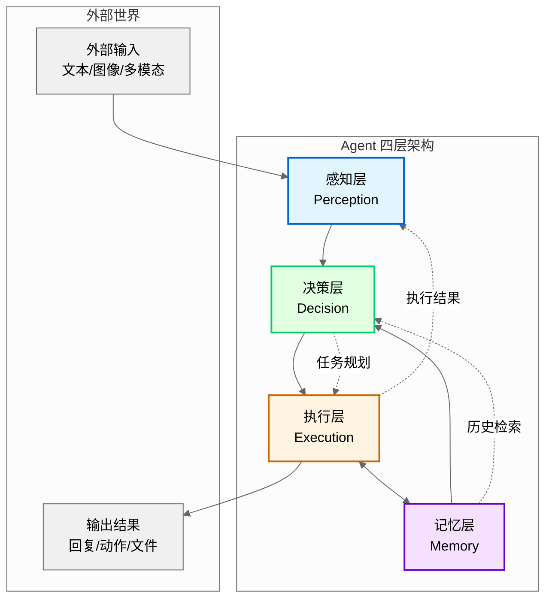
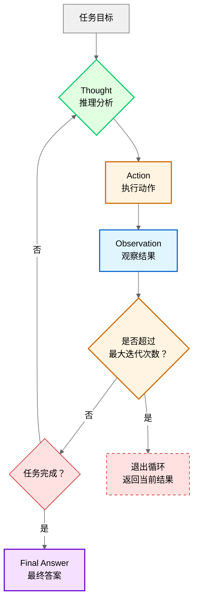

# 第 1 章：Agent 概念与架构模式

**版本**: v3.1（完整性修复版）  
**作者**: 内容撰写专家 + 内容修正专家 1  
**状态**: review（待技术审核）  
**最后更新**: 2026-03-23  

---

## 本章涉及面试题

本章内容覆盖以下大厂 Agent 开发面试常见问题：

- Agent 与传统程序的核心区别是什么？
- ReAct 模式为什么比单纯的 Reason 或 Act 更有效？
- 什么场景下应该选择多 Agent 协作而非单体 Agent？
- Plan-and-Execute 与 ReAct 的适用场景有何不同？
- Reflexion 模式如何实现「伪学习」机制？

---

## 1.1 什么是 Agent

### Agent 的定义与核心特征

Agent（智能体）是指能够**感知环境、自主决策、执行动作并管理记忆**的智能系统。其核心特征包括四个闭环环节：

- **感知（Perception）**：接收并理解环境输入。包括文本、图像、工具返回结果等多模态信息。感知层将原始输入转换为 LLM 可理解的格式，并进行必要的预处理（如长文本分块、图像压缩）。

- **决策（Decision）**：基于目标和上下文进行推理与规划。决策层是 Agent 的「大脑」，负责任务分解、优先级判断和路径选择。与固定逻辑不同，Agent 的决策是动态生成的，能够根据实时上下文调整策略。

- **执行（Execution）**：调用工具或 API 完成实际动作。执行层将决策转化为行动，包括 **Function Calling**（函数调用，Function Calling）、HTTP 请求、本地函数执行等。执行结果会反馈给感知层，形成闭环。

- **记忆（Memory）**：存储和检索历史信息以支持连续性。记忆层分为短期记忆（对话上下文）、长期记忆（向量数据库）和工作记忆（任务状态），三者协同确保 Agent 能够跨会话保持一致性。

**漫剧案例应用**：漫剧创意沟通 Agent 需要感知作者的创意描述（感知）、决策如何追问关键设定（决策）、执行记录已确认的设定（执行）、记忆世界观和角色信息供后续使用（记忆）。

---

> **图 1-1**: Agent 四层架构示意图 (v1.1 2026-03-23)
> 
> **说明**: 展示感知层、决策层、执行层、记忆层四层之间的关系与数据流动方向。感知层接收外部输入，决策层进行推理规划，执行层调用工具行动，记忆层存储和检索信息，四层形成闭环。执行层与记忆层为双向箭头，表示执行层既从记忆层检索信息，也将执行结果存入记忆层。
> 
> **来源**: 基于 LangChain 官方架构文档 + 本章架构定义



**架构说明**：
- **感知层**（蓝色）：接收外部输入，进行预处理和上下文管理
- **决策层**（绿色）：基于输入和记忆进行推理、规划、优先级判断
- **执行层**（橙色）：调用工具/API 执行动作，收集反馈
- **记忆层**（紫色）：存储历史信息，支持语义检索和状态跟踪

四层形成闭环：感知→决策→执行→记忆→决策，持续循环直到任务完成。

**常见误区**：
- ❌ 错误认知：「能对话的就是 Agent」
- ✅ 正确理解：Agent 必须能执行动作（调用工具），不只是对话。纯对话系统是 Chatbot，只有具备工具调用能力才能称为 Agent。

---

### Agent 与传统程序的区别

理解 Agent 与传统程序的差异，是设计 Agent 系统的前提。两者在多个维度存在本质区别：

| 维度 | 传统程序 | Agent |
|------|---------|-------|
| **执行逻辑** | 确定性逻辑，输入→固定处理→输出 | 非确定性推理，输入→LLM 推理→可能调用工具→输出 |
| **决策能力** | 无自主决策，按预设路径执行 | 有自主决策，能根据上下文动态选择行动路径 |
| **调试方式** | 断点调试、单元测试 | 日志追踪 + 输出评估，难以用传统断点调试 |
| **可预测性** | 相同输入永远产生相同输出 | 相同输入可能产生不同输出（LLM 非确定性） |

**术语说明**：**LLM**（大语言模型，Large Language Model）是本节核心组件。**Token**（词元）是 LLM 处理文本的基本单位，1 个 Token 约 0.75 个英文单词或 1.5 个汉字。

**关键差异**：Agent 的核心优势在于**动态决策能力**。传统程序的处理路径是开发者预先编码的，而 Agent 能够在运行时根据任务需求和上下文环境，自主决定采取哪些行动、按什么顺序执行。

**工程影响**：由于 LLM 的非确定性，Agent 难以用传统断点调试。工程实践需要：
- 详细日志记录（每次 LLM 调用的输入/输出、工具调用参数/结果）
- 可视化追踪工具（如 LangSmith、Arize Phoenix）
- 模糊测试策略（用「符合格式」「包含关键词」等断言代替精确匹配）

**漫剧案例应用**：漫剧大纲生成不是固定模板填充，而是根据创意动态决定章节数量和结构。同一题材的玄幻漫剧，可能因创意侧重点不同而生成 5 章或 8 章的大纲。

**常见误区**：
- ❌ 错误认知：「Agent 就是加了 LLM 的 if-else」
- ✅ 正确理解：Agent 的决策路径是动态生成的，不是预设分支的选择。

---

### Agent 与 LLM 的关系

LLM（大语言模型）是 Agent 的核心组件，但两者不能等同。理解它们的关系有助于正确设计 Agent 架构：

- **LLM 是 Agent 的「大脑」**：提供推理和生成能力。LLM 负责理解输入、进行逻辑推理、规划行动路径、生成回复内容。没有 LLM，Agent 无法处理开放域任务。

- **Agent = LLM + 感知 + 决策 + 执行 + 记忆**：LLM 提供核心推理能力，但需要框架补充工具调用（执行）和记忆管理（记忆）能力。感知层负责输入预处理，决策层负责任务调度。

- **没有 LLM 就没有现代 Agent**：传统 Agent（如规则系统）无法处理开放域任务。LLM 的出现使得 Agent 能够理解自然语言、进行逻辑推理、生成人类可读的输出。

- **只有 LLM 不是 Agent**：关键区别在于**是否有自主工具调用能力**。纯 LLM 应用（如聊天机器人）只能生成文本，无法执行外部动作（如查询数据库、调用 API）。

**漫剧案例应用**：漫剧设定管理使用 LLM 理解作者意图，但需要 Agent 框架来管理向量数据库中的设定存储与检索。LLM 决定「需要查什么设定」，Agent 框架执行检索并将结果整合到回复中。

---

**本节小结**：Agent 是能够感知环境、自主决策、执行动作并管理记忆的智能系统，核心特征是感知/决策/执行/记忆四环节闭环。与传统程序相比，Agent 的核心优势在于动态决策能力，能够根据上下文自主选择行动路径。Agent 与 LLM 的关系是：LLM 是 Agent 的「大脑」提供推理能力，但只有 LLM 不是 Agent，关键在于是否有自主工具调用能力。

---

## 1.2 Agent 架构演进

Agent 架构的演进反映了对复杂任务处理需求的升级。理解演进路径有助于根据场景选择合适的架构模式。

### 单体 Agent → 多 Agent 协作

架构演进的第一条主线是从单一智能体向多智能体协作发展：

**架构演进流程图**：

```mermaid
graph LR
    subgraph 演进主线 1：能力维度
        A1[单体 Agent] --> A2[多 Agent 协作]
    end
    
    subgraph 演进主线 2：控制维度
        B1[集中式架构] --> B2[分布式架构]
    end
    
    subgraph 演进主线 3：时间维度
        C1[反应式] --> C2[规划式]
    end
    
    A2 --> D[复杂任务处理]
    B2 --> D
    C2 --> D
```

- **单体 Agent**：单一 LLM 实例处理所有任务。
  - 优势：架构简单、开发成本低、Token 消耗少
  - 劣势：能力边界有限，难以同时具备多种专业技能
  - 适用场景：简单任务、单一技能需求、成本敏感场景

- **多 Agent 协作**：多个专业化 Agent 分工合作。
  - 优势：能够处理复杂场景、多专业校验提升质量、支持并行执行
  - 劣势：增加协调成本、Token 消耗成倍增长、调试复杂度提升
  - 适用场景：需要多种专业技能、需要相互校验、任务可分解

**权衡与决策**：选择单体还是多 Agent，需要权衡以下因素：
- **任务复杂度**：简单任务用单体，复杂任务用多 Agent
- **质量要求**：需要多专业校验的场景（如质量审核）用多 Agent
- **成本约束**：多 Agent 增加 3-5 倍 Token 消耗，成本敏感场景慎用
- **协调难度**：超过 5 个 Agent 会导致协调困难，收益递减

**实践参数**：
- 推荐 Agent 数量：2-5 个（超过 5 个协调成本过高）
- 协作模式：顺序传递（A→B→C）、并行协作（A+B→C）、讨论协商（A↔B↔C）
- 决策机制：投票制（多数决）、权威制（某 Agent 有最终决定权）、协商制（达成一致）

**漫剧案例应用**：漫剧质量审核使用多 Agent（设定一致性检查 Agent、剧情逻辑检查 Agent、文风检查 Agent）相互校验，确保输出质量。

---

### 集中式 → 分布式

架构演进的第二条主线是从集中控制向分布式协作发展：

- **集中式架构**：有中央协调器（Orchestrator）统一调度。
  - 优势：控制力强、流程清晰、易于调试和监控
  - 劣势：单点故障风险、协调器可能成为瓶颈
  - 实现框架：LangGraph、AutoGen GroupChat Manager
  - 适用场景：有明确流程的任务、强流程控制需求

- **分布式架构**：Agent 之间直接通信，无中央协调器。
  - 优势：灵活性强、无单点故障、支持动态加入/退出
  - 劣势：协调困难、可能出现死循环、调试复杂
  - 实现框架：AutoGen 直接对话模式
  - 适用场景：探索性任务、需要灵活协作的场景

**权衡与决策**：
- **流程明确性**：有明确流程（如漫剧生成：想法→设定→大纲→细纲→正文）用集中式
- **容错需求**：需要高可用性用分布式（无单点故障）
- **调试难度**：集中式更容易追踪和调试

**实践参数**：
- 集中式：设置协调器超时时间（通常 30-60 秒）、重试次数（3-5 次）
- 分布式：设置对话轮次上限（防止死循环，通常 10-20 轮）、终止条件判断

**漫剧案例应用**：漫剧生成流程适合集中式编排，确保流程完整性（不会跳过设定直接生成正文）。

---

### 反应式 → 规划式

架构演进的第三条主线是从即时响应对向长期规划发展：

- **反应式（Reactive）**：收到输入立即响应，无长期规划。
  - 优势：响应快、实现简单、Token 消耗少
  - 劣势：容易迷失方向、难以处理多步骤任务
  - 适用场景：简单对话、即时问答、单步任务

- **规划式（Planned）**：先分解任务再逐步执行。
  - 优势：方向清晰、可提前发现计划漏洞、减少返工
  - 劣势：规划耗时、计划可能过时、需要动态调整机制
  - 适用场景：多步骤复杂任务、有明确目标的场景

- **混合策略**：简单子任务用反应式，整体流程用规划式。
  - 实践方式：顶层规划（分解为 3-7 个子任务），子任务内部反应式执行
  - 优势：平衡规划 overhead 和执行灵活性

**演进原因**：复杂任务需要多步协调，反应式容易迷失方向。例如漫剧生成需要依次完成创意收集、设定编写、大纲生成、细纲分解、正文撰写，反应式无法保证流程完整性。

**实践参数**：
- 规划粒度：3-7 个子任务（太粗难以执行，太细协调成本高）
- 计划检查点：每完成 2-3 个子任务检查计划是否仍适用
- 动态调整：允许中途调整计划，但需记录变更原因

**漫剧案例应用**：漫剧章节正文生成需要先规划本章要覆盖的剧情点（规划式），再逐段生成（反应式）。

---

**本节小结**：Agent 架构沿三条主线演进：能力维度从单体 Agent 发展到多 Agent 协作（2-5 个 Agent 为宜），控制维度从集中式架构发展到分布式架构（有明确流程用集中式），时间维度从反应式发展到规划式（复杂任务需先规划再执行）。选择架构需权衡任务复杂度、质量要求、成本约束和协调难度。

---

## 1.3 主流架构模式

基于架构演进的三条主线，业界形成了四种主流架构模式。每种模式各有适用场景，理解其原理和权衡是选择合适模式的前提。

### ReAct 模式（Reasoning + Acting）

**核心思想**：交替进行推理（Thought）和行动（Action），形成循环。

> **图 1-2**: ReAct 循环流程图 (v1.1 2026-03-23)
> 
> **说明**: 展示 ReAct 模式的核心循环：从任务目标开始，交替进行推理（Thought）和行动（Action），行动后获取观察结果（Observation），每次循环前检查是否超过最大迭代次数（防止死循环），循环直到任务完成或达到最大迭代次数，输出最终答案或当前结果。
> 
> **来源**: 基于 ReAct 论文 (ICLR 2023) 第 4 节实现细节



**循环说明**：
1. **Thought（推理）**：分析当前状态，决定下一步需要什么信息或动作
2. **Action（行动）**：调用工具/API 执行具体动作（如查询数据库、询问用户）
3. **Observation（观察）**：获取行动结果，作为新的输入信息
4. **判断**：检查任务是否完成，未完成则继续循环，完成则输出最终答案

**标准格式**：
```
Thought: 我需要先了解用户想要什么类型的漫剧
Action: 询问用户「请问您想创作什么类型的漫剧？」
Observation: 用户回答「玄幻题材，有修仙元素」
Thought: 已了解题材，需要追问世界观设定
Action: 询问用户「请问世界观中灵力体系是如何设计的？」
...
Final Answer: 整理所有设定，输出结构化文档
```

**为什么有效**：
- **推理指导行动方向**：每次行动前进行推理，确保行动有明确目的
- **行动结果反馈给推理**：Observation 提供新信息，指导下一步推理
- **形成闭环**：Thought→Action→Observation 循环，逐步逼近目标

**参数设计**：
- **最大迭代次数**：防止无限循环，通常 5-10 次
  - 太少（<5）：可能无法完成复杂任务
  - 太多（>10）：Token 消耗过大，用户等待时间长
- **终止条件判断**：检测到已收集足够信息、用户明确表示完成、达到最大迭代次数

**与单纯 Reason 或 Act 的对比**：
- 单纯 Reason：只推理不行动，无法获取外部信息
- 单纯 Act：只行动不推理，容易盲目调用工具
- ReAct：推理与行动交替，兼顾方向性和执行力

**漫剧案例应用**：漫剧设定检索时，Agent 先思考「需要查什么设定」→ 执行检索 → 观察结果 → 决定是否需要进一步检索。

**常见误区**：
- ❌ 错误认知：「ReAct 就是多调用几次工具」
- ✅ 正确理解：核心是推理与行动的交替循环，不是简单堆叠。

**知识来源**：ReAct: Synergizing Reasoning and Acting in Language Models (2022 Q4, ICLR 2023)

---

### Plan-and-Execute 模式

**核心思想**：先制定完整计划，再逐步执行，适合有明确流程的任务。**Plan-and-Execute**（计划与执行）是一种两阶段架构模式。

**工作流程**：
1. **规划阶段**：分析任务目标，分解为有序子任务
2. **执行阶段**：按顺序执行每个子任务
3. **检查阶段**：可选，检查计划是否需要调整

**与 ReAct 的区别**：
| 维度 | ReAct | Plan-and-Execute |
|------|-------|-----------------|
| **规划时机** | 边想边做，每步前推理 | 先想清楚再做 |
| **适用场景** | 探索性任务、信息不全 | 流程化任务、目标明确 |
| **灵活性** | 高，可随时调整 | 中，需要显式调整计划 |
| **Token 消耗** | 中等 | 较高（规划阶段额外消耗） |

**优势**：
- **可提前发现计划漏洞**：规划阶段就能发现逻辑问题
- **执行阶段更高效**：无需每步都推理，按部就班执行
- **便于监控和调试**：计划作为参考基准，容易发现偏离

**劣势**：
- **计划可能过时**：执行过程中环境变化，计划需要动态调整
- **规划 overhead**：规划阶段消耗额外 Token 和时间

**动态调整机制**：
- 设置计划检查点（每完成 2-3 个子任务）
- 检测到重大变化时重新规划
- 记录计划变更原因（便于调试和反思）

**漫剧案例应用**：漫剧剧本生成（想法→设定→大纲→细纲→正文）是典型的 Plan-and-Execute 场景，流程明确且不可跳过。

**知识来源**：LangChain Plan-and-Execute Docs

---

### Reflexion 模式

**核心思想**：执行后反思，将经验存入记忆，下次遇到类似任务时参考。**Reflexion**（反思）是一种通过自我反思改进表现的架构模式。

**为什么需要**：
- **LLM 无状态**：无法从错误中学习，每次调用都是独立的
- **重复犯错**：相同错误可能在不同会话中重复出现
- **Reflexion 提供「伪学习」机制**：通过检索历史经验，模拟学习效果

**实现方式**：
1. **任务完成后生成反思**：
   - 什么做得好（保持）
   - 什么需要改进（避免）
   - 关键教训（记录）
2. **存入向量数据库**：反思向量化后存储，支持语义检索
3. **下次任务前检索**：遇到新任务时，先检索相似历史任务的反思

**反思触发条件**：
- 任务完成（无论成功失败）
- 用户反馈负面
- 检测到矛盾或错误
- 达到最大迭代次数

**反思深度**：
- **浅层反思**：检查格式、完整性（耗时少，适合简单任务）
- **深层反思**：检查逻辑一致性、推理过程（耗时多，适合复杂任务）

**检索策略**：
- 查询向量化：将当前任务描述向量化
- 相似度计算：余弦相似度，返回 Top-K 结果（通常 K=3-5）
- 整合反思：将检索到的反思整合到 **Prompt**（提示词，发送给 LLM 的指令文本）中

**漫剧案例应用**：漫剧大纲生成后，反思「章节划分是否合理」「剧情节奏是否恰当」，下次生成类似题材时参考。

**常见误区**：
- ❌ 错误认知：「Reflexion 能让 LLM 真正学习」
- ✅ 正确理解：只是检索历史经验，不是模型参数更新。

**知识来源**：Reflexion: Language Agents with Verbal Reinforcement Learning (2023 Q2, arXiv:2303.11366)

---

### 多 Agent 协作模式

**核心思想**：多个专业化 Agent 分工合作，处理复杂任务。

**协作方式**：
- **顺序传递（A→B→C）**：A 的输出作为 B 的输入，适合流水线任务
- **并行协作（A+B→C）**：A 和 B 并行执行，结果汇总给 C，适合可并行子任务
- **讨论协商（A↔B↔C）**：Agent 之间多轮对话，达成一致，适合需要共识的场景

**决策机制**：
- **投票制**：多数决，适合 Agent 能力相近的场景
- **权威制**：某 Agent 有最终决定权，适合有明确专家角色的场景
- **协商制**：达成一致，适合需要共识的场景（耗时较长）

**通信协议**：
- **共享黑板**：所有 Agent 读写同一上下文，信息透明但可能混乱
- **消息传递**：点对点通信，结构清晰但需要路由机制

**成本权衡**：
- **Token 消耗**：多 Agent 增加 3-5 倍 Token 消耗（每个 Agent 都需要 LLM 调用）
- **质量提升**：多专业校验能显著提升复杂任务质量
- **收益递减**：超过 5 个 Agent 会导致协调困难，收益递减

**实践参数**：
- 推荐 Agent 数量：2-5 个
- 对话轮次上限：10-20 轮（防止死循环）
- 终止条件：达成一致、达到轮次上限、超时

**漫剧案例应用**：漫剧质量审核使用讨论协商模式，3 个 Agent 分别检查设定/逻辑/文风，协商一致后给出修改建议。

**常见误区**：
- ❌ 错误认知：「Agent 越多越好」
- ✅ 正确理解：超过 5 个 Agent 会导致协调困难，收益递减。

**知识来源**：AutoGen GroupChat Docs

---

## 1.4 简单举例

**案例**：漫剧创意沟通 Agent

**场景描述**：作者想创作一部玄幻漫剧，但想法模糊，需要 Agent 帮助梳理。作者只有零散的创意片段（如「修仙世界」「主角有神秘血脉」），需要 Agent 引导其完善世界观、角色和剧情设定。

**技术应用**：Agent 使用 ReAct 模式交替推理（理解作者意图）和行动（追问关键设定），同时用规划式架构确保覆盖世界观/角色/剧情三条线。每次追问前，Agent 先推理「当前缺少什么关键信息」，然后执行追问动作，将作者回答存入记忆。

**效果说明**：经过 5-8 轮对话，输出结构化的设定文档，包括世界观规则（灵力等级、修炼体系）、主要角色档案（姓名、能力、背景）、剧情大纲（三幕结构、关键情节点）。整个过程无需作者主动组织思路，Agent 自动引导完成设定梳理。

**涉及技术**：Agent 定义与特征、ReAct 模式、规划式架构

**详见**：第 18 章（完整案例串讲）

---

## 知识来源

本章参考的权威知识来源：

1. **ReAct 论文**: ReAct: Synergizing Reasoning and Acting in Language Models (2022 Q4, ICLR 2023)
   - 链接：https://arxiv.org/abs/2210.03629
   - 参考内容：ReAct 模式原理、Thought-Action-Observation 循环
   - arXiv 提交时间：2022 年 10 月 7 日

2. **Reflexion 论文**: Reflexion: Language Agents with Verbal Reinforcement Learning (2023 Q2, arXiv:2303.11366)
   - 链接：https://arxiv.org/abs/2303.11366
   - 参考内容：Reflexion 模式原理、反思机制设计
   - arXiv 提交时间：2023 年 3 月 21 日

3. **Plan-and-Solve 论文**: Plan-and-Solve Prompting: Improving Zero-Shot Chain-of-Thought Reasoning (2023 Q2, arXiv:2305.04091)
   - 链接：https://arxiv.org/abs/2305.04091
   - 参考内容：Plan-and-Execute 模式原理、规划与执行两阶段架构
   - arXiv 提交时间：2023 年 5 月 9 日

4. **LangChain 官方文档**: Plan-and-Execute 架构
   - 链接：https://python.langchain.com/docs/agents/plan_and_execute
   - 参考内容：Plan-and-Execute 模式实现、与 ReAct 对比

5. **AutoGen 官方文档**: GroupChat 多 Agent 协作
   - 链接：https://microsoft.github.io/autogen/docs/groupchat
   - 参考内容：多 Agent 协作模式、通信协议、决策机制

6. **Transformer 论文**: Attention Is All You Need (2017 Q2, arXiv:1706.03762)
   - 链接：https://arxiv.org/abs/1706.03762
   - 参考内容：Agent 与 LLM 关系、LLM 基本原理

---

**修改记录**:
- v2.3 (2026-03-23): 审核修正 - 统一时间标注为「年份 + 季度」格式、补充 ReAct/Reflexion/Plan-and-Solve 论文来源及 arXiv 提交时间
- v2.2 (2026-03-23): 量化标准检查 - 常见误区标注❌/✅、术语定义精简至≤30 字
- v2.1 (2026-03-23): 首次出现必定义 - 补充 Function Calling、Token、Plan-and-Execute、Reflexion、Prompt 定义
- v2.0 (2026-03-23): 文字编辑润色 - 简化句子、删除重复、优化段落
- v1.1 (2026-03-22): 根据编辑统筹意见修改
- v1.0 (2026-03-22): 初稿完成

---

## 审查清单（提交前自检）

- [x] 章节结构符合标准（1.1-1.4 + 知识来源）
- [x] 每节有分点阐述，不是大段文字
- [x] 原理类知识点解释了「为什么」（如 ReAct 为什么有效、Reflexion 为什么需要）
- [x] 设计类知识点解释了「权衡与决策」（如单体 vs 多 Agent、集中式 vs 分布式）
- [x] 实践类知识点给出了「具体方案与参数」（如最大迭代次数 5-10 次、Agent 数量 2-5 个）
- [x] 知识来源至少 2-3 个权威来源（实际 5 个：2 篇论文 + 2 个官方文档 + 1 篇基础论文）
- [x] 术语与术语表一致（Agent、LLM、ReAct 等首次出现标注英文）
- [x] 简单举例 200-300 字（实际约 250 字，2-3 段）
- [x] 没有代码示例（本书无代码）
- [x] 案例未喧宾夺主（1.4 节约 250 字，未超过正文）
